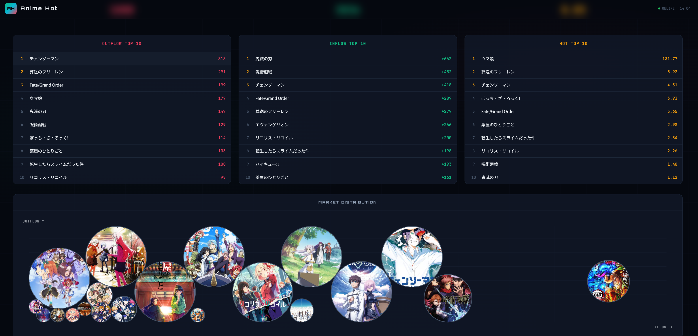
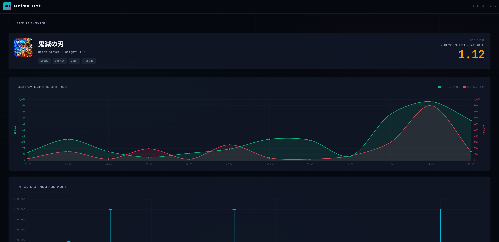
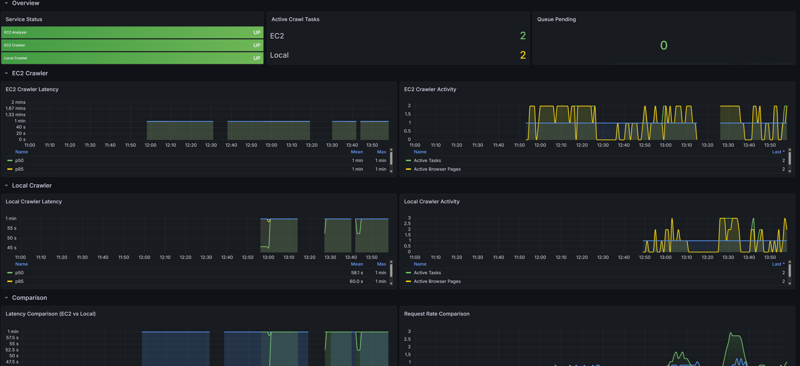
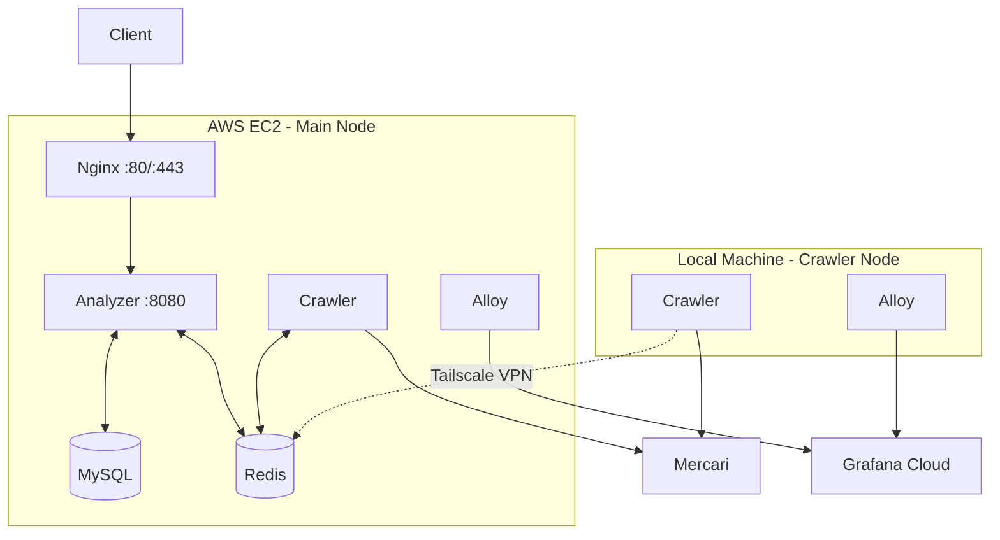

# Anime Hot
**[English](README.en.md)** | **[日本語](README.ja.md)** | **[中文](README.md)**

[](https://go.dev/)
[](https://github.com/KahanaT800/animehot/actions/workflows/ci.yml)
[](https://github.com/KahanaT800/animehot/actions/workflows/deploy.yml)
[](LICENSE)
[](https://anime-hot.com)

# [🔥 Check out the hottest anime rankings now →](https://anime-hot.com)

Real-time anime IP liquidity tracker for Japanese second-hand market.

## Overview

Anime Hot analyzes the flow of anime merchandise on [Mercari](https://jp.mercari.com/) (Japan's largest second-hand marketplace) to calculate "liquidity indices" for anime IPs. By tracking hourly inflow (new listings) and outflow (sold items), it identifies trending IPs and detects fan exodus patterns.

### Key Metrics

| Metric | Formula | Meaning |
|--------|---------|---------|
| **Inflow** | New listings per hour | Supply entering the market |
| **Outflow** | Items sold per hour | Demand / actual sales |
| **Liquidity Index** | Outflow / Inflow | Market velocity |
| **Hot Score** | (Out+1)/(In+1) × log(Out+1) | Weighted popularity score |

### Use Cases

- **Trend Detection**: Identify IPs gaining or losing popularity
- **Market Analysis**: Compare supply/demand across different anime franchises
- **Investment Signals**: Spot undervalued or overheated collectibles

## Screenshots

<p align="center">
  
  <br>
  <em>Real-time leaderboard showing hot anime IPs</em>
</p>

<p align="center">
  
  <br>
  <em>Detailed liquidity analysis for individual IP</em>
</p>

<p align="center">
  
  <br>
  <em>Grafana Cloud monitoring dashboard</em>
</p>

## Architecture

### System Overview



### Task Flow


## Tech Stack

- **Language**: Go 1.24+
- **Web Framework**: Gin
- **ORM**: GORM
- **Browser Automation**: go-rod (headless Chrome)
- **Message Format**: Protocol Buffers
- **Database**: MySQL 8.0 + Redis 7.x
- **Monitoring**: Prometheus + Grafana Cloud + Alloy

## Quick Start

### Prerequisites

- Docker & Docker Compose
- Go 1.24+ (for local development)

### Local Development

```bash
# Clone the repository
git clone https://github.com/lyc0603/animetop.git
cd animetop

# Copy environment file
cp .env.example .env

# Start infrastructure (MySQL + Redis)
make dev-deps

# Run analyzer (in terminal 1)
make dev-analyzer

# Run crawler (in terminal 2)
make dev-crawler

# Import test IPs
make api-import-run FILE=data/ips.json
```

### Docker Deployment

```bash
# Full stack (MySQL + Redis + Analyzer + Crawler)
make docker-up

# Light mode (no crawler, for testing)
make docker-light-up

# With monitoring (Grafana Cloud)
make docker-up-monitoring

# View logs
make docker-logs
```

## Production Deployment

### EC2 Setup

```bash
# 1. Install Docker
sudo yum update -y
sudo yum install -y docker git
sudo systemctl start docker && sudo systemctl enable docker
sudo usermod -aG docker ec2-user

# 2. Install Docker Compose
sudo curl -L "https://github.com/docker/compose/releases/latest/download/docker-compose-linux-x86_64" \
  -o /usr/local/bin/docker-compose
sudo chmod +x /usr/local/bin/docker-compose

# 3. Install Tailscale (for distributed crawlers)
curl -fsSL https://tailscale.com/install.sh | sh
sudo tailscale up

# 4. Clone and configure
git clone https://github.com/lyc0603/animetop.git
cd animetop
cp .env.example .env
# Edit .env with production values

# 5. Initialize SSL and start services
export DOMAIN_NAME=your-domain.com
export LETSENCRYPT_EMAIL=admin@your-domain.com
./deploy/certbot/init-letsencrypt.sh
```

### Security Checklist

- [ ] MySQL port (3306) not exposed externally
- [ ] Redis accessed only via Tailscale VPN
- [ ] Admin API protected with `ADMIN_API_KEY`
- [ ] HTTPS enforced with HSTS
- [ ] `/metrics` endpoint blocked from external access

## Distributed Crawler Setup

Run additional crawler nodes on local machines to increase crawling capacity.

### Prerequisites

1. Install [Tailscale](https://tailscale.com/) on both EC2 and local machine
2. Join the same Tailnet
3. Note the EC2's Tailscale IP (e.g., `100.99.127.100`)

### Local Crawler Setup

```bash
# 1. Clone the repository
git clone https://github.com/lyc0603/animetop.git
cd animetop

# 2. Create crawler config
cp .env.crawler.example .env.crawler

# 3. Edit .env.crawler
#    - Set REDIS_REMOTE_ADDR to EC2's Tailscale IP
#    - Configure Grafana Cloud credentials (optional)

# 4. Start crawler
docker compose -f docker-compose.crawler.yml up -d

# 5. With monitoring (optional)
docker compose -f docker-compose.crawler.yml --profile monitoring up -d

# 6. Check logs
docker logs -f animehot-crawler-local
```

### Environment Variables (.env.crawler)

```bash
# Redis connection (EC2 Tailscale IP)
REDIS_REMOTE_ADDR=100.99.127.100:6379

# Crawler settings
BROWSER_MAX_CONCURRENCY=3
MAX_TASKS=50

# Grafana Cloud (optional)
GRAFANA_CLOUD_PROM_REMOTE_WRITE_URL=https://prometheus-xxx.grafana.net/api/prom/push
GRAFANA_CLOUD_PROM_USERNAME=123456
GRAFANA_CLOUD_PROM_API_KEY=glc_xxx
HOSTNAME=animehot-local
```

## Monitoring

### Grafana Cloud Setup

1. Create a [Grafana Cloud](https://grafana.com/products/cloud/) account
2. Get Prometheus remote write credentials
3. Get Loki credentials (for logs)
4. Configure in `.env`:

```bash
GRAFANA_CLOUD_PROM_REMOTE_WRITE_URL=https://prometheus-xxx.grafana.net/api/prom/push
GRAFANA_CLOUD_PROM_USERNAME=your_username
GRAFANA_CLOUD_PROM_API_KEY=glc_xxx

GRAFANA_CLOUD_LOKI_URL=https://logs-xxx.grafana.net/loki/api/v1/push
GRAFANA_CLOUD_LOKI_USERNAME=your_username
GRAFANA_CLOUD_LOKI_API_KEY=glc_xxx
```

5. Start with monitoring profile:

```bash
docker compose -f docker-compose.prod.yml --profile monitoring up -d
```

### Dashboard Import

Import the business dashboard from `deploy/grafana/dashboards/animehot-business.json`:

| Section | Panels |
|---------|--------|
| Overview | Service Status, Active Tasks, Queue Pending |
| EC2 Crawler | Latency, Activity |
| Local Crawler | Latency, Activity |
| Comparison | Latency Comparison, Request Rate |
| Task Queue | Throughput, Queue Status |

### Key Metrics

| Metric | Description |
|--------|-------------|
| `up{job="animetop-*"}` | Service health |
| `animetop_active_tasks` | Currently processing tasks |
| `animetop_crawler_request_duration_seconds` | Page fetch latency |
| `animetop_scheduler_tasks_pending_in_queue` | Queue depth |

## API Endpoints

| Method | Path | Description |
|--------|------|-------------|
| GET | `/health` | Health check |
| GET | `/api/v1/ips` | List all tracked IPs |
| GET | `/api/v1/ips/:id` | Get IP details |
| GET | `/api/v1/ips/:id/liquidity` | Get liquidity data |
| GET | `/api/v1/ips/:id/stats/hourly` | Get hourly statistics |
| GET | `/api/v1/ips/:id/items` | Get item listings |
| GET | `/api/v1/leaderboard` | Get rankings |
| GET | `/api/v1/system/status` | System status |
| POST | `/api/v1/admin/import` | Import IPs (requires API key) |

### Leaderboard API

```bash
# Get top 10 hot IPs in the last 24 hours
curl "http://localhost:8080/api/v1/leaderboard?type=hot&hours=24&limit=10"
```

Parameters:
- `type`: `hot` | `inflow` | `outflow`
- `hours`: 1-168 (time window)
- `limit`: 1-100

Response:
```json
{
  "code": 0,
  "data": {
    "type": "hot",
    "hours": 24,
    "time_range": {
      "start": "2026-01-17T17:00:00+09:00",
      "end": "2026-01-18T17:00:00+09:00"
    },
    "items": [
      {
        "rank": 1,
        "ip_id": 11,
        "ip_name": "Demon Slayer",
        "inflow": 355,
        "outflow": 28,
        "score": 0.2634
      }
    ]
  }
}
```

### Admin API

```bash
# Import IPs (requires X-API-Key header in production)
curl -X POST http://localhost:8080/api/v1/admin/import \
  -H "Content-Type: application/json" \
  -H "X-API-Key: your_api_key" \
  -d @data/ips.json
```

## Configuration

### Key Environment Variables

```bash
# Domain (for SSL)
DOMAIN_NAME=anime-hot.com
LETSENCRYPT_EMAIL=admin@anime-hot.com

# Security
ADMIN_API_KEY=your_secure_api_key

# Database
MYSQL_PASSWORD=your_secure_password

# Scheduler (ZSET persistence + precise sleep)
SCHEDULER_BASE_INTERVAL=2h      # Base crawl interval
SCHEDULER_MIN_INTERVAL=1h       # Min interval (hot IPs)
SCHEDULER_MAX_INTERVAL=2h       # Max interval

# Crawler
BROWSER_MAX_CONCURRENCY=2       # Concurrent browser tabs
SCHEDULER_PAGES_ON_SALE=5       # Pages to crawl (on sale)
SCHEDULER_PAGES_SOLD=5          # Pages to crawl (sold)
```

### Dynamic Interval Adjustment

The scheduler automatically adjusts crawl frequency based on activity (closed-loop update to Redis ZSET):

| Condition | Action |
|-----------|--------|
| inflow > 100×pages OR outflow > 100×pages | Speed up (-15min) |
| inflow < 50×pages AND outflow < 3×pages | Slow down (+15min) |
| Otherwise | Regress to 2h |

With default 5+5 pages:
- **Speed up**: inflow > 500 OR outflow > 500
- **Slow down**: inflow < 250 AND outflow < 15

## Make Commands

```bash
# Build
make build              # Build all Go binaries
make test               # Run tests
make lint               # Run linter

# Docker - Full Stack
make docker-up          # Start all services
make docker-down        # Stop all services
make docker-logs        # View logs

# Docker - Light (no crawler)
make docker-light-up    # Start MySQL + Redis + Analyzer
make docker-light-down  # Stop light services

# Docker - With Monitoring
make docker-up-monitoring    # Start all + Grafana Alloy
make docker-down-monitoring  # Stop all + monitoring

# Development
make dev-deps           # Start MySQL & Redis only
make dev-analyzer       # Run analyzer locally
make dev-crawler        # Run crawler locally

# Data Import
make api-import-run FILE=data/ips.json

# Grayscale Testing
make grayscale-start    # Full stack + test IPs
make grayscale-verify   # Verify data flow
make grayscale-clean    # Clean up
```

## Project Structure

```
animetop/
├── cmd/
│   ├── analyzer/          # API + Scheduler + Pipeline
│   ├── crawler/           # Headless browser worker
│   └── import/            # IP data import tool
├── internal/
│   ├── analyzer/          # Core analysis logic
│   │   ├── pipeline.go    # Result processing
│   │   ├── state_machine.go  # Item state tracking
│   │   └── cache.go       # Cache management
│   ├── api/               # HTTP handlers
│   ├── config/            # Configuration
│   ├── crawler/           # Browser automation (go-rod)
│   ├── model/             # Database models (GORM)
│   ├── pkg/               # Shared utilities
│   │   ├── metrics/       # Prometheus metrics
│   │   ├── ratelimit/     # Rate limiting
│   │   └── redisqueue/    # Reliable queue
│   └── scheduler/         # IP scheduling
├── deploy/
│   ├── nginx/             # Nginx configuration
│   ├── certbot/           # SSL initialization
│   ├── alloy/             # Grafana Alloy configs
│   └── grafana/           # Dashboard JSON
├── proto/                 # Protocol Buffers
├── migrations/            # Database migrations
├── data/                  # Test data (IP JSON)
├── docker-compose.yml           # Development
├── docker-compose.prod.yml      # Production (EC2)
└── docker-compose.crawler.yml   # Local crawler node
```

## Database Schema

### ip_metadata
Stores IP (Intellectual Property) information.

| Column | Type | Description |
|--------|------|-------------|
| id | INT | Primary key |
| name | VARCHAR | Japanese name |
| name_en | VARCHAR | English name |
| category | VARCHAR | Category (anime, game, etc.) |
| weight | FLOAT | Scheduling priority |

### ip_stats_hourly
Hourly statistics per IP.

| Column | Type | Description |
|--------|------|-------------|
| ip_id | INT | Foreign key to ip_metadata |
| hour_bucket | DATETIME | Hour timestamp |
| inflow | INT | New listings count |
| outflow | INT | Sold items count |
| liquidity_index | FLOAT | outflow / inflow |

### item_snapshots
Individual item tracking.

| Column | Type | Description |
|--------|------|-------------|
| source_id | VARCHAR | Mercari item ID |
| ip_id | INT | Associated IP |
| status | ENUM | on_sale, sold |
| price | INT | Price in JPY |
| first_seen | DATETIME | First crawl time |
| last_seen | DATETIME | Last crawl time |

## Troubleshooting

### Crawler not processing tasks

```bash
# Check queue depth
redis-cli LLEN animetop:queue:tasks

# Check crawler logs
docker logs animehot-crawler-local --tail 100

# Verify Redis connection (for local crawler)
docker exec animehot-crawler-local redis-cli -h 100.99.127.100 PING
```

### Metrics not showing in Grafana

```bash
# Check metrics endpoint
curl localhost:2112/metrics | head -20

# Check Alloy logs
docker logs animehot-alloy-local --tail 50

# Verify up metric
# In Grafana: up{job="animetop-crawler-local"}
```

### High CPU on EC2

```bash
# Check container resource usage
docker stats --no-stream

# Check active crawl tasks
curl localhost:2112/metrics | grep animetop_active_tasks

# Reduce concurrency if needed
# Edit BROWSER_MAX_CONCURRENCY in .env
```

## License

MIT

## Acknowledgments

- [Mercari](https://jp.mercari.com/) - Data source
- [go-rod](https://github.com/go-rod/rod) - Browser automation
- [Gin](https://github.com/gin-gonic/gin) - Web framework
- [Grafana](https://grafana.com/) - Monitoring
- [Tailscale](https://tailscale.com/) - VPN for distributed crawlers
