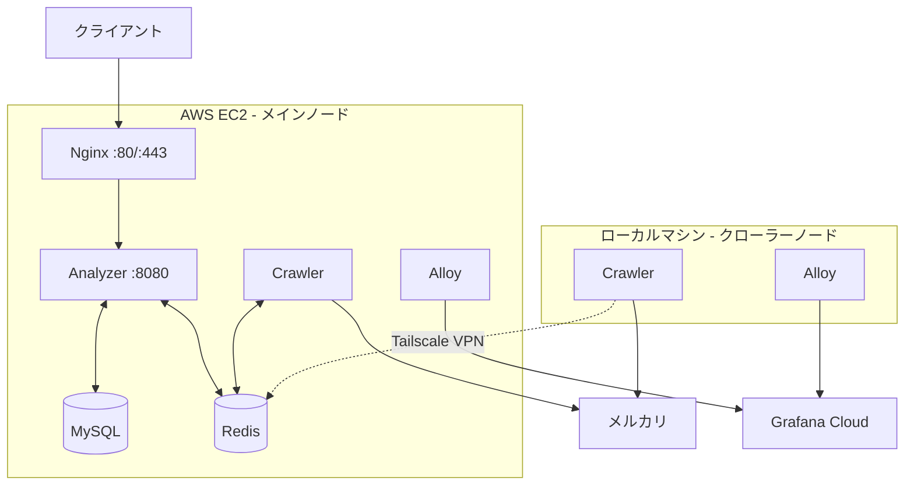
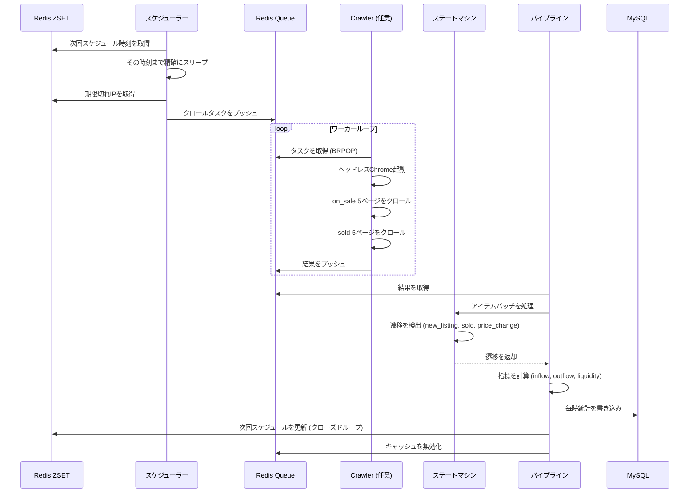

# Anime Hot

**[English](README.en.md)** | **[日本語](README.ja.md)** | **[中文](README.md)**

[](https://go.dev/)
[](https://github.com/KahanaT800/animehot/actions/workflows/ci.yml)
[](https://github.com/KahanaT800/animehot/actions/workflows/deploy.yml)
[](LICENSE)
[](https://anime-hot.com)

### [🔥 今すぐ人気アニメランキングをチェック →](https://anime-hot.com)

日本の中古市場におけるアニメIP流動性のリアルタイムトラッカー。

## 概要

Anime Hotは、[メルカリ](https://jp.mercari.com/)（日本最大のフリマアプリ）におけるアニメグッズの流通を分析し、アニメIPの「流動性指数」を算出します。毎時の流入（新規出品）と流出（売却済み）を追跡することで、トレンドIPの特定やファン離れパターンの検出が可能です。

### 主要指標

| 指標 | 計算式 | 意味 |
|------|--------|------|
| **流入** | 毎時の新規出品数 | 市場への供給 |
| **流出** | 毎時の売却数 | 需要 / 実際の販売 |
| **流動性指数** | 流出 / 流入 | 市場の回転速度 |
| **ホットスコア** | (Out+1)/(In+1) × log(Out+1) | 加重人気スコア |

### ユースケース

- **トレンド検出**: 人気上昇中または下降中のIPを特定
- **市場分析**: 異なるアニメフランチャイズ間の需給比較
- **投資シグナル**: 過小評価または過熱しているコレクターズアイテムの発見

## スクリーンショット

<p align="center">
  
  <br>
  <em>人気アニメIPのリアルタイムランキング</em>
</p>

<p align="center">
  
  <br>
  <em>個別IPの詳細な流動性分析</em>
</p>

<p align="center">
  
  <br>
  <em>Grafana Cloudモニタリングダッシュボード</em>
</p>

## アーキテクチャ

### システム概要



### タスクフロー



## 技術スタック

- **言語**: Go 1.24+
- **Webフレームワーク**: Gin
- **ORM**: GORM
- **ブラウザ自動化**: go-rod (ヘッドレスChrome)
- **メッセージフォーマット**: Protocol Buffers
- **データベース**: MySQL 8.0 + Redis 7.x
- **モニタリング**: Prometheus + Grafana Cloud + Alloy

## クイックスタート

### 前提条件

- Docker & Docker Compose
- Go 1.24+ (ローカル開発用)

### ローカル開発

```bash
# リポジトリをクローン
git clone https://github.com/lyc0603/animetop.git
cd animetop

# 環境ファイルをコピー
cp .env.example .env

# インフラを起動 (MySQL + Redis)
make dev-deps

# Analyzerを実行 (ターミナル1)
make dev-analyzer

# Crawlerを実行 (ターミナル2)
make dev-crawler

# テストIPをインポート
make api-import-run FILE=data/ips.json
```

### Dockerデプロイ

```bash
# フルスタック (MySQL + Redis + Analyzer + Crawler)
make docker-up

# ライトモード (クローラーなし、テスト用)
make docker-light-up

# モニタリング付き (Grafana Cloud)
make docker-up-monitoring

# ログを確認
make docker-logs
```

## 本番デプロイ

### EC2セットアップ

```bash
# 1. Dockerをインストール
sudo yum update -y
sudo yum install -y docker git
sudo systemctl start docker && sudo systemctl enable docker
sudo usermod -aG docker ec2-user

# 2. Docker Composeをインストール
sudo curl -L "https://github.com/docker/compose/releases/latest/download/docker-compose-linux-x86_64" \
  -o /usr/local/bin/docker-compose
sudo chmod +x /usr/local/bin/docker-compose

# 3. Tailscaleをインストール (分散クローラー用)
curl -fsSL https://tailscale.com/install.sh | sh
sudo tailscale up

# 4. クローンと設定
git clone https://github.com/lyc0603/animetop.git
cd animetop
cp .env.example .env
# .envを本番用の値に編集

# 5. SSL初期化とサービス起動
export DOMAIN_NAME=your-domain.com
export LETSENCRYPT_EMAIL=admin@your-domain.com
./deploy/certbot/init-letsencrypt.sh
```

### セキュリティチェックリスト

- [ ] MySQLポート (3306) が外部に公開されていない
- [ ] RedisはTailscale VPN経由でのみアクセス可能
- [ ] Admin APIは`ADMIN_API_KEY`で保護
- [ ] HTTPSがHSTSで強制
- [ ] `/metrics`エンドポイントが外部からブロック

## 分散クローラーセットアップ

ローカルマシンで追加のクローラーノードを実行し、クロール能力を向上させます。

### 前提条件

1. EC2とローカルマシンの両方に[Tailscale](https://tailscale.com/)をインストール
2. 同じTailnetに参加
3. EC2のTailscale IP (例: `100.99.127.100`) をメモ

### ローカルクローラーセットアップ

```bash
# 1. リポジトリをクローン
git clone https://github.com/lyc0603/animetop.git
cd animetop

# 2. クローラー設定を作成
cp .env.crawler.example .env.crawler

# 3. .env.crawlerを編集
#    - REDIS_REMOTE_ADDRをEC2のTailscale IPに設定
#    - Grafana Cloud認証情報を設定 (オプション)

# 4. クローラーを起動
docker compose -f docker-compose.crawler.yml up -d

# 5. モニタリング付き (オプション)
docker compose -f docker-compose.crawler.yml --profile monitoring up -d

# 6. ログを確認
docker logs -f animehot-crawler-local
```

### 環境変数 (.env.crawler)

```bash
# Redis接続 (EC2 Tailscale IP)
REDIS_REMOTE_ADDR=100.99.127.100:6379

# クローラー設定
BROWSER_MAX_CONCURRENCY=3
MAX_TASKS=50

# Grafana Cloud (オプション)
GRAFANA_CLOUD_PROM_REMOTE_WRITE_URL=https://prometheus-xxx.grafana.net/api/prom/push
GRAFANA_CLOUD_PROM_USERNAME=123456
GRAFANA_CLOUD_PROM_API_KEY=glc_xxx
HOSTNAME=animehot-local
```

## モニタリング

### Grafana Cloudセットアップ

1. [Grafana Cloud](https://grafana.com/products/cloud/)アカウントを作成
2. Prometheusリモートライト認証情報を取得
3. Loki認証情報を取得 (ログ用)
4. `.env`に設定:

```bash
GRAFANA_CLOUD_PROM_REMOTE_WRITE_URL=https://prometheus-xxx.grafana.net/api/prom/push
GRAFANA_CLOUD_PROM_USERNAME=your_username
GRAFANA_CLOUD_PROM_API_KEY=glc_xxx

GRAFANA_CLOUD_LOKI_URL=https://logs-xxx.grafana.net/loki/api/v1/push
GRAFANA_CLOUD_LOKI_USERNAME=your_username
GRAFANA_CLOUD_LOKI_API_KEY=glc_xxx
```

5. モニタリングプロファイルで起動:

```bash
docker compose -f docker-compose.prod.yml --profile monitoring up -d
```

### ダッシュボードインポート

`deploy/grafana/dashboards/animehot-business.json`からビジネスダッシュボードをインポート:

| セクション | パネル |
|-----------|--------|
| 概要 | サービスステータス、アクティブタスク、キュー待機 |
| EC2 Crawler | レイテンシ、アクティビティ |
| Local Crawler | レイテンシ、アクティビティ |
| 比較 | レイテンシ比較、リクエストレート |
| タスクキュー | スループット、キューステータス |

### 主要メトリクス

| メトリクス | 説明 |
|-----------|------|
| `up{job="animetop-*"}` | サービス正常性 |
| `animetop_active_tasks` | 現在処理中のタスク |
| `animetop_crawler_request_duration_seconds` | ページ取得レイテンシ |
| `animetop_scheduler_tasks_pending_in_queue` | キュー深度 |

## APIエンドポイント

| メソッド | パス | 説明 |
|---------|------|------|
| GET | `/health` | ヘルスチェック |
| GET | `/api/v1/ips` | 追跡中の全IPリスト |
| GET | `/api/v1/ips/:id` | IP詳細 |
| GET | `/api/v1/ips/:id/liquidity` | 流動性データ |
| GET | `/api/v1/ips/:id/stats/hourly` | 毎時統計 |
| GET | `/api/v1/ips/:id/items` | アイテムリスト |
| GET | `/api/v1/leaderboard` | ランキング |
| GET | `/api/v1/system/status` | システムステータス |
| POST | `/api/v1/admin/import` | IPインポート (APIキー必要) |

### ランキングAPI

```bash
# 過去24時間のホットIP上位10件を取得
curl "http://localhost:8080/api/v1/leaderboard?type=hot&hours=24&limit=10"
```

パラメータ:
- `type`: `hot` | `inflow` | `outflow`
- `hours`: 1-168 (時間窓)
- `limit`: 1-100

レスポンス:
```json
{
  "code": 0,
  "data": {
    "type": "hot",
    "hours": 24,
    "time_range": {
      "start": "2026-01-17T17:00:00+09:00",
      "end": "2026-01-18T17:00:00+09:00"
    },
    "items": [
      {
        "rank": 1,
        "ip_id": 11,
        "ip_name": "鬼滅の刃",
        "inflow": 355,
        "outflow": 28,
        "score": 0.2634
      }
    ]
  }
}
```

### Admin API

```bash
# IPをインポート (本番環境ではX-API-Keyヘッダーが必要)
curl -X POST http://localhost:8080/api/v1/admin/import \
  -H "Content-Type: application/json" \
  -H "X-API-Key: your_api_key" \
  -d @data/ips.json
```

## 設定

### 主要環境変数

```bash
# ドメイン (SSL用)
DOMAIN_NAME=anime-hot.com
LETSENCRYPT_EMAIL=admin@anime-hot.com

# セキュリティ
ADMIN_API_KEY=your_secure_api_key

# データベース
MYSQL_PASSWORD=your_secure_password

# スケジューラー (ZSET永続化 + 精確スリープ)
SCHEDULER_BASE_INTERVAL=2h      # 基本クロール間隔
SCHEDULER_MIN_INTERVAL=1h       # 最小間隔 (ホットIP)
SCHEDULER_MAX_INTERVAL=2h       # 最大間隔

# クローラー
BROWSER_MAX_CONCURRENCY=2       # 同時ブラウザタブ数
SCHEDULER_PAGES_ON_SALE=5       # クロールページ数 (販売中)
SCHEDULER_PAGES_SOLD=5          # クロールページ数 (売却済み)
```

### 動的間隔調整

スケジューラーはアクティビティに基づいてクロール頻度を自動調整 (Redis ZSETにクローズドループ更新):

| 条件 | アクション |
|------|-----------|
| inflow > 100×pages または outflow > 100×pages | 加速 (-15分) |
| inflow < 50×pages かつ outflow < 3×pages | 減速 (+15分) |
| その他 | 2時間に回帰 |

デフォルト5+5ページの場合:
- **加速**: inflow > 500 または outflow > 500
- **減速**: inflow < 250 かつ outflow < 15

## Makeコマンド

```bash
# ビルド
make build              # 全Goバイナリをビルド
make test               # テスト実行
make lint               # リンター実行

# Docker - フルスタック
make docker-up          # 全サービス起動
make docker-down        # 全サービス停止
make docker-logs        # ログ確認

# Docker - ライト (クローラーなし)
make docker-light-up    # MySQL + Redis + Analyzer起動
make docker-light-down  # ライトサービス停止

# Docker - モニタリング付き
make docker-up-monitoring    # 全て + Grafana Alloy起動
make docker-down-monitoring  # 全て + モニタリング停止

# 開発
make dev-deps           # MySQL & Redisのみ起動
make dev-analyzer       # Analyzerをローカル実行
make dev-crawler        # Crawlerをローカル実行

# データインポート
make api-import-run FILE=data/ips.json

# グレースケールテスト
make grayscale-start    # フルスタック + テストIP
make grayscale-verify   # データフロー検証
make grayscale-clean    # クリーンアップ
```

## プロジェクト構成

```
animetop/
├── cmd/
│   ├── analyzer/          # API + Scheduler + Pipeline
│   ├── crawler/           # ヘッドレスブラウザワーカー
│   └── import/            # IPデータインポートツール
├── internal/
│   ├── analyzer/          # コア分析ロジック
│   │   ├── pipeline.go    # 結果処理
│   │   ├── state_machine.go  # アイテム状態追跡
│   │   └── cache.go       # キャッシュ管理
│   ├── api/               # HTTPハンドラー
│   ├── config/            # 設定
│   ├── crawler/           # ブラウザ自動化 (go-rod)
│   ├── model/             # データベースモデル (GORM)
│   ├── pkg/               # 共有ユーティリティ
│   │   ├── metrics/       # Prometheusメトリクス
│   │   ├── ratelimit/     # レート制限
│   │   └── redisqueue/    # 信頼性キュー
│   └── scheduler/         # IPスケジューリング
├── deploy/
│   ├── nginx/             # Nginx設定
│   ├── certbot/           # SSL初期化
│   ├── alloy/             # Grafana Alloy設定
│   └── grafana/           # ダッシュボードJSON
├── proto/                 # Protocol Buffers
├── migrations/            # データベースマイグレーション
├── data/                  # テストデータ (IP JSON)
├── docker-compose.yml           # 開発用
├── docker-compose.prod.yml      # 本番 (EC2)
└── docker-compose.crawler.yml   # ローカルクローラーノード
```

## データベーススキーマ

### ip_metadata
IP（知的財産）情報を格納。

| カラム | 型 | 説明 |
|--------|------|------|
| id | INT | 主キー |
| name | VARCHAR | 日本語名 |
| name_en | VARCHAR | 英語名 |
| category | VARCHAR | カテゴリ (anime, game等) |
| weight | FLOAT | スケジューリング優先度 |

### ip_stats_hourly
IP毎の毎時統計。

| カラム | 型 | 説明 |
|--------|------|------|
| ip_id | INT | ip_metadataへの外部キー |
| hour_bucket | DATETIME | 時間タイムスタンプ |
| inflow | INT | 新規出品数 |
| outflow | INT | 売却数 |
| liquidity_index | FLOAT | outflow / inflow |

### item_snapshots
個別アイテム追跡。

| カラム | 型 | 説明 |
|--------|------|------|
| source_id | VARCHAR | メルカリアイテムID |
| ip_id | INT | 関連IP |
| status | ENUM | on_sale, sold |
| price | INT | 価格 (円) |
| first_seen | DATETIME | 初回クロール時刻 |
| last_seen | DATETIME | 最終クロール時刻 |

## トラブルシューティング

### クローラーがタスクを処理しない

```bash
# キュー深度を確認
redis-cli LLEN animetop:queue:tasks

# クローラーログを確認
docker logs animehot-crawler-local --tail 100

# Redis接続を確認 (ローカルクローラー)
docker exec animehot-crawler-local redis-cli -h 100.99.127.100 PING
```

### Grafanaにメトリクスが表示されない

```bash
# メトリクスエンドポイントを確認
curl localhost:2112/metrics | head -20

# Alloyログを確認
docker logs animehot-alloy-local --tail 50

# upメトリクスを確認
# Grafana: up{job="animetop-crawler-local"}
```

### EC2でCPU使用率が高い

```bash
# コンテナリソース使用状況を確認
docker stats --no-stream

# アクティブクロールタスクを確認
curl localhost:2112/metrics | grep animetop_active_tasks

# 必要に応じて並行性を下げる
# .envのBROWSER_MAX_CONCURRENCYを編集
```

## ライセンス

MIT

## 謝辞

- [メルカリ](https://jp.mercari.com/) - データソース
- [go-rod](https://github.com/go-rod/rod) - ブラウザ自動化
- [Gin](https://github.com/gin-gonic/gin) - Webフレームワーク
- [Grafana](https://grafana.com/) - モニタリング
- [Tailscale](https://tailscale.com/) - 分散クローラー用VPN
