# Anime Hot

**[English](README.en.md)** | **[日本語](README.ja.md)** | **[中文](README.md)**

[](https://go.dev/)
[](https://python.org/)
[](https://k3s.io/)
[](https://redis.io/)
[](https://grafana.com/)
[](https://github.com/KahanaT800/animehot/actions/workflows/ci.yml)
[](https://github.com/KahanaT800/animehot/actions/workflows/deploy.yml)
[](LICENSE)
[](https://anime-hot.com)

### [🔥 今すぐ人気アニメランキングをチェック →](https://anime-hot.com)

日本の中古市場におけるアニメIP流動性のリアルタイムトラッカー。

## 概要

Anime Hotは、[メルカリ](https://jp.mercari.com/)（日本最大のフリマアプリ）におけるアニメグッズの流通を分析し、アニメIPの「流動性指数」を算出します。毎時の流入（新規出品）と流出（売却済み）を追跡することで、トレンドIPの特定やファン離れパターンの検出が可能です。

### 主要指標

| 指標 | 計算式 | 意味 |
|------|--------|------|
| **流入** | 毎時の新規出品数 | 市場への供給 |
| **流出** | 毎時の売却数 | 需要 / 実際の販売 |
| **流動性指数** | 流出 / 流入 | 市場の回転速度 |
| **ホットスコア** | (Out+1)/(In+1) × log(Out+1) | 加重人気スコア |

### ユースケース

- **トレンド検出**: 人気上昇中または下降中のIPを特定
- **市場分析**: 異なるアニメフランチャイズ間の需給比較
- **投資シグナル**: 過小評価または過熱しているコレクターズアイテムの発見

## スクリーンショット

<p align="center">
  
  <br>
  <em>人気アニメIPのリアルタイムランキング</em>
</p>

<p align="center">
  
  <br>
  <em>個別IPの詳細な流動性分析</em>
</p>

<p align="center">
  
  <br>
  <em>Grafana Cloudモニタリングダッシュボード</em>
</p>

## アーキテクチャ

### システム概要

```mermaid
graph TB
    CLIENT[クライアント]

    subgraph EC2[AWS EC2 - メインノード / K3s Server]
        NGINX[Nginx :80/:443]
        ANALYZER[Analyzer :8080]
        MYSQL[(MySQL)]
        REDIS[(Redis)]
        KEDA[KEDA]
        SCALER[Spot ASG Scaler]
    end

    subgraph SPOT[AWS Spot ノードプール - K3s Agent]
        CRAWLER1[py-crawler Pod]
        CRAWLER2[py-crawler Pod]
        ALLOY[Alloy DaemonSet]
    end

    MERCARI[メルカリ]
    GRAFANA[Grafana Cloud]
    ASG[EC2 Auto Scaling Group]

    CLIENT --> NGINX
    NGINX --> ANALYZER
    ANALYZER <--> MYSQL
    ANALYZER <--> REDIS

    KEDA -->|キュー深度| SCALER
    SCALER -->|容量調整| ASG
    ASG -->|起動/終了| SPOT

    CRAWLER1 & CRAWLER2 -.->|Tailscale VPN| REDIS
    CRAWLER1 & CRAWLER2 --> MERCARI

    ALLOY --> GRAFANA
```



### コア設計

- **K3sクラスター**: EC2メインノードがServer、SpotインスタンスがAgentノード
- **KEDAオートスケーリング**: Redisキュー深度に基づいてpy-crawlerレプリカを自動調整
- **Spot ASG Scaler**: Pod pending状態に応じてSpotノードを起動、アイドル時に自動終了
- **Tailscale VPN**: SpotノードがTailscale経由でメインノードのRedisに接続
- **Grafana Alloy**: DaemonSetとしてデプロイ、全ノードのメトリクスとログを自動収集

### タスクフロー

```mermaid
sequenceDiagram
    participant ZSET as Redis ZSET
    participant SCH as スケジューラー
    participant RQ as Redis Queue
    participant CRW as Crawler (任意)
    participant SM as ステートマシン
    participant PIP as パイプライン
    participant DB as MySQL

    SCH->>ZSET: 次回スケジュール時刻を取得
    SCH->>SCH: その時刻まで精確にスリープ
    SCH->>ZSET: 期限切れIPを取得
    SCH->>RQ: クロールタスクをプッシュ

    loop ワーカーループ
        CRW->>RQ: タスクを取得 (BRPOP)
        CRW->>CRW: HTTP認証リクエスト
        CRW->>CRW: on_sale 5ページをクロール
        CRW->>CRW: sold 5ページをクロール
        CRW->>RQ: 結果をプッシュ
    end

    PIP->>RQ: 結果を取得
    PIP->>SM: アイテムバッチを処理
    SM->>SM: 遷移を検出 (new_listing, sold, price_change)
    SM-->>PIP: 遷移を返却
    PIP->>PIP: 指標を計算 (inflow, outflow, liquidity)
    PIP->>DB: 毎時統計を書き込み
    PIP->>ZSET: 次回スケジュールを更新 (クローズドループ)
    PIP->>RQ: キャッシュを無効化
```



## 技術スタック

- **バックエンド**: Go 1.24+ (Gin + GORM)
- **クローラー**: Python 3.11+ (HTTP認証 + Playwrightフォールバック)
- **メッセージフォーマット**: Protocol Buffers (protojson)
- **データベース**: MySQL 8.0 + Redis 7.x
- **モニタリング**: Prometheus + Grafana Cloud + Alloy

## クイックスタート

### 前提条件

- Docker & Docker Compose
- Go 1.24+ (ローカル開発用)

### ローカル開発

```bash
# リポジトリをクローン
git clone https://github.com/KahanaT800/animehot
cd animehot

# 環境ファイルをコピー
cp .env.example .env

# インフラを起動 (MySQL + Redis)
make dev-deps

# Analyzerを実行 (ターミナル1)
make dev-analyzer

# Crawlerを実行 (ターミナル2)
make dev-crawler

# テストIPをインポート
make api-import-run FILE=data/ips.json
```

### Dockerデプロイ

```bash
# フルスタック (MySQL + Redis + Analyzer + Crawler)
make docker-up

# ライトモード (クローラーなし、テスト用)
make docker-light-up

# モニタリング付き (Grafana Cloud)
make docker-up-monitoring

# ログを確認
make docker-logs
```

## 本番デプロイ

### EC2セットアップ

```bash
# 1. Dockerをインストール
sudo yum update -y
sudo yum install -y docker git
sudo systemctl start docker && sudo systemctl enable docker
sudo usermod -aG docker ec2-user

# 2. Docker Composeをインストール
sudo curl -L "https://github.com/docker/compose/releases/latest/download/docker-compose-linux-x86_64" \
  -o /usr/local/bin/docker-compose
sudo chmod +x /usr/local/bin/docker-compose

# 3. Tailscaleをインストール (分散クローラー用)
curl -fsSL https://tailscale.com/install.sh | sh
sudo tailscale up

# 4. クローンと設定
git clone https://github.com/lyc0603/animetop.git
cd animetop
cp .env.example .env
# .envを本番用の値に編集

# 5. SSL初期化とサービス起動
export DOMAIN_NAME=your-domain.com
export LETSENCRYPT_EMAIL=admin@your-domain.com
./deploy/certbot/init-letsencrypt.sh
```

### セキュリティチェックリスト

- [ ] MySQLポート (3306) が外部に公開されていない
- [ ] RedisはTailscale VPN経由でのみアクセス可能
- [ ] Admin APIは`ADMIN_API_KEY`で保護
- [ ] HTTPSがHSTSで強制
- [ ] `/metrics`エンドポイントが外部からブロック

## K8s/Spot 分散クローラー

AWS Spotインスタンスを使用してオンデマンドでクローラー容量を拡張。コストはオンデマンドインスタンスの10-30%。

### アーキテクチャ概要

```
EC2メインノード (K3s Server)          Spotノードプール (K3s Agent)
┌─────────────────────┐          ┌─────────────────────┐
│  Analyzer           │          │  py-crawler Pod     │
│  MySQL / Redis      │◄─────────│  py-crawler Pod     │
│  KEDA               │ Tailscale│  Alloy DaemonSet    │
│  Spot ASG Scaler    │          └─────────────────────┘
└─────────────────────┘                    ▲
         │                                 │
         ▼                                 │
   ┌───────────┐     容量調整      ┌───────────────┐
   │ キュー深度 │ ─────────────────▶│  EC2 ASG      │
   └───────────┘                   └───────────────┘
```

### オートスケーリングロジック

| トリガー条件 | アクション |
|-------------|-----------|
| キュー深度 > 0 | KEDAがpy-crawler Podを作成 |
| Pod pending (ノードなし) | ScalerがSpotインスタンスを起動 |
| ノードアイドル15分 | ScalerがSpotインスタンスを終了 |
| Spot中断通知 | Podを優雅にシャットダウン、ノード自動クリーンアップ |

### K3sクラスター初期化

```bash
# EC2メインノード - K3s Serverをインストール
curl -sfL https://get.k3s.io | sh -s - server \
  --tls-san $(tailscale ip -4) \
  --node-external-ip $(tailscale ip -4)

# join tokenを取得
cat /var/lib/rancher/k3s/server/node-token

# K8sリソースをデプロイ
kubectl apply -f k8s/namespace.yaml
kubectl apply -f k8s/secrets.yaml  # 先に認証情報を記入
kubectl apply -f k8s/py-crawler.yaml
kubectl apply -f k8s/keda-scaledobject.yaml
kubectl apply -f k8s/spot-asg-scaler.yaml
kubectl apply -f k8s/alloy-configmap.yaml
kubectl apply -f k8s/alloy-daemonset.yaml
```

### 主要K8sリソース

| ファイル | 説明 |
|---------|------|
| `k8s/py-crawler.yaml` | py-crawler Deployment |
| `k8s/keda-scaledobject.yaml` | KEDAオートスケーリングルール |
| `k8s/spot-asg-scaler.yaml` | Spotノード管理CronJob |
| `k8s/alloy-*.yaml` | Grafana Alloyモニタリング設定 |
| `k8s/secrets.yaml.template` | 認証情報テンプレート |

## モニタリング

### Grafana Cloudセットアップ

1. [Grafana Cloud](https://grafana.com/products/cloud/)アカウントを作成
2. Prometheusリモートライト認証情報を取得
3. Loki認証情報を取得 (ログ用)
4. `.env`に設定:

```bash
GRAFANA_CLOUD_PROM_REMOTE_WRITE_URL=https://prometheus-xxx.grafana.net/api/prom/push
GRAFANA_CLOUD_PROM_USERNAME=your_username
GRAFANA_CLOUD_PROM_API_KEY=glc_xxx

GRAFANA_CLOUD_LOKI_URL=https://logs-xxx.grafana.net/loki/api/v1/push
GRAFANA_CLOUD_LOKI_USERNAME=your_username
GRAFANA_CLOUD_LOKI_API_KEY=glc_xxx
```

5. モニタリングプロファイルで起動:

```bash
docker compose -f docker-compose.prod.yml --profile monitoring up -d
```

### ダッシュボードインポート

`deploy/grafana/dashboards/animehot-business.json`からビジネスダッシュボードをインポート:

| セクション | パネル |
|-----------|--------|
| Overview | サービスステータス、アクティブタスク、キュー深度 |
| Spot Py-Crawler | クローラー数、タスク進捗、レイテンシ、Authモード |
| Task Queue | スループット、キューステータス |
| Redis Queues | DLQ、スケジュールIP、タスク/結果キュー |

### 主要メトリクス

| メトリクス | 説明 |
|-----------|------|
| `up{job="animetop-analyzer"}` | Analyzer正常性 |
| `up{app="py-crawler", cluster="animehot-k3s"}` | Spotクローラー正常性 |
| `mercari_crawler_tasks_in_progress{cluster="animehot-k3s"}` | Spot処理中タスク数 |
| `mercari_crawler_api_request_duration_seconds` | APIリクエストレイテンシ |
| `mercari_crawler_auth_mode` | 認証モード (0=HTTP, 1=Browser) |
| `animetop_scheduler_tasks_pending_in_queue` | キュー深度 |

## APIエンドポイント

| メソッド | パス | 説明 |
|---------|------|------|
| GET | `/health` | ヘルスチェック |
| GET | `/api/v1/ips` | 追跡中の全IPリスト |
| GET | `/api/v1/ips/:id` | IP詳細 |
| GET | `/api/v1/ips/:id/liquidity` | 流動性データ |
| GET | `/api/v1/ips/:id/stats/hourly` | 毎時統計 |
| GET | `/api/v1/ips/:id/items` | アイテムリスト |
| GET | `/api/v1/leaderboard` | ランキング |
| GET | `/api/v1/system/status` | システムステータス |
| POST | `/api/v1/admin/import` | IPインポート (APIキー必要) |

### ランキングAPI

```bash
# 過去24時間のホットIP上位10件を取得
curl "http://localhost:8080/api/v1/leaderboard?type=hot&hours=24&limit=10"
```

パラメータ:
- `type`: `hot` | `inflow` | `outflow`
- `hours`: 1-168 (時間窓)
- `limit`: 1-100

レスポンス:
```json
{
  "code": 0,
  "data": {
    "type": "hot",
    "hours": 24,
    "time_range": {
      "start": "2026-01-17T17:00:00+09:00",
      "end": "2026-01-18T17:00:00+09:00"
    },
    "items": [
      {
        "rank": 1,
        "ip_id": 11,
        "ip_name": "鬼滅の刃",
        "inflow": 355,
        "outflow": 28,
        "score": 0.2634
      }
    ]
  }
}
```

### Admin API

```bash
# IPをインポート (本番環境ではX-API-Keyヘッダーが必要)
curl -X POST http://localhost:8080/api/v1/admin/import \
  -H "Content-Type: application/json" \
  -H "X-API-Key: your_api_key" \
  -d @data/ips.json
```

## 設定

### 主要環境変数

```bash
# ドメイン (SSL用)
DOMAIN_NAME=anime-hot.com
LETSENCRYPT_EMAIL=admin@anime-hot.com

# セキュリティ
ADMIN_API_KEY=your_secure_api_key

# データベース
MYSQL_PASSWORD=your_secure_password

# スケジューラー (ZSET永続化 + 精確スリープ)
SCHEDULER_BASE_INTERVAL=2h      # 基本クロール間隔
SCHEDULER_MIN_INTERVAL=1h       # 最小間隔 (ホットIP)
SCHEDULER_MAX_INTERVAL=2h       # 最大間隔

# クローラー
BROWSER_MAX_CONCURRENCY=2       # 同時ブラウザタブ数
SCHEDULER_PAGES_ON_SALE=5       # クロールページ数 (販売中)
SCHEDULER_PAGES_SOLD=5          # クロールページ数 (売却済み)
```

### 動的間隔調整

スケジューラーはアクティビティに基づいてクロール頻度を自動調整 (Redis ZSETにクローズドループ更新):

| 条件 | アクション |
|------|-----------|
| inflow > 100×pages または outflow > 100×pages | 加速 (-15分) |
| inflow < 50×pages かつ outflow < 3×pages | 減速 (+15分) |
| その他 | 2時間に回帰 |

デフォルト5+5ページの場合:
- **加速**: inflow > 500 または outflow > 500
- **減速**: inflow < 250 かつ outflow < 15

## Makeコマンド

```bash
# ビルド
make build              # 全Goバイナリをビルド
make test               # テスト実行
make lint               # リンター実行

# Docker - フルスタック
make docker-up          # 全サービス起動
make docker-down        # 全サービス停止
make docker-logs        # ログ確認

# Docker - ライト (クローラーなし)
make docker-light-up    # MySQL + Redis + Analyzer起動
make docker-light-down  # ライトサービス停止

# Docker - モニタリング付き
make docker-up-monitoring    # 全て + Grafana Alloy起動
make docker-down-monitoring  # 全て + モニタリング停止

# 開発
make dev-deps           # MySQL & Redisのみ起動
make dev-analyzer       # Analyzerをローカル実行
make dev-crawler        # Crawlerをローカル実行

# データインポート
make api-import-run FILE=data/ips.json

# グレースケールテスト
make grayscale-start    # フルスタック + テストIP
make grayscale-verify   # データフロー検証
make grayscale-clean    # クリーンアップ
```

## プロジェクト構成

```
animetop/
├── cmd/
│   ├── analyzer/          # API + Scheduler + Pipeline
│   ├── crawler/           # ヘッドレスブラウザワーカー
│   └── import/            # IPデータインポートツール
├── internal/
│   ├── analyzer/          # コア分析ロジック
│   │   ├── pipeline.go    # 結果処理
│   │   ├── state_machine.go  # アイテム状態追跡
│   │   └── cache.go       # キャッシュ管理
│   ├── api/               # HTTPハンドラー
│   ├── config/            # 設定
│   ├── crawler/           # ブラウザ自動化 (go-rod)
│   ├── model/             # データベースモデル (GORM)
│   ├── pkg/               # 共有ユーティリティ
│   │   ├── metrics/       # Prometheusメトリクス
│   │   ├── ratelimit/     # レート制限
│   │   └── redisqueue/    # 信頼性キュー
│   └── scheduler/         # IPスケジューリング
├── k8s/                   # Kubernetesマニフェスト
│   ├── py-crawler.yaml    # py-crawler Deployment
│   ├── keda-scaledobject.yaml  # KEDAオートスケーリング
│   ├── spot-asg-scaler.yaml    # Spotノード管理
│   └── alloy-*.yaml       # Grafana Alloy DaemonSet
├── infra/aws/             # AWSインフラ
│   └── user-data-spot.sh  # Spotインスタンスブートストラップ
├── deploy/
│   ├── nginx/             # Nginx設定
│   ├── certbot/           # SSL初期化
│   ├── alloy/             # Grafana Alloy設定
│   └── grafana/           # ダッシュボードJSON
├── proto/                 # Protocol Buffers
├── migrations/            # データベースマイグレーション
├── data/                  # テストデータ (IP JSON)
├── docker-compose.yml           # 開発用
├── docker-compose.prod.yml      # 本番 (EC2)
└── docker-compose.crawler.yml   # ローカルクローラーノード
```

## データベーススキーマ

### ip_metadata
IP（知的財産）情報を格納。

| カラム | 型 | 説明 |
|--------|------|------|
| id | INT | 主キー |
| name | VARCHAR | 日本語名 |
| name_en | VARCHAR | 英語名 |
| category | VARCHAR | カテゴリ (anime, game等) |
| weight | FLOAT | スケジューリング優先度 |

### ip_stats_hourly
IP毎の毎時統計。

| カラム | 型 | 説明 |
|--------|------|------|
| ip_id | INT | ip_metadataへの外部キー |
| hour_bucket | DATETIME | 時間タイムスタンプ |
| inflow | INT | 新規出品数 |
| outflow | INT | 売却数 |
| liquidity_index | FLOAT | outflow / inflow |

### item_snapshots
個別アイテム追跡。

| カラム | 型 | 説明 |
|--------|------|------|
| source_id | VARCHAR | メルカリアイテムID |
| ip_id | INT | 関連IP |
| status | ENUM | on_sale, sold |
| price | INT | 価格 (円) |
| first_seen | DATETIME | 初回クロール時刻 |
| last_seen | DATETIME | 最終クロール時刻 |

## トラブルシューティング

### クローラーがタスクを処理しない

```bash
# キュー深度を確認
redis-cli LLEN animetop:queue:tasks

# py-crawler Podステータスを確認 (K8s)
kubectl get pods -n animehot -l app=py-crawler

# py-crawlerログを確認 (K8s)
kubectl logs -n animehot -l app=py-crawler --tail=100

# Spotノードを確認
kubectl get nodes -l node-role=spot
```

### Grafanaにメトリクスが表示されない

```bash
# Alloy DaemonSetステータスを確認
kubectl get ds -n animehot alloy

# Alloyログを確認
kubectl logs -n animehot -l app=alloy --tail=50

# upメトリクスを確認
# Grafana: up{app="py-crawler", cluster="animehot-k3s"}
```

### Spotノードが起動しない

```bash
# KEDA ScaledObjectを確認
kubectl get scaledobject -n animehot

# spot-asg-scalerログを確認
kubectl logs -n animehot -l app=spot-asg-scaler --tail=50

# EC2 ASGステータスを確認
aws autoscaling describe-auto-scaling-groups --auto-scaling-group-names animehot-spot
```

## ライセンス

MIT

## 謝辞

- [メルカリ](https://jp.mercari.com/) - データソース
- [go-rod](https://github.com/go-rod/rod) - ブラウザ自動化
- [Gin](https://github.com/gin-gonic/gin) - Webフレームワーク
- [Grafana](https://grafana.com/) - モニタリング
- [Tailscale](https://tailscale.com/) - 分散クローラー用VPN
- [K3s](https://k3s.io/) - 軽量Kubernetes
- [KEDA](https://keda.sh/) - Kubernetesオートスケーリング
