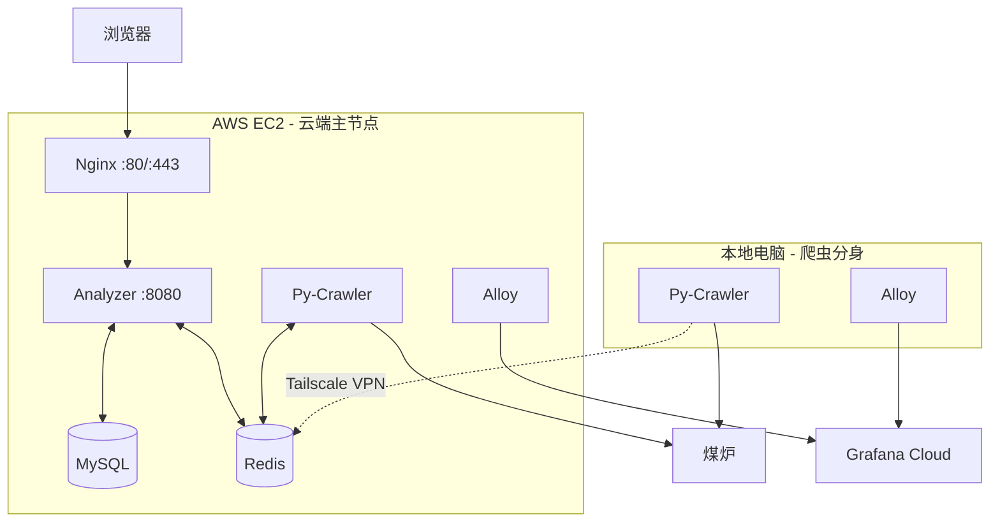
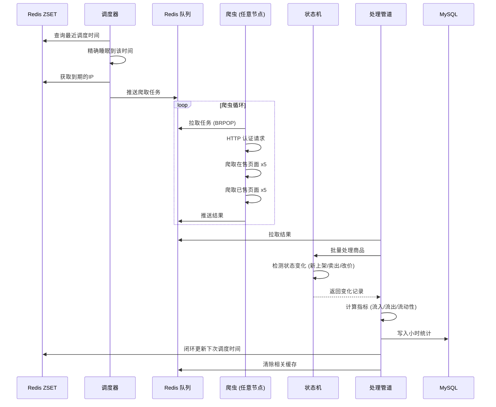

# Anime Hot

**[English](README.en.md)** | **[日本語](README.ja.md)** | **[中文](README.md)**

[](https://go.dev/)
[](https://python.org/)
[](https://github.com/KahanaT800/animehot/actions/workflows/ci.yml)
[](https://github.com/KahanaT800/animehot/actions/workflows/deploy.yml)
[](LICENSE)
[](https://anime-hot.com)

你的二次元婆罗门论战利器：实时追踪日本二手市场上各大动漫IP的流动性指数，看看谁在入坑、谁在退坑！

## 这是什么？

作为一个二次元婆罗门，你是不是也想知道：
- 哪些番才是正在的国民级IP
- 哪些番的粉丝开始退坑了？二手市场被周边淹没...（会赢的！）
- 入手某个IP的周边，是抄底良机还是高位接盘？
- 鬼马咒万家到底谁是德不配位（

### [🔥 立刻看看哪些番最火 →](https://anime-hot.com)

**Anime Hot** 通过分析 [煤炉](https://jp.mercari.com/)（日本最大的二手交易平台）上的动漫周边交易数据，计算每个IP的"流动性指数"，帮你洞察市场趋势！

### 核心指标

| 指标 | 计算公式 | 人话解释 |
|------|---------|---------|
| **流入量** | 每小时新上架数 | 有多少人在出周边（可能在退坑） |
| **流出量** | 每小时成交数 | 有多少人在收周边 |
| **流动性指数** | 流出 / 流入 | 越大越强！ |
| **热度分** | (Out+1)/(In+1) × log(Out+1) | 综合热度评分 |

### 能干啥？

- **追番风向标**: 哪些番正在出圈？哪些番凉了？
- **韭菜预警器**: 某IP周边价格虚高？还是捡漏良机？
- **退坑观察站**: 大量周边涌入二手市场，粉丝们这是怎么了...（我打宿傩？！）

## 截图预览

<p align="center">
  
  <br>
  <em>实时热番排行榜，看看谁是本季霸权！</em>
</p>

<p align="center">
  
  <br>
  <em>单个IP的详细流动性分析</em>
</p>

<p align="center">
  
  <br>
  <em>Grafana Cloud 监控面板（运维狂喜）</em>
</p>

## 系统架构

### 整体架构



### 任务流程



## 技术栈

- **后端**: Go 1.24+ (Gin + GORM)
- **爬虫**: Python 3.11+ (HTTP 认证 + Playwright 降级)
- **消息格式**: Protocol Buffers (protojson)
- **数据库**: MySQL 8.0 + Redis 7.x
- **监控**: Prometheus + Grafana Cloud + Alloy

## 快速开始

### 前置要求

- Docker & Docker Compose
- Go 1.24+

### 本地开发

```bash
# 克隆仓库
git clone https://github.com/KahanaT800/animehot
cd animehot

# 复制环境配置
cp .env.example .env

# 启动基础设施 (MySQL + Redis)
make dev-deps

# 启动分析器 (终端1)
make dev-analyzer

# 启动爬虫 (终端2)
make dev-crawler

# 导入测试IP
make api-import-run FILE=data/ips.json
```

### Docker 部署

```bash
# 全家桶 (MySQL + Redis + Analyzer + Crawler)
make docker-up

# 轻量模式 (不带爬虫，纯测试用)
make docker-light-up

# 带监控 (Grafana Cloud)
make docker-up-monitoring

# 查看日志
make docker-logs
```

## 生产部署

### EC2 初始化

```bash
# 1. 安装 Docker
sudo yum update -y
sudo yum install -y docker git
sudo systemctl start docker && sudo systemctl enable docker
sudo usermod -aG docker ec2-user

# 2. 安装 Docker Compose
sudo curl -L "https://github.com/docker/compose/releases/latest/download/docker-compose-linux-x86_64" \
  -o /usr/local/bin/docker-compose
sudo chmod +x /usr/local/bin/docker-compose

# 3. 安装 Tailscale (用于分布式爬虫)
curl -fsSL https://tailscale.com/install.sh | sh
sudo tailscale up

# 4. 克隆并配置
git clone https://github.com/lyc0603/animetop.git
cd animetop
cp .env.example .env
# 编辑 .env 填入生产配置

# 5. 初始化 SSL 并启动服务
export DOMAIN_NAME=your-domain.com
export LETSENCRYPT_EMAIL=admin@your-domain.com
./deploy/certbot/init-letsencrypt.sh
```

### 安全检查清单

- [ ] MySQL 端口 (3306) 没有对外暴露
- [ ] Redis 只能通过 Tailscale VPN 访问
- [ ] Admin API 用 `ADMIN_API_KEY` 保护
- [ ] 强制 HTTPS + HSTS
- [ ] `/metrics` 端点禁止外部访问

## 分布式爬虫

在本地电脑跑个爬虫分身，提升爬取效率！

### 前置准备

1. EC2 和本地电脑都装上 [Tailscale](https://tailscale.com/)
2. 加入同一个 Tailnet
3. 记下 EC2 的 Tailscale IP (类似 `100.99.127.100`)

### 本地爬虫配置

```bash
# 1. 克隆仓库
git clone https://github.com/lyc0603/animetop.git
cd animetop

# 2. 创建爬虫配置
cp .env.crawler.example .env.crawler

# 3. 编辑 .env.crawler
#    - 把 REDIS_REMOTE_ADDR 改成 EC2 的 Tailscale IP
#    - 配置 Grafana Cloud 凭据 (可选)

# 4. 启动爬虫
docker compose -f docker-compose.crawler.yml up -d

# 5. 带监控启动 (可选)
docker compose -f docker-compose.crawler.yml --profile monitoring up -d

# 6. 查看日志
docker logs -f animehot-py-crawler-local
```

### 环境变量 (.env.crawler)

```bash
# Redis 连接 (EC2 的 Tailscale IP)
REDIS_REMOTE_ADDR=100.99.127.100:6379

# 爬虫设置
BROWSER_MAX_CONCURRENCY=3
MAX_TASKS=50

# Grafana Cloud (可选)
GRAFANA_CLOUD_PROM_REMOTE_WRITE_URL=https://prometheus-xxx.grafana.net/api/prom/push
GRAFANA_CLOUD_PROM_USERNAME=123456
GRAFANA_CLOUD_PROM_API_KEY=glc_xxx
HOSTNAME=animehot-local
```

## 监控

### Grafana Cloud 配置

1. 注册 [Grafana Cloud](https://grafana.com/products/cloud/) 账号
2. 获取 Prometheus remote write 凭据
3. 获取 Loki 凭据 (日志用)
4. 在 `.env` 中配置:

```bash
GRAFANA_CLOUD_PROM_REMOTE_WRITE_URL=https://prometheus-xxx.grafana.net/api/prom/push
GRAFANA_CLOUD_PROM_USERNAME=your_username
GRAFANA_CLOUD_PROM_API_KEY=glc_xxx

GRAFANA_CLOUD_LOKI_URL=https://logs-xxx.grafana.net/loki/api/v1/push
GRAFANA_CLOUD_LOKI_USERNAME=your_username
GRAFANA_CLOUD_LOKI_API_KEY=glc_xxx
```

5. 带监控配置启动:

```bash
docker compose -f docker-compose.prod.yml --profile monitoring up -d
```

### 导入仪表盘

从 `deploy/grafana/dashboards/animehot-business.json` 导入业务仪表盘:

| 区域 | 面板 |
|------|------|
| 概览 | 服务状态、活跃任务、队列等待 |
| EC2 爬虫 | 延迟、活动情况 |
| 本地爬虫 | 延迟、活动情况 |
| 对比 | 延迟对比、请求速率 |
| 任务队列 | 吞吐量、队列状态 |

### 关键指标

| 指标 | 说明 |
|------|------|
| `up{job="animetop-*"}` | 服务健康状态 |
| `mercari_crawler_tasks_in_progress` | 正在处理的任务数 |
| `mercari_crawler_api_request_duration_seconds` | API 请求延迟 |
| `mercari_crawler_auth_mode` | 认证模式 (0=HTTP, 1=Browser) |
| `animetop_scheduler_tasks_pending_in_queue` | 队列深度 |

## API 接口

| 方法 | 路径 | 说明 |
|------|------|------|
| GET | `/health` | 健康检查 |
| GET | `/api/v1/ips` | 获取所有追踪的IP列表 |
| GET | `/api/v1/ips/:id` | 获取IP详情 |
| GET | `/api/v1/ips/:id/liquidity` | 获取流动性数据 |
| GET | `/api/v1/ips/:id/stats/hourly` | 获取小时统计 |
| GET | `/api/v1/ips/:id/items` | 获取商品列表 |
| GET | `/api/v1/leaderboard` | 获取排行榜 |
| GET | `/api/v1/system/status` | 系统状态 |
| POST | `/api/v1/admin/import` | 导入IP (需要API密钥) |

### 排行榜 API

```bash
# 获取过去24小时热度前10的IP
curl "http://localhost:8080/api/v1/leaderboard?type=hot&hours=24&limit=10"
```

参数:
- `type`: `hot` | `inflow` | `outflow`
- `hours`: 1-168 (时间窗口)
- `limit`: 1-100

响应示例:
```json
{
  "code": 0,
  "data": {
    "type": "hot",
    "hours": 24,
    "time_range": {
      "start": "2026-01-17T17:00:00+09:00",
      "end": "2026-01-18T17:00:00+09:00"
    },
    "items": [
      {
        "rank": 1,
        "ip_id": 11,
        "ip_name": "鬼灭之刃",
        "inflow": 355,
        "outflow": 28,
        "score": 0.2634
      }
    ]
  }
}
```

### Admin API

```bash
# 导入IP (生产环境需要 X-API-Key 头)
curl -X POST http://localhost:8080/api/v1/admin/import \
  -H "Content-Type: application/json" \
  -H "X-API-Key: your_api_key" \
  -d @data/ips.json
```

## 配置

### 关键环境变量

```bash
# 域名 (SSL用)
DOMAIN_NAME=anime-hot.com
LETSENCRYPT_EMAIL=admin@anime-hot.com

# 安全
ADMIN_API_KEY=your_secure_api_key

# 数据库
MYSQL_PASSWORD=your_secure_password

# 调度器 (ZSET 持久化 + 精确睡眠)
SCHEDULER_BASE_INTERVAL=2h      # 基础爬取间隔
SCHEDULER_MIN_INTERVAL=1h       # 最小间隔 (热门IP)
SCHEDULER_MAX_INTERVAL=2h       # 最大间隔

# 爬虫
BROWSER_MAX_CONCURRENCY=2       # 同时开的浏览器标签页数
SCHEDULER_PAGES_ON_SALE=5       # 每次爬取在售页数
SCHEDULER_PAGES_SOLD=5          # 每次爬取已售页数
```

### 动态间隔调整

调度器会根据活跃度自动调整爬取频率 (闭环更新到 Redis ZSET):

| 条件 | 动作 |
|------|------|
| 流入 > 100×页数 或 流出 > 100×页数 | 加速 (-15分钟) |
| 流入 < 50×页数 且 流出 < 3×页数 | 减速 (+15分钟) |
| 其他情况 | 向2小时回归 |

默认 5+5 页配置下:
- **加速条件**: 流入 > 500 或 流出 > 500
- **减速条件**: 流入 < 250 且 流出 < 15

## Make 命令

```bash
# 构建
make build              # 构建所有 Go 二进制
make test               # 跑测试
make lint               # 跑 linter

# Docker - 全家桶
make docker-up          # 启动所有服务
make docker-down        # 停止所有服务
make docker-logs        # 查看日志

# Docker - 轻量版 (不带爬虫)
make docker-light-up    # 启动 MySQL + Redis + Analyzer
make docker-light-down  # 停止轻量服务

# Docker - 带监控
make docker-up-monitoring    # 启动全部 + Grafana Alloy
make docker-down-monitoring  # 停止全部 + 监控

# 开发
make dev-deps           # 只启动 MySQL & Redis
make dev-analyzer       # 本地跑 Analyzer
make dev-crawler        # 本地跑 Crawler

# 数据导入
make api-import-run FILE=data/ips.json

# 灰度测试
make grayscale-start    # 全家桶 + 测试IP
make grayscale-verify   # 验证数据流
make grayscale-clean    # 清理
```

## 项目结构

```
animetop/
├── cmd/
│   ├── analyzer/          # API + 调度器 + 处理管道
│   ├── crawler/           # 无头浏览器爬虫
│   └── import/            # IP数据导入工具
├── internal/
│   ├── analyzer/          # 核心分析逻辑
│   │   ├── pipeline.go    # 结果处理
│   │   ├── state_machine.go  # 商品状态追踪
│   │   └── cache.go       # 缓存管理
│   ├── api/               # HTTP 接口
│   ├── config/            # 配置
│   ├── crawler/           # Go 爬虫 (deprecated)
│   ├── model/             # 数据库模型 (GORM)
│   ├── pkg/               # 公共工具库
│   │   ├── metrics/       # Prometheus 指标
│   │   ├── ratelimit/     # 限流
│   │   └── redisqueue/    # 可靠队列
│   └── scheduler/         # IP 调度
├── py-crawler/            # Python 爬虫 (私有子模块)
├── deploy/
│   ├── nginx/             # Nginx 配置
│   ├── certbot/           # SSL 初始化
│   ├── alloy/             # Grafana Alloy 配置
│   └── grafana/           # 仪表盘 JSON
├── proto/                 # Protocol Buffers
├── migrations/            # 数据库迁移
├── data/                  # 测试数据 (IP JSON)
├── docker-compose.yml           # 开发环境
├── docker-compose.prod.yml      # 生产环境 (EC2)
└── docker-compose.crawler.yml   # 本地爬虫节点
```

## 数据库设计

### ip_metadata
存储 IP（知识产权/动漫作品）信息

| 字段 | 类型 | 说明 |
|------|------|------|
| id | INT | 主键 |
| name | VARCHAR | 日文名 |
| name_en | VARCHAR | 英文名 |
| category | VARCHAR | 分类 (anime, game 等) |
| weight | FLOAT | 调度优先级 |

### ip_stats_hourly
每个IP的小时统计

| 字段 | 类型 | 说明 |
|------|------|------|
| ip_id | INT | 外键关联 ip_metadata |
| hour_bucket | DATETIME | 小时时间戳 |
| inflow | INT | 新上架数 |
| outflow | INT | 成交数 |
| liquidity_index | FLOAT | 流出 / 流入 |

### item_snapshots
单个商品追踪

| 字段 | 类型 | 说明 |
|------|------|------|
| source_id | VARCHAR | 煤炉商品ID |
| ip_id | INT | 关联的IP |
| status | ENUM | on_sale, sold |
| price | INT | 价格 (日元) |
| first_seen | DATETIME | 首次抓取时间 |
| last_seen | DATETIME | 最后抓取时间 |

## 常见问题排查

### 爬虫不处理任务

```bash
# 检查队列深度
redis-cli LLEN animetop:queue:tasks

# 检查爬虫日志
docker logs animehot-py-crawler-local --tail 100

# 检查爬虫健康状态
curl localhost:8081/health

# 检查认证模式
curl localhost:2112/metrics | grep mercari_crawler_auth_mode
```

### Grafana 看不到指标

```bash
# 检查 metrics 端点
curl localhost:2112/metrics | head -20

# 检查 Alloy 日志
docker logs animehot-alloy-local --tail 50

# 验证 up 指标
# 在 Grafana: up{job="animetop-crawler-local"}
```

### EC2 CPU 爆了

```bash
# 检查容器资源使用
docker stats --no-stream

# 检查活跃爬取任务
curl localhost:2112/metrics | grep animetop_active_tasks

# 降低并发数
# 编辑 .env 中的 BROWSER_MAX_CONCURRENCY
```

## 开源协议

MIT

## 致谢

- [煤炉](https://jp.mercari.com/) - 数据来源
- [go-rod](https://github.com/go-rod/rod) - 浏览器自动化
- [Gin](https://github.com/gin-gonic/gin) - Web 框架
- [Grafana](https://grafana.com/) - 监控
- [Tailscale](https://tailscale.com/) - 分布式爬虫 VPN
