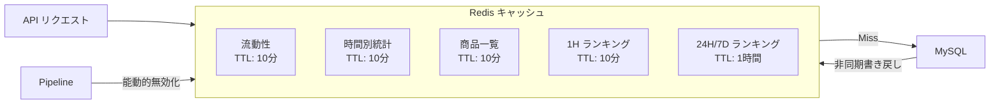

# Anime Hot API リファレンス

## 概要

Anime Hot API は Gin フレームワークで構築された RESTful API で、IP 流動性データの照会と管理を提供します。

**Base URL**: `http://localhost:8080`

**レスポンス形式**: すべてのレスポンスは統一された JSON 形式を使用：

```json
{
  "code": 0,
  "message": "success",
  "data": {}
}
```

- `code: 0` は成功を示す
- `code: 0以外` はエラーを示す（値は HTTP ステータスコード）

---

## 目次

1. [ヘルスチェック](#1-ヘルスチェック)
2. [IP 管理](#2-ip-管理)
3. [統計・分析](#3-統計分析)
4. [アラート管理](#4-アラート管理)
5. [システム状態](#5-システム状態)
6. [管理インターフェース](#6-管理インターフェース)
7. [エラーハンドリング](#7-エラーハンドリング)
8. [認証・認可](#8-認証認可)
9. [キャッシュ戦略](#9-キャッシュ戦略)

---

## 1. ヘルスチェック

### GET /health

サービスの健全性を確認します。

**レスポンス例**:

```json
{
  "status": "ok",
  "time": "2026-01-21T14:30:00+09:00"
}
```

---

## 2. IP 管理

### 2.1 IP 一覧取得

```
GET /api/v1/ips
```

**クエリパラメータ**:

| パラメータ | 型 | デフォルト | 説明 |
|------------|------|--------|------|
| page | int | 1 | ページ番号 |
| page_size | int | 20 | 1ページあたりの件数 (最大: 100) |
| status | string | - | ステータスフィルタ (active/paused/deleted) |
| category | string | - | カテゴリフィルタ |
| keyword | string | - | あいまい検索 (name/name_en/name_cn) |

**レスポンス例**:

```json
{
  "code": 0,
  "data": [
    {
      "id": 11,
      "name": "鬼滅の刃",
      "name_en": "Demon Slayer",
      "name_cn": "鬼灭之刃",
      "category": "anime",
      "tags": ["shounen", "action"],
      "weight": 1.5,
      "status": "active",
      "last_crawled_at": "2026-01-21T14:00:00+09:00"
    }
  ],
  "total": 50,
  "page": 1,
  "page_size": 20
}
```

---

### 2.2 単一 IP 取得

```
GET /api/v1/ips/:id
```

**パスパラメータ**:

| パラメータ | 型 | 説明 |
|------------|------|------|
| id | uint64 | IP ID |

**レスポンス例**:

```json
{
  "code": 0,
  "data": {
    "id": 11,
    "name": "鬼滅の刃",
    "name_en": "Demon Slayer",
    "name_cn": "鬼灭之刃",
    "category": "anime",
    "tags": ["shounen", "action"],
    "image_url": "https://example.com/image.jpg",
    "external_id": "mal:38000",
    "weight": 1.5,
    "status": "active",
    "notes": "",
    "last_crawled_at": "2026-01-21T14:00:00+09:00",
    "created_at": "2026-01-01T00:00:00+09:00",
    "updated_at": "2026-01-21T14:00:00+09:00"
  }
}
```

---

### 2.3 IP 作成

```
POST /api/v1/ips
```

**リクエストボディ**:

```json
{
  "name": "鬼滅の刃",
  "name_en": "Demon Slayer",
  "name_cn": "鬼灭之刃",
  "category": "anime",
  "tags": ["shounen", "action"],
  "image_url": "https://example.com/image.jpg",
  "external_id": "mal:38000",
  "weight": 1.0,
  "notes": ""
}
```

| フィールド | 型 | 必須 | 説明 |
|------------|------|------|------|
| name | string | はい | 日本語名（検索キーワード） |
| name_en | string | いいえ | 英語名 |
| name_cn | string | いいえ | 中国語名 |
| category | string | いいえ | カテゴリ |
| tags | []string | いいえ | タグ配列 |
| image_url | string | いいえ | 画像 URL |
| external_id | string | いいえ | 外部 ID |
| weight | float | いいえ | 重み（デフォルト 1.0） |
| notes | string | いいえ | メモ |

**レスポンス**: HTTP 201 Created

---

### 2.4 IP 更新

```
PUT /api/v1/ips/:id
```

**リクエストボディ**: 作成と同じ、すべてのフィールドはオプション

**副作用**:
- スケジューラの重み/ステータスを更新
- 関連キャッシュを無効化

---

### 2.5 IP 削除

```
DELETE /api/v1/ips/:id
```

**説明**: 論理削除、ステータスを `deleted` に設定

**レスポンス例**:

```json
{
  "code": 0,
  "data": {
    "id": 11,
    "deleted": true
  }
}
```

---

### 2.6 クロールトリガー

```
POST /api/v1/ips/:id/trigger
```

**説明**: 手動でクロールをトリガー、通常のスケジュールをバイパス

**レスポンス例**:

```json
{
  "code": 0,
  "data": {
    "id": 11,
    "triggered": true
  }
}
```

---

## 3. 統計・分析

### 3.1 流動性データ取得

```
GET /api/v1/ips/:id/liquidity
```

**レスポンス例**:

```json
{
  "code": 0,
  "data": {
    "ip_id": 11,
    "ip_name": "鬼滅の刃",
    "on_sale_inflow": 120,
    "on_sale_outflow": 45,
    "on_sale_total": 350,
    "sold_inflow": 0,
    "sold_total": 1200,
    "liquidity_index": 0.375,
    "hot_score": 2.634,
    "updated_at": "2026-01-21T14:00:00+09:00",
    "from_cache": true
  }
}
```

**フィールド説明**:

| フィールド | 説明 |
|------------|------|
| on_sale_inflow | 新規出品数 |
| on_sale_outflow | 成約数 |
| liquidity_index | 流動性指数 (outflow/inflow) |
| hot_score | ホットスコア |
| from_cache | キャッシュからか |

**Hot Score 計算式**:

```
H = (outflow+1)/(inflow+1) × log(outflow+1)
```

---

### 3.2 時間別統計取得

```
GET /api/v1/ips/:id/stats/hourly
```

**クエリパラメータ**:

| パラメータ | 型 | デフォルト | 説明 |
|------------|------|--------|------|
| start | string | - | 開始時刻 (RFC3339 または YYYY-MM-DD) |
| end | string | - | 終了時刻 |
| limit | int | 24 | 取得件数 (最大: 168) |

**レスポンス例**:

```json
{
  "code": 0,
  "data": {
    "ip_id": 11,
    "ip_name": "鬼滅の刃",
    "stats": [
      {
        "hour_bucket": "2026-01-21T14:00:00+09:00",
        "inflow": 25,
        "outflow": 8,
        "liquidity_index": 0.32,
        "active_count": 350,
        "avg_price": 3500,
        "min_price": 500,
        "max_price": 15000
      }
    ],
    "count": 24,
    "from_cache": false
  }
}
```

---

### 3.3 商品一覧取得

```
GET /api/v1/ips/:id/items
```

**クエリパラメータ**:

| パラメータ | 型 | デフォルト | 説明 |
|------------|------|--------|------|
| status | string | - | ステータス (on_sale/sold) |
| page | int | 1 | ページ番号 |
| page_size | int | 50 | 1ページあたりの件数 (最大: 100) |

**レスポンス例**:

```json
{
  "code": 0,
  "data": [
    {
      "id": 12345,
      "source_id": "m1234567890",
      "title": "鬼滅の刃 フィギュア 炭治郎",
      "price": 3500,
      "status": "on_sale",
      "image_url": "https://static.mercdn.net/...",
      "item_url": "https://jp.mercari.com/item/m1234567890",
      "first_seen_at": "2026-01-20T10:00:00+09:00",
      "last_seen_at": "2026-01-21T14:00:00+09:00"
    }
  ],
  "total": 350,
  "page": 1,
  "page_size": 50,
  "from_cache": true
}
```

---

### 3.4 ランキング取得

```
GET /api/v1/leaderboard
```

**クエリパラメータ**:

| パラメータ | 型 | デフォルト | 説明 |
|------------|------|--------|------|
| type | string | hot | ランキング種別 (hot/inflow/outflow) |
| hours | int | 24 | 時間窓 (1/24/168) |
| limit | int | 10 | 取得件数 (最大: 100) |

**レスポンス例**:

```json
{
  "code": 0,
  "data": {
    "type": "hot",
    "hours": 24,
    "time_range": {
      "start": "2026-01-20T00:00:00+09:00",
      "end": "2026-01-21T00:00:00+09:00"
    },
    "items": [
      {
        "rank": 1,
        "ip_id": 11,
        "ip_name": "鬼滅の刃",
        "ip_name_en": "Demon Slayer",
        "inflow": 355,
        "outflow": 128,
        "score": 2.634
      }
    ],
    "count": 10,
    "from_cache": true,
    "cached_at": "2026-01-21T14:30:00+09:00"
  }
}
```

**時間窓とデータソース**:

| hours | データソース | 説明 |
|-------|--------------|------|
| 1-23 | ip_stats_hourly | 現在時を除外 |
| 24 | ip_stats_daily | 昨日のデータ |
| 168 | ip_stats_weekly | 先週のデータ |

---

## 4. アラート管理

### 4.1 アラート一覧取得

```
GET /api/v1/alerts
```

**クエリパラメータ**:

| パラメータ | 型 | デフォルト | 説明 |
|------------|------|--------|------|
| ip_id | uint64 | - | IP でフィルタ |
| severity | string | - | 重大度 (info/warning/critical) |
| acknowledged | bool | false | 確認済みか |
| page | int | 1 | ページ番号 |
| page_size | int | 20 | 1ページあたりの件数 |

**レスポンス例**:

```json
{
  "code": 0,
  "data": [
    {
      "id": 1,
      "ip_id": 11,
      "ip_name": "鬼滅の刃",
      "alert_type": "high_outflow",
      "severity": "warning",
      "message": "異常な高出荷量: 128 (閾値: 50)",
      "metric_value": 128,
      "threshold_value": 50,
      "hour_bucket": "2026-01-21T14:00:00+09:00",
      "acknowledged": false,
      "created_at": "2026-01-21T14:05:00+09:00"
    }
  ],
  "total": 5,
  "page": 1,
  "page_size": 20
}
```

**アラート種別**:

| alert_type | 説明 |
|------------|------|
| high_outflow | 高出荷量 |
| low_liquidity | 低流動性 |
| high_liquidity | 高流動性 |
| price_drop | 価格下落 |
| surge | 異常流入 |

---

### 4.2 アラート確認

```
POST /api/v1/alerts/:id/ack
```

**レスポンス例**:

```json
{
  "code": 0,
  "data": {
    "id": 1,
    "acknowledged": true,
    "acknowledged_at": "2026-01-21T15:00:00+09:00"
  }
}
```

---

## 5. システム状態

### 5.1 システム状態取得

```
GET /api/v1/system/status
```

**レスポンス例**:

```json
{
  "code": 0,
  "data": {
    "status": "healthy",
    "timestamp": "2026-01-21T14:30:00+09:00",
    "database": {
      "connected": true,
      "ip_count": 50
    },
    "pipeline": {
      "running": true,
      "processed": 1250,
      "failed": 3,
      "success_rate": 99.76
    },
    "scheduler": {
      "running": true,
      "total_ips": 50,
      "overdue_ips": 2
    },
    "stats": {
      "unacked_alerts": 5,
      "active_items": 12500
    }
  }
}
```

---

### 5.2 スケジューラ状態取得

```
GET /api/v1/system/scheduler
```

**レスポンス例**:

```json
{
  "code": 0,
  "data": {
    "running": true,
    "total_ips": 50,
    "overdue_ips": 2,
    "schedules": [
      {
        "ip_id": 11,
        "ip_name": "鬼滅の刃",
        "next_schedule": "2026-01-21T16:00:00+09:00",
        "time_until": "1h30m",
        "is_overdue": false
      }
    ]
  }
}
```

---

## 6. 管理インターフェース

すべての `/api/v1/admin/*` エンドポイントは `X-API-Key` ヘッダーが必要です（`AdminAPIKey` が設定されている場合）。

### 6.1 IP 一括インポート

```
POST /api/v1/admin/import
```

**ヘッダー**:

```
X-API-Key: your-api-key
Content-Type: application/json
```

**リクエストボディ**:

```json
{
  "ips": [
    {
      "name": "鬼滅の刃",
      "name_en": "Demon Slayer",
      "category": "anime",
      "tags": ["shounen"],
      "weight": 1.5
    }
  ],
  "upsert": true
}
```

**レスポンス例**:

```json
{
  "code": 0,
  "data": {
    "created": 5,
    "updated": 3,
    "failed": 1,
    "details": [
      {"name": "鬼滅の刃", "status": "updated", "id": 11},
      {"name": "新IP", "status": "created", "id": 51},
      {"name": "", "status": "failed", "error": "name is required"}
    ]
  }
}
```

---

### 6.2 日次アーカイブトリガー

```
POST /api/v1/admin/archive/daily?date=2026-01-20
```

時間別データを日次テーブルに集計します。

---

### 6.3 週次アーカイブトリガー

```
POST /api/v1/admin/archive/weekly?week_start=2026-01-13
```

日次データを週次テーブルに集計します。

---

## 7. エラーハンドリング

**エラーレスポンス形式**:

```json
{
  "code": 400,
  "message": "invalid parameter: id must be positive"
}
```

**一般的なエラーコード**:

| Code | 説明 |
|------|------|
| 400 | リクエストパラメータエラー |
| 401 | 未認証（API Key が無効または不足） |
| 404 | リソースが存在しない |
| 500 | サーバー内部エラー |

---

## 8. 認証・認可

### 公開エンドポイント

認証不要：
- `/health`
- `/api/v1/ips/*`
- `/api/v1/alerts`
- `/api/v1/system/*`
- `/api/v1/leaderboard`

### 保護エンドポイント

`X-API-Key` ヘッダーが必要：
- `/api/v1/admin/*`

**認証方法**:

```bash
curl -X POST http://localhost:8080/api/v1/admin/import \
  -H "X-API-Key: your-secret-key" \
  -H "Content-Type: application/json" \
  -d '{"ips": [...]}'
```

**注意**: `ADMIN_API_KEY` 環境変数が設定されていない場合、管理エンドポイントは公開アクセス可能になります（開発モード）。

---

## 9. キャッシュ戦略



**キャッシュキー形式**:

| データ | Key Pattern | TTL |
|--------|-------------|-----|
| 流動性 | `animetop:ip:{id}:liquidity` | 10分 |
| 時間別統計 | `animetop:ip:{id}:hourly_stats:{limit}` | 10分 |
| 商品一覧 | `animetop:ip:{id}:items:{status}:{page}:{size}` | 10分 |
| 1H ランキング | `animetop:leaderboard:{type}:1` | 10分 |
| 24H/7D ランキング | `animetop:leaderboard:{type}:{hours}` | 1時間 |

**キャッシュ無効化トリガー**:
- Pipeline 処理完了後、対応する IP の詳細キャッシュを無効化
- Pipeline 処理完了後、1H ランキングキャッシュを無効化
