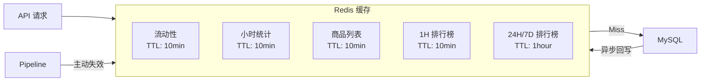

# Anime Hot API Reference

## Overview

Anime Hot API 基于 Gin 框架构建，提供 RESTful 接口用于 IP 流动性数据的查询和管理。

**Base URL**: `http://localhost:8080`

**响应格式**: 所有响应使用统一的 JSON 格式：

```json
{
  "code": 0,
  "message": "success",
  "data": {}
}
```

- `code: 0` 表示成功
- `code: 非0` 表示错误（值为 HTTP 状态码）

---

## 目录

1. [健康检查](#1-健康检查)
2. [IP 管理](#2-ip-管理)
3. [统计与分析](#3-统计与分析)
4. [告警管理](#4-告警管理)
5. [系统状态](#5-系统状态)
6. [管理接口](#6-管理接口)
7. [错误处理](#7-错误处理)
8. [认证与授权](#8-认证与授权)
9. [缓存策略](#9-缓存策略)

---

## 1. 健康检查

### GET /health

检查服务健康状态。

**响应示例**:

```json
{
  "status": "ok",
  "time": "2026-01-21T14:30:00+09:00"
}
```

---

## 2. IP 管理

### 2.1 获取 IP 列表

```
GET /api/v1/ips
```

**Query Parameters**:

| 参数 | 类型 | 默认值 | 说明 |
|------|------|--------|------|
| page | int | 1 | 页码 |
| page_size | int | 20 | 每页数量 (max: 100) |
| status | string | - | 状态过滤 (active/paused/deleted) |
| category | string | - | 分类过滤 |
| keyword | string | - | 模糊搜索 (name/name_en/name_cn) |

**响应示例**:

```json
{
  "code": 0,
  "data": [
    {
      "id": 11,
      "name": "鬼滅の刃",
      "name_en": "Demon Slayer",
      "name_cn": "鬼灭之刃",
      "category": "anime",
      "tags": ["shounen", "action"],
      "weight": 1.5,
      "status": "active",
      "last_crawled_at": "2026-01-21T14:00:00+09:00"
    }
  ],
  "total": 50,
  "page": 1,
  "page_size": 20
}
```

---

### 2.2 获取单个 IP

```
GET /api/v1/ips/:id
```

**Path Parameters**:

| 参数 | 类型 | 说明 |
|------|------|------|
| id | uint64 | IP ID |

**响应示例**:

```json
{
  "code": 0,
  "data": {
    "id": 11,
    "name": "鬼滅の刃",
    "name_en": "Demon Slayer",
    "name_cn": "鬼灭之刃",
    "category": "anime",
    "tags": ["shounen", "action"],
    "image_url": "https://example.com/image.jpg",
    "external_id": "mal:38000",
    "weight": 1.5,
    "status": "active",
    "notes": "",
    "last_crawled_at": "2026-01-21T14:00:00+09:00",
    "created_at": "2026-01-01T00:00:00+09:00",
    "updated_at": "2026-01-21T14:00:00+09:00"
  }
}
```

---

### 2.3 创建 IP

```
POST /api/v1/ips
```

**Request Body**:

```json
{
  "name": "鬼滅の刃",
  "name_en": "Demon Slayer",
  "name_cn": "鬼灭之刃",
  "category": "anime",
  "tags": ["shounen", "action"],
  "image_url": "https://example.com/image.jpg",
  "external_id": "mal:38000",
  "weight": 1.0,
  "notes": ""
}
```

| 字段 | 类型 | 必填 | 说明 |
|------|------|------|------|
| name | string | 是 | 日文名称 (搜索关键词) |
| name_en | string | 否 | 英文名称 |
| name_cn | string | 否 | 中文名称 |
| category | string | 否 | 分类 |
| tags | []string | 否 | 标签数组 |
| image_url | string | 否 | 图片 URL |
| external_id | string | 否 | 外部 ID |
| weight | float | 否 | 权重 (默认 1.0) |
| notes | string | 否 | 备注 |

**响应**: HTTP 201 Created

---

### 2.4 更新 IP

```
PUT /api/v1/ips/:id
```

**Request Body**: 同创建，所有字段可选

**副作用**:
- 更新调度器权重/状态
- 失效相关缓存

---

### 2.5 删除 IP

```
DELETE /api/v1/ips/:id
```

**说明**: 软删除，将状态设为 `deleted`

**响应示例**:

```json
{
  "code": 0,
  "data": {
    "id": 11,
    "deleted": true
  }
}
```

---

### 2.6 触发爬取

```
POST /api/v1/ips/:id/trigger
```

**说明**: 手动触发爬取，绕过正常调度周期

**响应示例**:

```json
{
  "code": 0,
  "data": {
    "id": 11,
    "triggered": true
  }
}
```

---

## 3. 统计与分析

### 3.1 获取流动性数据

```
GET /api/v1/ips/:id/liquidity
```

**响应示例**:

```json
{
  "code": 0,
  "data": {
    "ip_id": 11,
    "ip_name": "鬼滅の刃",
    "on_sale_inflow": 120,
    "on_sale_outflow": 45,
    "on_sale_total": 350,
    "sold_inflow": 0,
    "sold_total": 1200,
    "liquidity_index": 0.375,
    "hot_score": 2.634,
    "updated_at": "2026-01-21T14:00:00+09:00",
    "from_cache": true
  }
}
```

**字段说明**:

| 字段 | 说明 |
|------|------|
| on_sale_inflow | 新上架数量 |
| on_sale_outflow | 成交数量 |
| liquidity_index | 流动性指数 (outflow/inflow) |
| hot_score | 热度分数 |
| from_cache | 是否来自缓存 |

**Hot Score 公式**:

```
H = (outflow+1)/(inflow+1) × log(outflow+1)
```

---

### 3.2 获取小时统计

```
GET /api/v1/ips/:id/stats/hourly
```

**Query Parameters**:

| 参数 | 类型 | 默认值 | 说明 |
|------|------|--------|------|
| start | string | - | 开始时间 (RFC3339 或 YYYY-MM-DD) |
| end | string | - | 结束时间 |
| limit | int | 24 | 返回数量 (max: 168) |

**响应示例**:

```json
{
  "code": 0,
  "data": {
    "ip_id": 11,
    "ip_name": "鬼滅の刃",
    "stats": [
      {
        "hour_bucket": "2026-01-21T14:00:00+09:00",
        "inflow": 25,
        "outflow": 8,
        "liquidity_index": 0.32,
        "active_count": 350,
        "avg_price": 3500,
        "min_price": 500,
        "max_price": 15000
      }
    ],
    "count": 24,
    "from_cache": false
  }
}
```

---

### 3.3 获取商品列表

```
GET /api/v1/ips/:id/items
```

**Query Parameters**:

| 参数 | 类型 | 默认值 | 说明 |
|------|------|--------|------|
| status | string | - | 状态 (on_sale/sold) |
| page | int | 1 | 页码 |
| page_size | int | 50 | 每页数量 (max: 100) |

**响应示例**:

```json
{
  "code": 0,
  "data": [
    {
      "id": 12345,
      "source_id": "m1234567890",
      "title": "鬼滅の刃 フィギュア 炭治郎",
      "price": 3500,
      "status": "on_sale",
      "image_url": "https://static.mercdn.net/...",
      "item_url": "https://jp.mercari.com/item/m1234567890",
      "first_seen_at": "2026-01-20T10:00:00+09:00",
      "last_seen_at": "2026-01-21T14:00:00+09:00"
    }
  ],
  "total": 350,
  "page": 1,
  "page_size": 50,
  "from_cache": true
}
```

---

### 3.4 获取排行榜

```
GET /api/v1/leaderboard
```

**Query Parameters**:

| 参数 | 类型 | 默认值 | 说明 |
|------|------|--------|------|
| type | string | hot | 排行类型 (hot/inflow/outflow) |
| hours | int | 24 | 时间窗口 (1/24/168) |
| limit | int | 10 | 返回数量 (max: 100) |

**响应示例**:

```json
{
  "code": 0,
  "data": {
    "type": "hot",
    "hours": 24,
    "time_range": {
      "start": "2026-01-20T00:00:00+09:00",
      "end": "2026-01-21T00:00:00+09:00"
    },
    "items": [
      {
        "rank": 1,
        "ip_id": 11,
        "ip_name": "鬼滅の刃",
        "ip_name_en": "Demon Slayer",
        "inflow": 355,
        "outflow": 128,
        "score": 2.634
      }
    ],
    "count": 10,
    "from_cache": true,
    "cached_at": "2026-01-21T14:30:00+09:00"
  }
}
```

**时间窗口与数据源**:

| hours | 数据源 | 说明 |
|-------|--------|------|
| 1-23 | ip_stats_hourly | 排除当前小时 |
| 24 | ip_stats_daily | 昨日数据 |
| 168 | ip_stats_weekly | 上周数据 |

---

## 4. 告警管理

### 4.1 获取告警列表

```
GET /api/v1/alerts
```

**Query Parameters**:

| 参数 | 类型 | 默认值 | 说明 |
|------|------|--------|------|
| ip_id | uint64 | - | 按 IP 过滤 |
| severity | string | - | 严重程度 (info/warning/critical) |
| acknowledged | bool | false | 是否已确认 |
| page | int | 1 | 页码 |
| page_size | int | 20 | 每页数量 |

**响应示例**:

```json
{
  "code": 0,
  "data": [
    {
      "id": 1,
      "ip_id": 11,
      "ip_name": "鬼滅の刃",
      "alert_type": "high_outflow",
      "severity": "warning",
      "message": "异常高出货量: 128 (阈值: 50)",
      "metric_value": 128,
      "threshold_value": 50,
      "hour_bucket": "2026-01-21T14:00:00+09:00",
      "acknowledged": false,
      "created_at": "2026-01-21T14:05:00+09:00"
    }
  ],
  "total": 5,
  "page": 1,
  "page_size": 20
}
```

**告警类型**:

| alert_type | 说明 |
|------------|------|
| high_outflow | 高出货量 |
| low_liquidity | 低流动性 |
| high_liquidity | 高流动性 |
| price_drop | 价格下跌 |
| surge | 异常涌入 |

---

### 4.2 确认告警

```
POST /api/v1/alerts/:id/ack
```

**响应示例**:

```json
{
  "code": 0,
  "data": {
    "id": 1,
    "acknowledged": true,
    "acknowledged_at": "2026-01-21T15:00:00+09:00"
  }
}
```

---

## 5. 系统状态

### 5.1 获取系统状态

```
GET /api/v1/system/status
```

**响应示例**:

```json
{
  "code": 0,
  "data": {
    "status": "healthy",
    "timestamp": "2026-01-21T14:30:00+09:00",
    "database": {
      "connected": true,
      "ip_count": 50
    },
    "pipeline": {
      "running": true,
      "processed": 1250,
      "failed": 3,
      "success_rate": 99.76
    },
    "scheduler": {
      "running": true,
      "total_ips": 50,
      "overdue_ips": 2
    },
    "stats": {
      "unacked_alerts": 5,
      "active_items": 12500
    }
  }
}
```

---

### 5.2 获取调度器状态

```
GET /api/v1/system/scheduler
```

**响应示例**:

```json
{
  "code": 0,
  "data": {
    "running": true,
    "total_ips": 50,
    "overdue_ips": 2,
    "schedules": [
      {
        "ip_id": 11,
        "ip_name": "鬼滅の刃",
        "next_schedule": "2026-01-21T16:00:00+09:00",
        "time_until": "1h30m",
        "is_overdue": false
      }
    ]
  }
}
```

---

## 6. 管理接口

所有 `/api/v1/admin/*` 接口需要 `X-API-Key` 头（如果配置了 `AdminAPIKey`）。

### 6.1 批量导入 IP

```
POST /api/v1/admin/import
```

**Headers**:

```
X-API-Key: your-api-key
Content-Type: application/json
```

**Request Body**:

```json
{
  "ips": [
    {
      "name": "鬼滅の刃",
      "name_en": "Demon Slayer",
      "category": "anime",
      "tags": ["shounen"],
      "weight": 1.5
    }
  ],
  "upsert": true
}
```

**响应示例**:

```json
{
  "code": 0,
  "data": {
    "created": 5,
    "updated": 3,
    "failed": 1,
    "details": [
      {"name": "鬼滅の刃", "status": "updated", "id": 11},
      {"name": "新IP", "status": "created", "id": 51},
      {"name": "", "status": "failed", "error": "name is required"}
    ]
  }
}
```

---

### 6.2 触发日归档

```
POST /api/v1/admin/archive/daily?date=2026-01-20
```

将小时数据聚合到日表。

---

### 6.3 触发周归档

```
POST /api/v1/admin/archive/weekly?week_start=2026-01-13
```

将日数据聚合到周表。

---

## 7. 错误处理

**错误响应格式**:

```json
{
  "code": 400,
  "message": "invalid parameter: id must be positive"
}
```

**常见错误码**:

| Code | 说明 |
|------|------|
| 400 | 请求参数错误 |
| 401 | 未授权 (API Key 无效或缺失) |
| 404 | 资源不存在 |
| 500 | 服务器内部错误 |

---

## 8. 认证与授权

### 公开接口

无需认证：
- `/health`
- `/api/v1/ips/*`
- `/api/v1/alerts`
- `/api/v1/system/*`
- `/api/v1/leaderboard`

### 受保护接口

需要 `X-API-Key` 头：
- `/api/v1/admin/*`

**认证方式**:

```bash
curl -X POST http://localhost:8080/api/v1/admin/import \
  -H "X-API-Key: your-secret-key" \
  -H "Content-Type: application/json" \
  -d '{"ips": [...]}'
```

**注意**: 如果未配置 `ADMIN_API_KEY` 环境变量，管理接口将公开访问（开发模式）。

---

## 9. 缓存策略



**缓存 Key 格式**:

| 数据 | Key Pattern | TTL |
|------|-------------|-----|
| 流动性 | `animetop:ip:{id}:liquidity` | 10min |
| 小时统计 | `animetop:ip:{id}:hourly_stats:{limit}` | 10min |
| 商品列表 | `animetop:ip:{id}:items:{status}:{page}:{size}` | 10min |
| 1H 排行榜 | `animetop:leaderboard:{type}:1` | 10min |
| 24H/7D 排行榜 | `animetop:leaderboard:{type}:{hours}` | 1hour |

**缓存失效触发**:
- Pipeline 处理完成后失效对应 IP 的详情缓存
- Pipeline 处理完成后失效 1H 排行榜缓存
