# Anime Hot システムアーキテクチャ設計書

## 目次

1. [システム概要](#1-システム概要)
2. [スケジューラ設計](#2-スケジューラ設計)
3. [クローラー設計](#3-クローラー設計)
4. [Pipeline 設計](#4-pipeline-設計)
5. [Redis データ構造詳細](#5-redis-データ構造詳細)
6. [システム連携とデータフロー](#6-システム連携とデータフロー)
7. [信頼性保証](#7-信頼性保証)

---

## 1. システム概要

### 1.1 アーキテクチャ全景

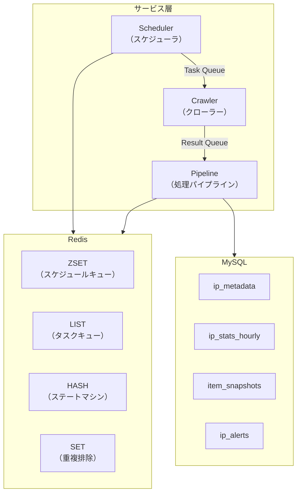

### 1.2 コアコンポーネントの役割

| コンポーネント | 役割 | 主要ファイル |
|----------------|------|--------------|
| **Scheduler** | IP スケジュール管理、タスク投入、バックプレッシャー制御 | `internal/scheduler/ip_scheduler.go` |
| **Crawler** | ブラウザ自動化、ページ取得、アンチクロール対策 | `internal/crawler/` |
| **Pipeline** | 結果処理、ステートマシン更新、データ集計 | `internal/analyzer/pipeline.go` |

### 1.3 データフロー

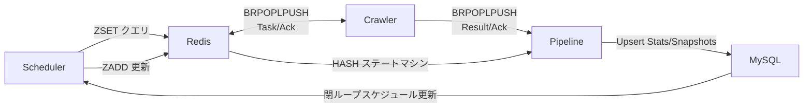

---

## 2. スケジューラ設計

### 2.1 コア設計理念

スケジューラは **ZSET 永続化 + 精密スリープ** の設計を採用し、従来のメモリスケジューリングの3つの問題を解決：

| 問題 | 従来方式 | 現行方式 |
|------|----------|----------|
| 再起動時データ消失 | メモリ map 消失 | Redis ZSET 永続化 |
| ポーリング効率低下 | 固定間隔ポーリング | 次タスクまで精密スリープ |
| 閉ループ不完全 | 次回ポーリングを待つ | Pipeline が直接 ZSET 更新 |

### 2.2 ZSET スケジュールキュー

**Redis Key**: `animetop:schedule:pending`

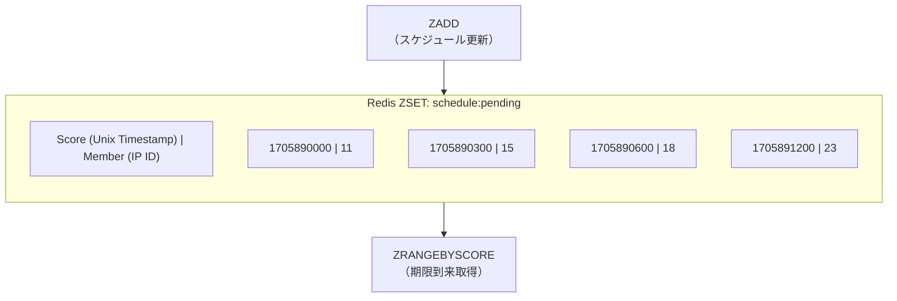

**コア操作**:

| 操作 | Redis コマンド | 用途 |
|------|----------------|------|
| IP スケジュール | `ZADD key NX score member` | 次回スケジュール時刻を設定/更新 |
| 期限到来取得 | `ZRANGEBYSCORE key -inf now` | 全期限到来タスクを取得 |
| 最近取得 | `ZRANGE key 0 0 WITHSCORES` | 精密スリープ計算用 |
| IP 削除 | `ZREM key member` | IP 削除時にクリーンアップ |
| カウント | `ZCARD key` | キュー深度モニタリング |

### 2.3 精密スリープメカニズム

```go
// internal/scheduler/ip_scheduler.go:196-254
func (s *IPScheduler) scheduleLoop(ctx context.Context) {
    for {
        // 1. 最近のスケジュール時刻を取得
        nextTime, exists, _ := s.scheduleStore.GetNextTime(ctx)

        // 2. 精密スリープ時間を計算
        if exists && nextTime.After(time.Now()) {
            sleepDuration := time.Until(nextTime)
            // 上限 5 分、長時間 ctx.Done に応答しないのを防ぐ
            if sleepDuration > maxSleepDuration {
                sleepDuration = maxSleepDuration
            }
            select {
            case <-ctx.Done():
                return
            case <-time.After(sleepDuration):
            }
        }

        // 3. 期限到来タスクを取得して処理
        s.checkAndSchedule(ctx)
    }
}
```

**スリープ戦略**:
- 次タスク時刻まで精密スリープ
- 最大スリープ 5 分（応答性保証）
- context キャンセル対応（グレースフルシャットダウン）

### 2.4 動的間隔計算

**基本公式**:
```
interval = BaseInterval / weight
interval = clamp(interval, MinInterval, MaxInterval)
```

**設定パラメータ**:

| パラメータ | デフォルト | 説明 |
|------------|----------|------|
| `BaseInterval` | 2h | 基本間隔 (weight=1.0) |
| `MinInterval` | 1h | ホット IP 下限 |
| `MaxInterval` | 2h | コールド IP 上限 |

**重みと間隔の対応**:

| Weight | 計算 | 実際の間隔 |
|--------|------|----------|
| 4.0 | 2h/4.0=30min | 1h (下限) |
| 2.0 | 2h/2.0=1h | 1h |
| 1.0 | 2h/1.0=2h | 2h |
| 0.5 | 2h/0.5=4h | 2h (上限) |

### 2.5 バックプレッシャー制御

```go
// internal/scheduler/ip_scheduler.go:295-365
func (s *IPScheduler) checkAndSchedule(ctx context.Context) {
    // 期限到来 IP をバッチ取得
    dueIPs, _ := s.scheduleStore.GetDue(ctx)

    for i := 0; i < len(dueIPs); i += s.config.BatchSize {
        batch := dueIPs[i:min(i+s.config.BatchSize, len(dueIPs))]

        for _, ipID := range batch {
            // タスクをキューに投入
            s.pushTasksForIP(ctx, ipID)
        }

        // キュー消化を待って次バッチを投入
        s.waitForQueueDrain(ctx)
    }
}
```

**バックプレッシャーパラメータ**:

| パラメータ | デフォルト | 説明 |
|------------|----------|------|
| `BatchSize` | 50 | バッチ投入タスク数 |
| `BackpressureThreshold` | 25 | キュー深度閾値 |

### 2.6 初期化フロー

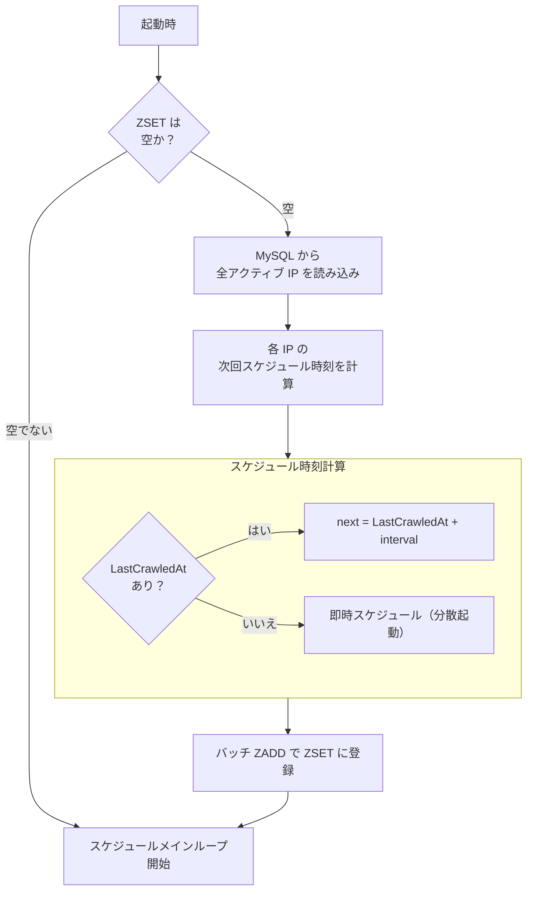

---

## 3. クローラー設計

### 3.1 コアアーキテクチャ

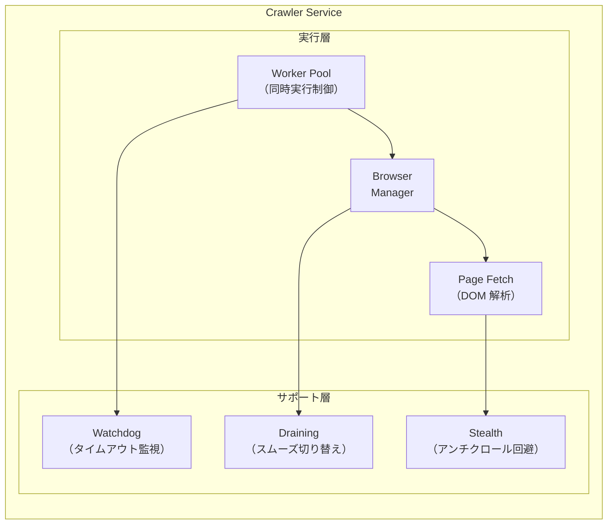

### 3.2 タスク消費フロー

```go
// internal/crawler/crawl.go:18-208
func (s *Service) StartWorker(ctx context.Context) {
    for {
        // 1. セマフォで同時実行制御
        s.semaphore.Acquire()

        // 2. Redis からタスク取得 (BRPOPLPUSH)
        task, err := s.redisQueue.PopTask(ctx, 2*time.Second)

        // 3. タスクコルーチンを起動
        go func() {
            defer s.semaphore.Release()

            // 4. ウォッチドッグタイムアウト制御
            taskCtx, cancel := context.WithTimeout(ctx, taskTimeout)
            defer cancel()

            // 5. クロール実行
            resp, err := s.doCrawl(taskCtx, task)

            // 6. 結果投入 & タスク確認
            s.redisQueue.PushResult(ctx, resp)
            s.redisQueue.AckTask(ctx, task)
        }()
    }
}
```

### 3.3 固定ページ取得 (v2 モード)

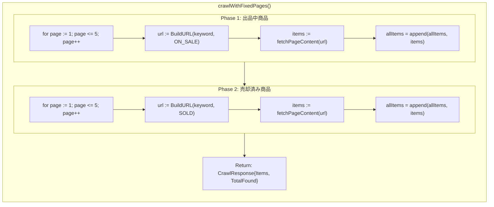

**設計選択**:
- 固定 5+5 ページ、アンカー不要
- 直列実行（on_sale → sold）
- 各ページ独立エラーハンドリング、単一ページ失敗は全体に影響しない

### 3.4 ブラウザ Draining メカニズム

プロキシ切り替えやブラウザ再起動時、スムーズな移行が必要：

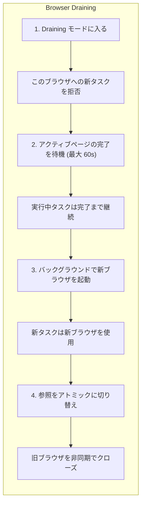

### 3.5 エラー分類とプロキシ切り替え

```go
// internal/crawler/detect.go
func classifyError(err error) crawlErrorType {
    switch {
    case isTimeout(err):
        return errTypeTimeout
    case isBlocked(err):      // 403, 429, Cloudflare, CAPTCHA
        return errTypeBlocked
    case isNetworkError(err): // 接続失敗
        return errTypeNetwork
    default:
        return errTypeUnknown
    }
}

// プロキシ切り替え条件
func shouldActivateProxy(err error) bool {
    errType := classifyError(err)
    return errType == errTypeBlocked ||
           errType == errTypeTimeout ||
           errType == errTypeNetwork
}
```

**プロキシ切り替え戦略**:
- 連続 10 回失敗後にトリガー
- まずプロキシの健全性をチェック
- 切り替え後 30 分のクールダウン期間を設定

---

## 4. Pipeline 設計

### 4.1 コアアーキテクチャ

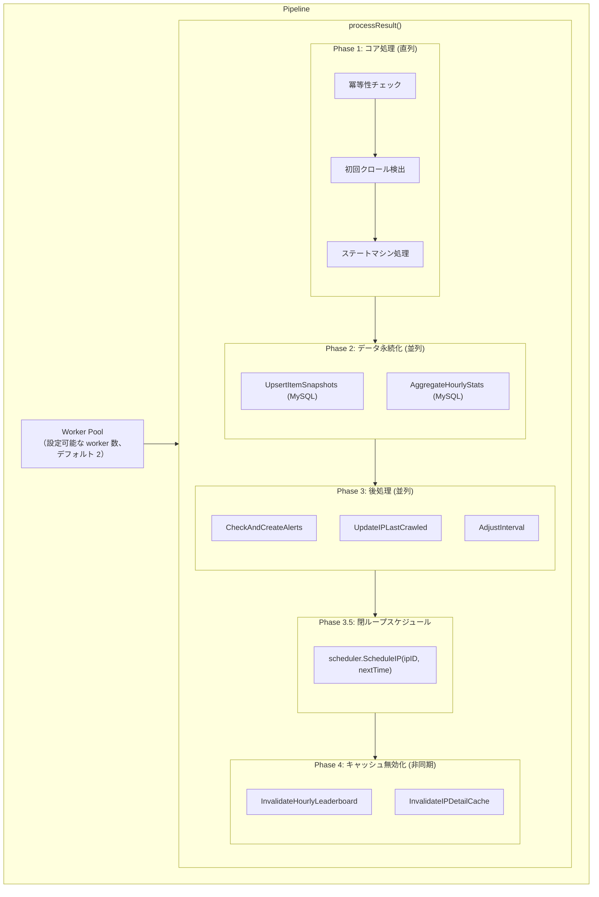

### 4.2 ステートマシン処理

**Redis Key**: `animetop:item:{ip_id}:{source_id}`

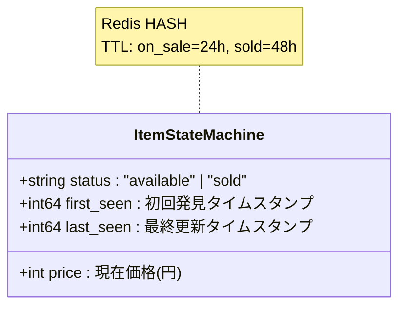

**状態遷移**:

| 遷移タイプ | トリガー条件 | 統計カウント |
|------------|--------------|--------------|
| `new_listing` | 商品初回出現かつ status=on_sale | inflow +1 |
| `sold` | 状態が available → sold | outflow +1 |
| `new_sold` | 商品初回出現かつ status=sold | outflow +1 |
| `price_change` | 価格変更かつまだ販売中 | - |
| `relisted` | 状態が sold → available (稀) | - |

### 4.3 閉ループスケジュール更新

```go
// internal/analyzer/pipeline.go:420-445
// Phase 3.5: 閉ループスケジュール
if p.scheduler != nil {
    // 新しい重みに基づいて次回間隔を計算
    nextInterval := p.config.IntervalAdjuster.BaseInterval
    if newWeight > 0 {
        nextInterval = time.Duration(float64(p.config.IntervalAdjuster.BaseInterval) / newWeight)
    }

    // 境界制限
    if nextInterval < p.config.IntervalAdjuster.MinInterval {
        nextInterval = p.config.IntervalAdjuster.MinInterval
    }
    if nextInterval > p.config.IntervalAdjuster.MaxInterval {
        nextInterval = p.config.IntervalAdjuster.MaxInterval
    }

    // ZSET を更新
    nextTime := time.Now().Add(nextInterval)
    p.scheduler.ScheduleIP(ctx, ipID, nextTime)
}
```

### 4.4 動的間隔調整

**調整ルール** (5+5 ページ設定基準):

| 条件 | アクション | 重み変化 |
|------|------------|----------|
| inflow > 500 または outflow > 500 | 加速 | weight += 0.25 |
| inflow < 250 かつ outflow < 15 | 減速 | weight -= 0.1 |
| その他 | 回帰 | 1.0 に向かう |

---

## 5. Redis データ構造詳細

### 5.1 データ構造概要

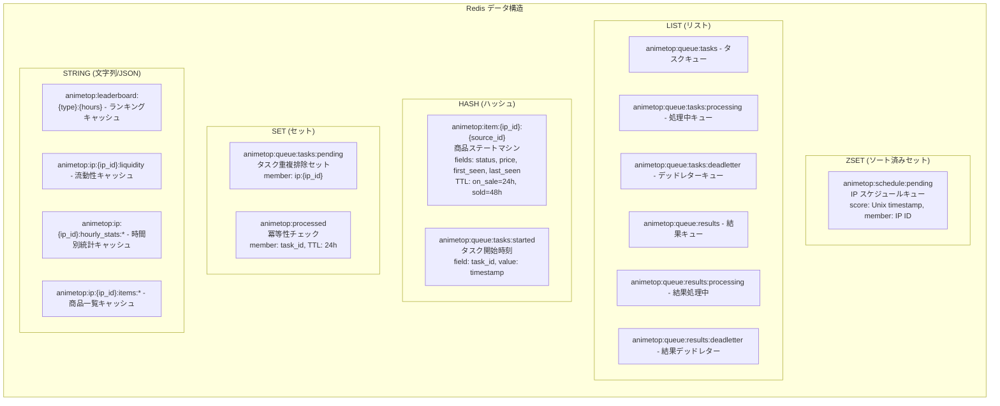

### 5.2 LIST 詳細 - 信頼性キュー

**パターン**: BRPOPLPUSH 信頼性キュー

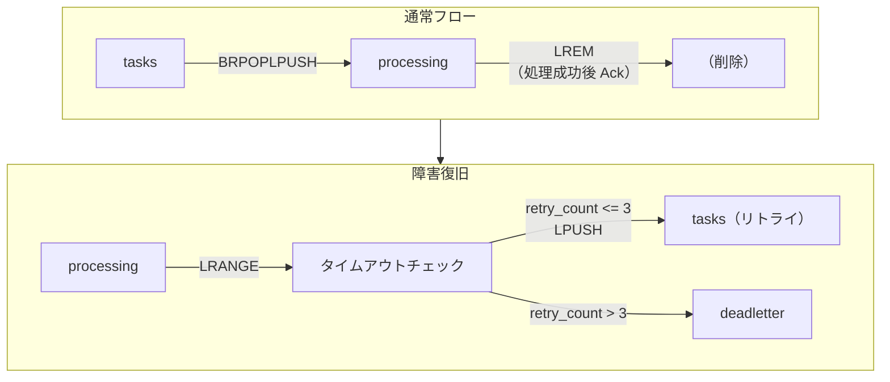

---

## 6. システム連携とデータフロー

### 6.1 完全データフロー図

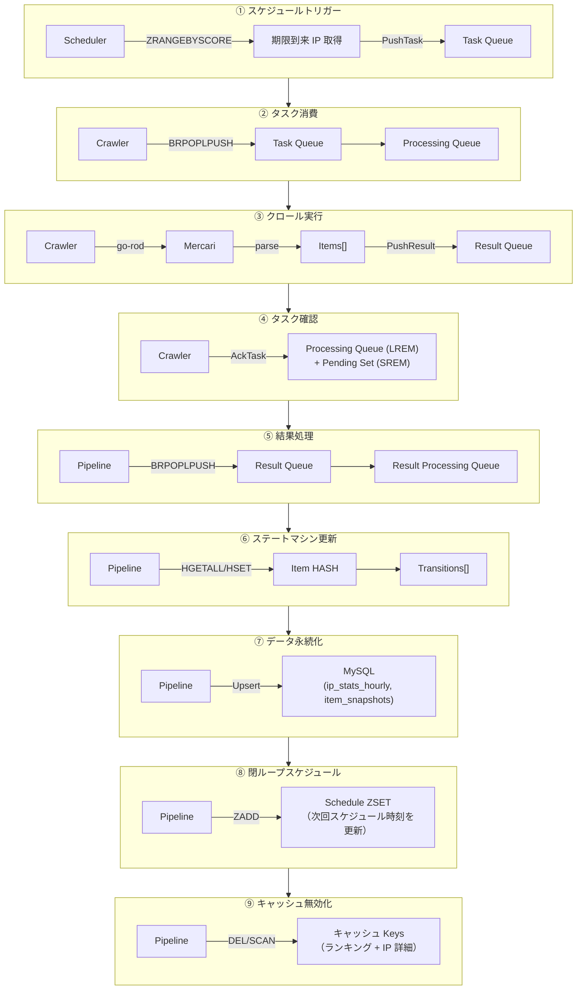

### 6.2 コンポーネントインターフェース定義

```go
// IPScheduler インターフェース (Pipeline 呼び出し用)
type IPScheduler interface {
    ScheduleIP(ctx context.Context, ipID uint64, nextTime time.Time) error
}

// ScheduleStore インターフェース (Scheduler 使用)
type ScheduleStore interface {
    Schedule(ctx context.Context, ipID uint64, nextTime time.Time) error
    GetDue(ctx context.Context) ([]uint64, error)
    GetNextTime(ctx context.Context) (time.Time, bool, error)
    Remove(ctx context.Context, ipID uint64) error
    Count(ctx context.Context) (int64, error)
}

// RedisQueue インターフェース (Crawler/Pipeline 共用)
type RedisQueue interface {
    PushTask(ctx context.Context, task *pb.CrawlRequest) error
    PopTask(ctx context.Context, timeout time.Duration) (*pb.CrawlRequest, error)
    AckTask(ctx context.Context, task *pb.CrawlRequest) error
    PushResult(ctx context.Context, result *pb.CrawlResponse) error
    PopResult(ctx context.Context, timeout time.Duration) (*pb.CrawlResponse, error)
    AckResult(ctx context.Context, result *pb.CrawlResponse) error
}
```

### 6.3 メッセージシリアライゼーション (Protocol Buffers)

サービス間通信は **Protocol Buffers** でメッセージ形式を定義し、**protojson** で JSON にシリアライズして Redis に格納します。

#### 6.3.1 メッセージ定義

```protobuf
// proto/crawler.proto

// クロールリクエスト (Scheduler → Crawler)
message CrawlRequest {
  uint64 ip_id = 1;              // IP データベース ID
  string keyword = 2;            // 検索キーワード
  string task_id = 4;            // タスク追跡 ID (UUID)
  int64 created_at = 5;          // タスク作成時刻 (Unix タイムスタンプ)
  int32 retry_count = 9;         // リトライ回数
  int32 pages_on_sale = 10;      // 販売中ページ数 (デフォルト 5)
  int32 pages_sold = 11;         // 売却済みページ数 (デフォルト 5)
}

// 商品情報
message Item {
  string source_id = 1;          // 商品ソース ID (m123456789)
  string title = 2;              // 商品タイトル
  int32 price = 3;               // 価格 (円)
  string image_url = 4;          // 商品画像 URL
  string item_url = 5;           // 商品詳細ページ URL
  ItemStatus status = 6;         // 商品ステータス (on_sale/sold)
}

// クロールレスポンス (Crawler → Pipeline)
message CrawlResponse {
  uint64 ip_id = 1;              // IP データベース ID
  repeated Item items = 3;       // 取得した商品リスト
  int32 total_found = 4;         // 総数
  string error_message = 5;      // エラーメッセージ
  string task_id = 6;            // タスク追跡 ID
  int64 crawled_at = 7;          // クロール完了時刻
  int32 pages_crawled = 10;      // 実際のページ数
  int32 retry_count = 11;        // リトライ回数
}
```

#### 6.3.2 シリアライゼーションフロー

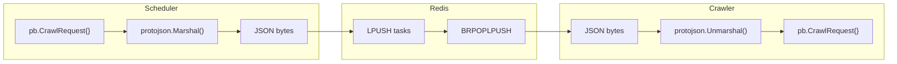

#### 6.3.3 Redis 内の JSON フォーマット

```json
// Task Queue (animetop:queue:tasks)
{
  "ipId": "11",
  "keyword": "鬼滅の刃",
  "taskId": "550e8400-e29b-41d4-a716-446655440000",
  "createdAt": "1705890000",
  "pagesOnSale": 5,
  "pagesSold": 5
}

// Result Queue (animetop:queue:results)
{
  "ipId": "11",
  "items": [
    {
      "sourceId": "m1234567890",
      "title": "鬼滅の刃 フィギュア",
      "price": 5000,
      "imageUrl": "https://...",
      "itemUrl": "https://...",
      "status": "ITEM_STATUS_ON_SALE"
    }
  ],
  "totalFound": 50,
  "taskId": "550e8400-e29b-41d4-a716-446655440000",
  "crawledAt": "1705890150",
  "pagesCrawled": 10
}
```

#### 6.3.4 protojson を選択した理由

| 比較項目 | protojson (JSON) | バイナリ proto |
|----------|------------------|----------------|
| 可読性 | ✅ `redis-cli` で直接確認可能 | ❌ デコードが必要 |
| デバッグ | ✅ ログフレンドリー | ❌ 読みにくい |
| フィールド互換性 | ✅ 欠落フィールドは自動でゼロ値 | ✅ 同様 |
| サイズ | 大きい (~2x) | 小さい |
| 性能 | 十分 (キューシナリオ) | より高速 |

**選択理由**: キューメッセージ量は少ない (~10 msg/min) ため、極限の性能より可読性を優先。

#### 6.3.5 コード生成

```bash
# proto から Go コードを生成
make proto

# または直接実行
protoc --go_out=. --go_opt=module=animetop proto/crawler.proto
```

生成ファイル: `proto/pb/crawler.pb.go`

### 6.4 初期化順序

```go
// cmd/analyzer/main.go

func main() {
    // 1. インフラストラクチャ
    db := initMySQL(cfg.MySQL)
    rdb := initRedis(cfg.Redis)
    queue := redisqueue.NewClientWithRedis(rdb)

    // 2. スケジュールストア (Scheduler より先)
    scheduleStore := scheduler.NewRedisScheduleStore(rdb, logger)

    // 3. スケジューラ (Pipeline より先)
    ipScheduler := scheduler.NewIPScheduler(db, rdb, queue, scheduleStore, cfg, logger)

    // 4. Pipeline (Scheduler に依存)
    pipeline := analyzer.NewPipeline(db, rdb, queue, analyzerCfg, pipelineCfg, ipScheduler)

    // 5. API Server (Pipeline + Scheduler に依存)
    server := api.NewServer(db, rdb, pipeline, ipScheduler, logger, apiCfg)

    // 6. 起動順序
    pipeline.Start(ctx)     // まずコンシューマを起動
    ipScheduler.Start(ctx)  // 次にプロデューサを起動
    server.Start()          // 最後に API を起動
}
```

---

## 7. 信頼性保証

### 7.1 障害シナリオと対応

| 障害シナリオ | 影響 | 対応メカニズム |
|--------------|------|----------------|
| Crawler クラッシュ | タスクが processing で停止 | Janitor 救援 (10分タイムアウト) |
| Pipeline クラッシュ | 結果が processing で停止 | Janitor 救援 |
| Redis 再起動 | ZSET/Queue データ消失 | RDB/AOF 永続化 |
| MySQL スロークエリ | Pipeline タイムアウト | 独立コネクションプール + タイムアウト制御 |
| ネットワーク不安定 | タスクタイムアウト | 自動リトライ (最大 3 回) |

### 7.2 Janitor 救援メカニズム

```go
// internal/scheduler/ip_scheduler.go:455-482
func (s *IPScheduler) janitorLoop(ctx context.Context) {
    ticker := time.NewTicker(s.config.JanitorInterval) // デフォルト 5 分
    for {
        select {
        case <-ctx.Done():
            return
        case <-ticker.C:
            // スタックしたタスクを救援
            s.queue.RescueStuckTasks(ctx, s.config.JanitorTimeout)
            // スタックした結果を救援
            s.queue.RescueStuckResults(ctx, s.config.JanitorTimeout)
        }
    }
}
```

**救援フロー**:

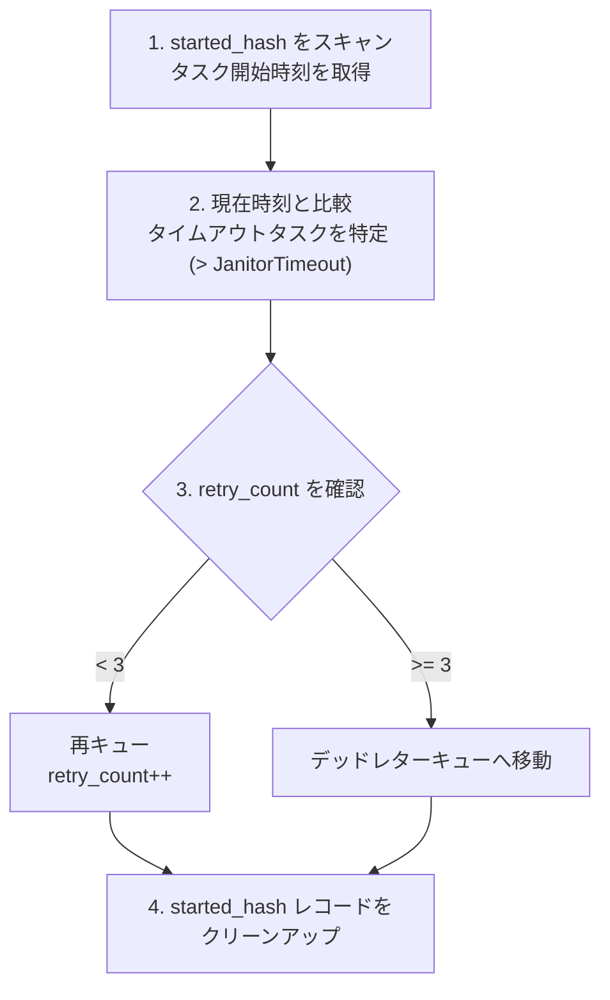

### 7.3 冪等性保証

**多層冪等性チェック**:

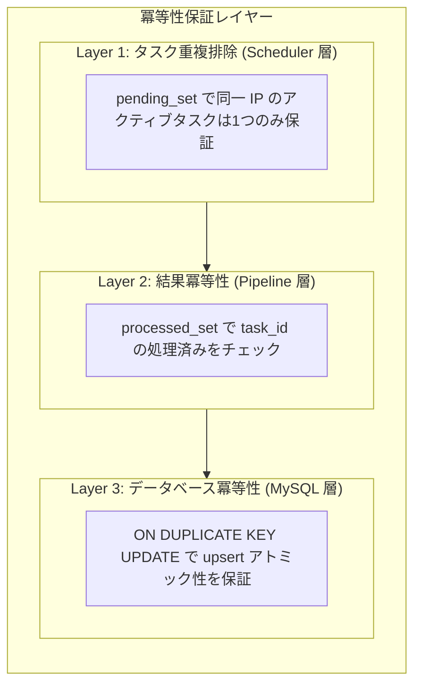

### 7.4 データ整合性

**最終整合性モデル**:

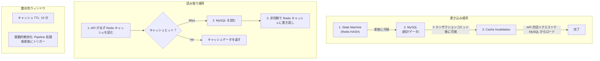

---

## 付録

### A. 設定パラメータ早見表

| パラメータ | 環境変数 | デフォルト | 説明 |
|------------|----------|----------|------|
| BaseInterval | `SCHEDULER_BASE_INTERVAL` | 2h | 基本クロール間隔 |
| MinInterval | `SCHEDULER_MIN_INTERVAL` | 1h | 最小間隔 |
| MaxInterval | `SCHEDULER_MAX_INTERVAL` | 2h | 最大間隔 |
| PagesOnSale | `SCHEDULER_PAGES_ON_SALE` | 5 | 出品中ページ数 |
| PagesSold | `SCHEDULER_PAGES_SOLD` | 5 | 売却済みページ数 |
| BatchSize | `SCHEDULER_BATCH_SIZE` | 50 | バッチ投入数 |
| JanitorInterval | `JANITOR_INTERVAL` | 5m | Janitor 間隔 |
| JanitorTimeout | `JANITOR_TIMEOUT` | 10m | タスクタイムアウト閾値 |
| MaxRetries | - | 3 | 最大リトライ回数 |
| ItemTTLAvailable | `ANALYZER_ITEM_TTL_AVAILABLE` | 24h | on_sale TTL |
| ItemTTLSold | `ANALYZER_ITEM_TTL_SOLD` | 48h | sold TTL |

### B. Redis Key 早見表

| Key パターン | 型 | 説明 |
|--------------|------|------|
| `animetop:schedule:pending` | ZSET | スケジュールキュー |
| `animetop:queue:tasks` | LIST | タスクキュー |
| `animetop:queue:tasks:processing` | LIST | 処理中タスク |
| `animetop:queue:tasks:deadletter` | LIST | デッドレタータスク |
| `animetop:queue:tasks:pending` | SET | タスク重複排除 |
| `animetop:queue:tasks:started` | HASH | タスク開始時刻 |
| `animetop:queue:results` | LIST | 結果キュー |
| `animetop:queue:results:processing` | LIST | 処理中結果 |
| `animetop:item:{ip_id}:{source_id}` | HASH | 商品状態 |
| `animetop:processed` | SET | 冪等性チェック |
| `animetop:leaderboard:{type}:{hours}` | STRING | ランキングキャッシュ |
| `animetop:ip:{ip_id}:*` | STRING | IP 詳細キャッシュ |

### C. 主要コードエントリポイント

| モジュール | ファイル | エントリ関数 |
|------------|----------|--------------|
| Scheduler | `internal/scheduler/ip_scheduler.go` | `NewIPScheduler()`, `Start()` |
| ScheduleStore | `internal/scheduler/schedule_store.go` | `NewRedisScheduleStore()` |
| Crawler | `internal/crawler/service.go` | `NewService()`, `Start()` |
| CrawlLogic | `internal/crawler/crawl.go` | `StartWorker()`, `doCrawl()` |
| Pipeline | `internal/analyzer/pipeline.go` | `NewPipeline()`, `Start()` |
| StateMachine | `internal/analyzer/state_machine.go` | `ProcessItemsBatch()` |
| RedisQueue | `internal/pkg/redisqueue/client.go` | `NewClientWithRedis()` |
