# Anime Hot 系统架构设计文档

## 目录

1. [系统概述](#1-系统概述)
2. [调度器设计](#2-调度器设计)
3. [爬虫设计](#3-爬虫设计)
4. [Pipeline 设计](#4-pipeline-设计)
5. [Redis 数据结构详解](#5-redis-数据结构详解)
6. [系统互联与数据流](#6-系统互联与数据流)
7. [可靠性保障](#7-可靠性保障)

---

## 1. 系统概述

### 1.1 架构全景

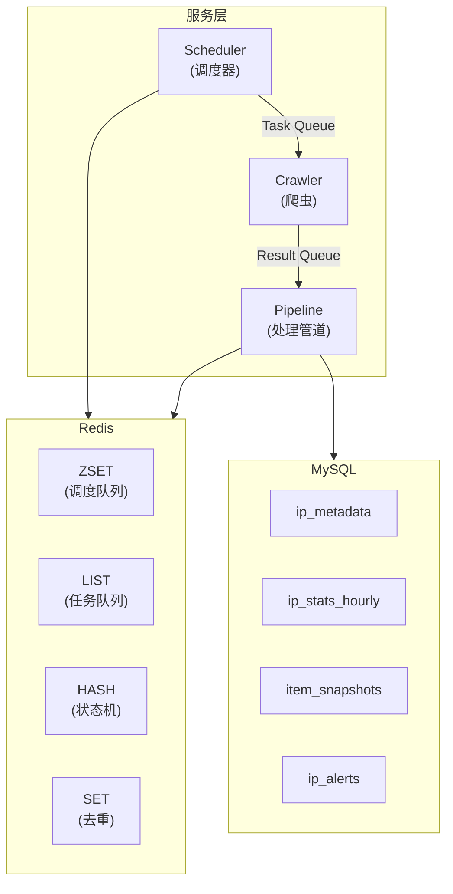

### 1.2 核心组件职责

| 组件 | 职责 | 主要文件 |
|------|------|----------|
| **Scheduler** | IP 调度管理、任务推送、背压控制 | `internal/scheduler/ip_scheduler.go` |
| **Crawler** | 浏览器自动化、页面抓取、反爬应对 | `internal/crawler/` |
| **Pipeline** | 结果处理、状态机更新、数据聚合 | `internal/analyzer/pipeline.go` |

### 1.3 数据流向

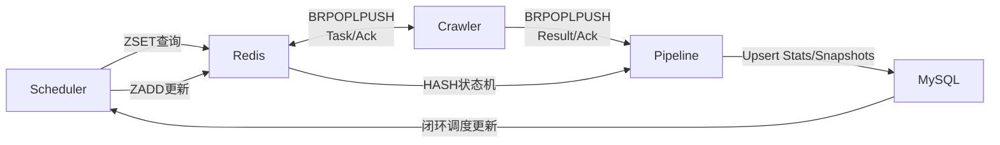

---

## 2. 调度器设计

### 2.1 核心设计理念

调度器采用 **ZSET 持久化 + 精确睡眠** 的设计，解决了传统内存调度的三大问题：

| 问题 | 传统方案 | 当前方案 |
|------|----------|----------|
| 重启数据丢失 | 内存 map 丢失 | Redis ZSET 持久化 |
| 轮询效率低 | 固定间隔轮询 | 精确睡眠到下一任务 |
| 闭环不完整 | 需等待下次轮询 | Pipeline 直接更新 ZSET |

### 2.2 ZSET 调度队列

**Redis Key**: `animetop:schedule:pending`

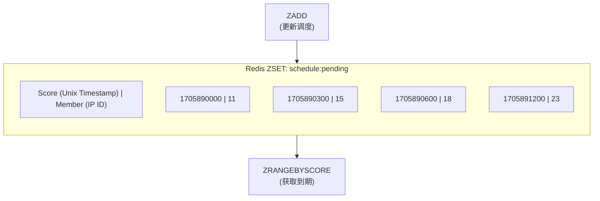

**核心操作**:

| 操作 | Redis 命令 | 用途 |
|------|-----------|------|
| 调度 IP | `ZADD key NX score member` | 设置/更新下次调度时间 |
| 获取到期 | `ZRANGEBYSCORE key -inf now` | 获取所有到期任务 |
| 获取最近 | `ZRANGE key 0 0 WITHSCORES` | 用于精确睡眠计算 |
| 移除 IP | `ZREM key member` | IP 删除时清理 |
| 计数 | `ZCARD key` | 监控队列深度 |

### 2.3 精确睡眠机制

```go
// internal/scheduler/ip_scheduler.go:196-254
func (s *IPScheduler) scheduleLoop(ctx context.Context) {
    for {
        // 1. 获取最近的调度时间
        nextTime, exists, _ := s.scheduleStore.GetNextTime(ctx)

        // 2. 计算精确睡眠时长
        if exists && nextTime.After(time.Now()) {
            sleepDuration := time.Until(nextTime)
            // 上限 5 分钟，避免长时间不响应 ctx.Done
            if sleepDuration > maxSleepDuration {
                sleepDuration = maxSleepDuration
            }
            select {
            case <-ctx.Done():
                return
            case <-time.After(sleepDuration):
            }
        }

        // 3. 获取并处理到期任务
        s.checkAndSchedule(ctx)
    }
}
```

**睡眠策略**:
- 精确睡眠到下一个任务时间
- 最大睡眠 5 分钟（响应性保障）
- 支持 context 取消（优雅关闭）

### 2.4 动态间隔计算

**基础公式**:
```
interval = BaseInterval / weight
interval = clamp(interval, MinInterval, MaxInterval)
```

**配置参数**:

| 参数 | 默认值 | 说明 |
|------|--------|------|
| `BaseInterval` | 2h | 基础间隔 (weight=1.0) |
| `MinInterval` | 1h | 热门 IP 下限 |
| `MaxInterval` | 2h | 冷门 IP 上限 |

**权重与间隔对应**:

| Weight | 计算 | 实际间隔 |
|--------|------|----------|
| 4.0 | 2h/4.0=30min | 1h (下限) |
| 2.0 | 2h/2.0=1h | 1h |
| 1.0 | 2h/1.0=2h | 2h |
| 0.5 | 2h/0.5=4h | 2h (上限) |

### 2.5 背压控制

```go
// internal/scheduler/ip_scheduler.go:295-365
func (s *IPScheduler) checkAndSchedule(ctx context.Context) {
    // 批量获取到期 IP
    dueIPs, _ := s.scheduleStore.GetDue(ctx)

    for i := 0; i < len(dueIPs); i += s.config.BatchSize {
        batch := dueIPs[i:min(i+s.config.BatchSize, len(dueIPs))]

        for _, ipID := range batch {
            // 推送任务到队列
            s.pushTasksForIP(ctx, ipID)
        }

        // 等待队列消化后再推送下一批
        s.waitForQueueDrain(ctx)
    }
}
```

**背压参数**:

| 参数 | 默认值 | 说明 |
|------|--------|------|
| `BatchSize` | 50 | 每批推送任务数 |
| `BackpressureThreshold` | 25 | 队列深度阈值 |

### 2.6 初始化流程

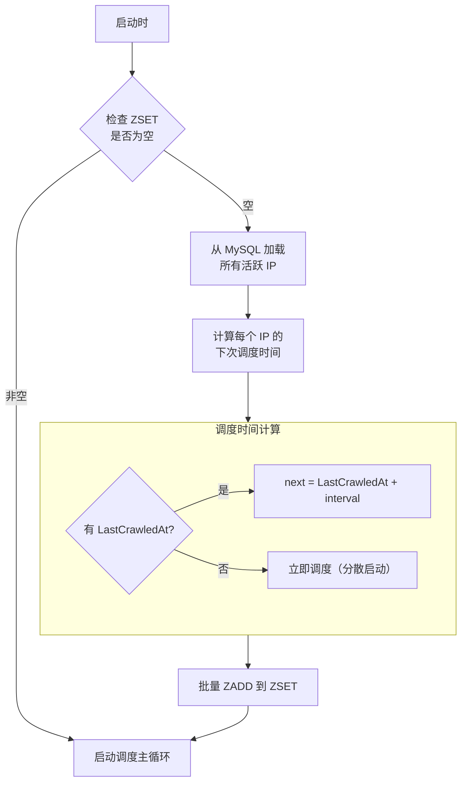

---

## 3. 爬虫设计

### 3.1 核心架构

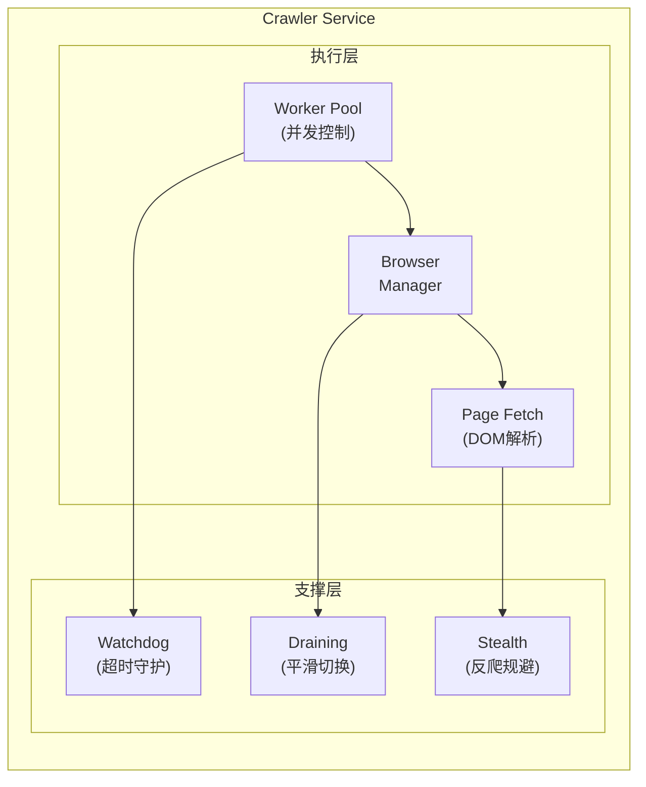

### 3.2 任务消费流程

```go
// internal/crawler/crawl.go:18-208
func (s *Service) StartWorker(ctx context.Context) {
    for {
        // 1. 信号量控制并发
        s.semaphore.Acquire()

        // 2. 从 Redis 拉取任务 (BRPOPLPUSH)
        task, err := s.redisQueue.PopTask(ctx, 2*time.Second)

        // 3. 启动任务协程
        go func() {
            defer s.semaphore.Release()

            // 4. 看门狗超时控制
            taskCtx, cancel := context.WithTimeout(ctx, taskTimeout)
            defer cancel()

            // 5. 执行爬取
            resp, err := s.doCrawl(taskCtx, task)

            // 6. 推送结果 & 确认任务
            s.redisQueue.PushResult(ctx, resp)
            s.redisQueue.AckTask(ctx, task)
        }()
    }
}
```

### 3.3 固定页数抓取 (v2 模式)

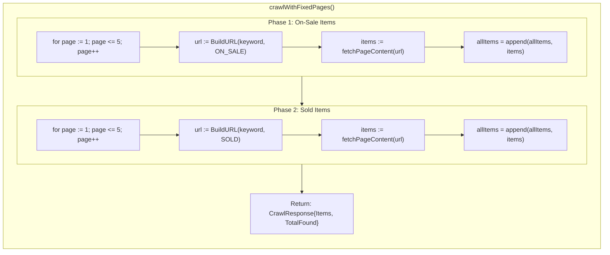

**设计选择**:
- 固定 5+5 页，无需锚点
- 串行执行（on_sale → sold）
- 每页独立错误处理，单页失败不影响整体

### 3.4 页面抓取流程

```go
// internal/crawler/page_fetch.go:31-434
func (s *Service) fetchPageContent(ctx context.Context, url string, opts *FetchOptions) ([]*pb.Item, error) {
    // 1. 创建页面 (10s 超时)
    page := browser.MustPage()

    // 2. 注入隐身脚本
    page.MustEvalOnNewDocument(stealthJS)

    // 3. 网络配置 (拦截无用资源)
    proto.NetworkEnable{}.Call(page)
    blockURLs := []string{"*.jpg", "*.png", "fonts.googleapis.com", "analytics"}

    // 4. 导航到目标页面
    page.Navigate(url)
    page.WaitLoad()
    page.WaitRequestIdle(1*time.Second)

    // 5. 人类行为模拟 (仅首页)
    if !opts.SkipHumanize {
        simulateHumanBehavior(page)
    }

    // 6. 封禁检测
    if isBlocked(page) {
        return nil, ErrBlocked
    }

    // 7. 虚拟列表滚动提取
    items := scrollAndExtract(page, opts.Limit)

    return items, nil
}
```

### 3.5 虚拟列表滚动

Mercari 使用虚拟列表渲染，需要滚动才能加载更多商品：

```go
// 滚动策略
func scrollAndExtract(page *rod.Page, limit int) []*pb.Item {
    seen := make(map[string]bool)
    items := []*pb.Item{}
    noGrowthCount := 0

    for {
        // 提取当前可见商品
        visible := extractVisibleItems(page)
        for _, item := range visible {
            if !seen[item.SourceId] {
                seen[item.SourceId] = true
                items = append(items, item)
            }
        }

        // 达到限制或无新增
        if len(items) >= limit {
            break
        }

        // 滚动一屏
        page.Eval(`window.scrollBy(0, window.innerHeight)`)
        time.Sleep(500 * time.Millisecond)

        // 连续 3 次无新增则停止
        if len(visible) == previousCount {
            noGrowthCount++
            if noGrowthCount >= 3 {
                break
            }
        }
    }
    return items
}
```

### 3.6 浏览器 Draining 机制

切换代理或重启浏览器时，需要平滑过渡：

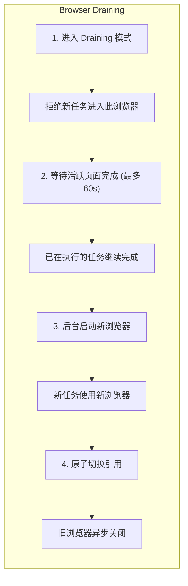

### 3.7 错误分类与代理切换

```go
// internal/crawler/detect.go
func classifyError(err error) crawlErrorType {
    switch {
    case isTimeout(err):
        return errTypeTimeout
    case isBlocked(err):      // 403, 429, Cloudflare, CAPTCHA
        return errTypeBlocked
    case isNetworkError(err): // 连接失败
        return errTypeNetwork
    default:
        return errTypeUnknown
    }
}

// 代理切换条件
func shouldActivateProxy(err error) bool {
    errType := classifyError(err)
    return errType == errTypeBlocked ||
           errType == errTypeTimeout ||
           errType == errTypeNetwork
}
```

**代理切换策略**:
- 连续失败 10 次后触发
- 先健康检查代理可用性
- 切换后设置 30 分钟冷却期

---

## 4. Pipeline 设计

### 4.1 核心架构

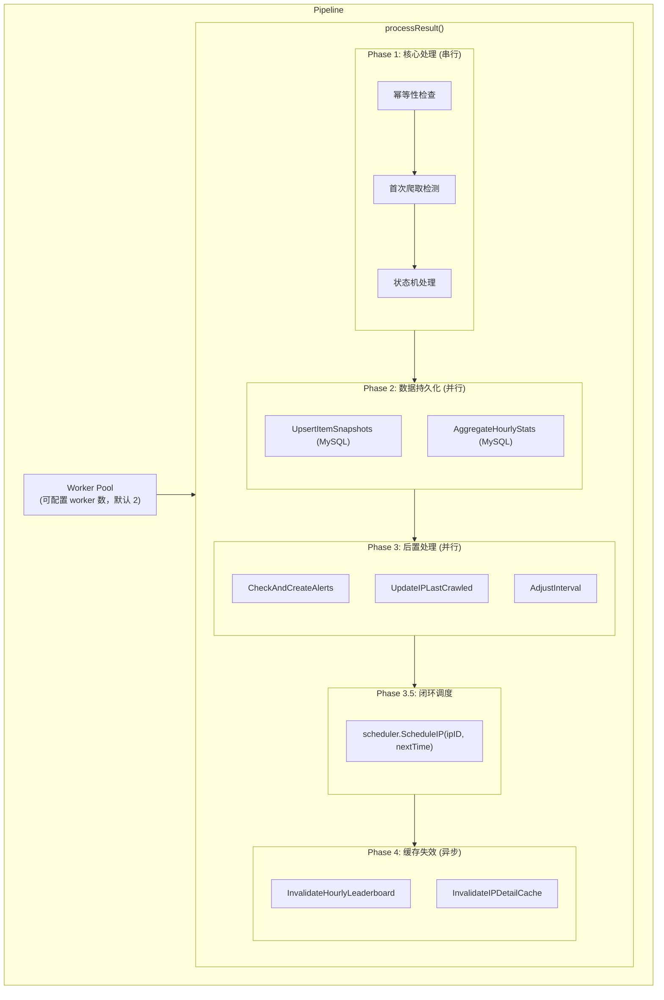

### 4.2 状态机处理

**Redis Key**: `animetop:item:{ip_id}:{source_id}`

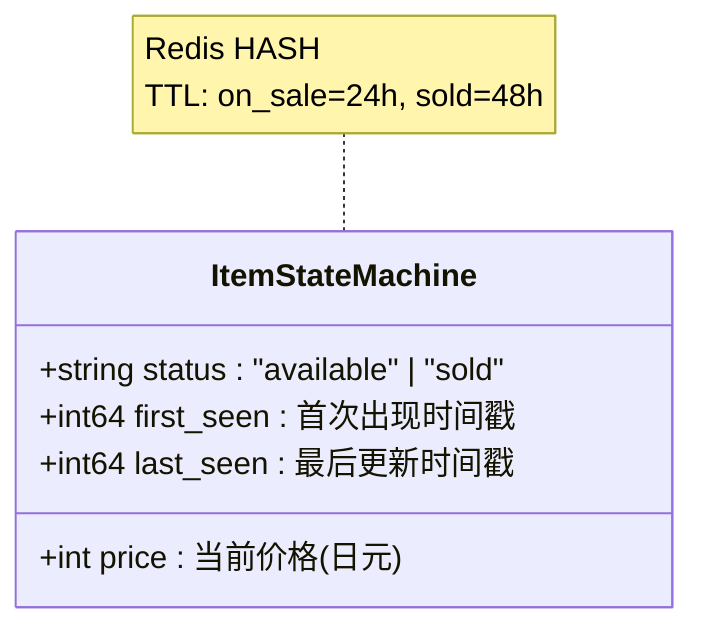

**状态转换**:

| 转换类型 | 触发条件 | 统计计入 |
|----------|----------|----------|
| `new_listing` | 商品首次出现且 status=on_sale | inflow +1 |
| `sold` | 状态从 available → sold | outflow +1 |
| `new_sold` | 商品首次出现且 status=sold | outflow +1 |
| `price_change` | 价格变化且仍在售 | - |
| `relisted` | 状态从 sold → available (罕见) | - |

**批量处理优化**:

```go
// 批量 500 条命令
func (sm *StateMachine) ProcessItemsBatch(ctx context.Context, ipID uint64, items []*pb.Item) ([]Transition, error) {
    // 1. 批量 HGETALL 获取现有状态
    pipe := sm.rdb.Pipeline()
    for _, item := range items {
        key := fmt.Sprintf("animetop:item:%d:%s", ipID, item.SourceId)
        pipe.HGetAll(ctx, key)
    }
    results, _ := pipe.Exec(ctx)

    // 2. 内存计算状态转换
    transitions := computeTransitions(items, results)

    // 3. 批量 HSET 更新状态
    pipe = sm.rdb.Pipeline()
    for _, t := range transitions {
        pipe.HSet(ctx, t.Key, t.NewState)
        pipe.Expire(ctx, t.Key, t.TTL)
    }
    pipe.Exec(ctx)

    return transitions, nil
}
```

### 4.3 数据聚合

**小时统计表** (`ip_stats_hourly`):

```sql
CREATE TABLE ip_stats_hourly (
    id BIGINT AUTO_INCREMENT PRIMARY KEY,
    ip_id BIGINT NOT NULL,
    hour_bucket DATETIME NOT NULL,  -- 小时对齐
    inflow INT DEFAULT 0,           -- 新上架数
    outflow INT DEFAULT 0,          -- 成交数
    liquidity_index DECIMAL(8,4),   -- outflow/inflow
    avg_price DECIMAL(10,2),        -- 平均成交价
    min_price DECIMAL(10,2),
    max_price DECIMAL(10,2),
    sample_count INT DEFAULT 0,     -- 价格样本数
    UNIQUE KEY uk_ip_hour (ip_id, hour_bucket)
);
```

**累积更新策略**:

```sql
-- 同一小时内多次爬取，累积 inflow/outflow
INSERT INTO ip_stats_hourly (ip_id, hour_bucket, inflow, outflow, ...)
VALUES (?, ?, ?, ?, ...)
ON DUPLICATE KEY UPDATE
    inflow = inflow + VALUES(inflow),
    outflow = outflow + VALUES(outflow),
    liquidity_index = (outflow + VALUES(outflow)) / NULLIF(inflow + VALUES(inflow), 0);
```

### 4.4 闭环调度更新

```go
// internal/analyzer/pipeline.go:420-445
// Phase 3.5: 闭环调度
if p.scheduler != nil {
    // 基于新权重计算下次间隔
    nextInterval := p.config.IntervalAdjuster.BaseInterval
    if newWeight > 0 {
        nextInterval = time.Duration(float64(p.config.IntervalAdjuster.BaseInterval) / newWeight)
    }

    // 边界限制
    if nextInterval < p.config.IntervalAdjuster.MinInterval {
        nextInterval = p.config.IntervalAdjuster.MinInterval
    }
    if nextInterval > p.config.IntervalAdjuster.MaxInterval {
        nextInterval = p.config.IntervalAdjuster.MaxInterval
    }

    // 更新 ZSET
    nextTime := time.Now().Add(nextInterval)
    p.scheduler.ScheduleIP(ctx, ipID, nextTime)
}
```

### 4.5 动态间隔调整

**调整规则** (基于 5+5 页配置):

| 条件 | 动作 | 权重变化 |
|------|------|----------|
| inflow > 500 或 outflow > 500 | 加速 | weight += 0.25 |
| inflow < 250 且 outflow < 15 | 减速 | weight -= 0.1 |
| 其他 | 回归 | 向 1.0 靠拢 |

---

## 5. Redis 数据结构详解

### 5.1 数据结构总览

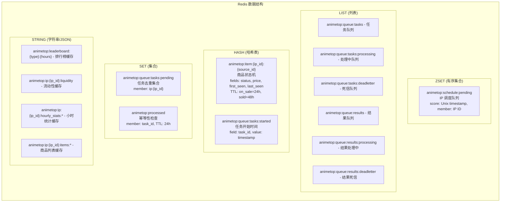

### 5.2 ZSET 详解 - 调度队列

**用途**: 持久化存储 IP 调度时间，支持高效的时间范围查询

**操作复杂度**:

| 操作 | 命令 | 复杂度 |
|------|------|--------|
| 调度 IP | ZADD | O(log N) |
| 获取到期 | ZRANGEBYSCORE | O(log N + M) |
| 获取最近 | ZRANGE 0 0 | O(1) |
| 移除 | ZREM | O(log N) |

**代码示例**:

```go
// internal/scheduler/schedule_store.go

// 调度 IP
func (s *RedisScheduleStore) Schedule(ctx context.Context, ipID uint64, nextTime time.Time) error {
    return s.rdb.ZAdd(ctx, s.key, redis.Z{
        Score:  float64(nextTime.Unix()),
        Member: ipID,
    }).Err()
}

// 获取到期任务
func (s *RedisScheduleStore) GetDue(ctx context.Context) ([]uint64, error) {
    now := float64(time.Now().Unix())
    members, err := s.rdb.ZRangeByScore(ctx, s.key, &redis.ZRangeBy{
        Min: "-inf",
        Max: fmt.Sprintf("%f", now),
    }).Result()
    // ... 转换为 []uint64
}

// 获取最近调度时间 (用于精确睡眠)
func (s *RedisScheduleStore) GetNextTime(ctx context.Context) (time.Time, bool, error) {
    results, err := s.rdb.ZRangeWithScores(ctx, s.key, 0, 0).Result()
    if len(results) == 0 {
        return time.Time{}, false, nil
    }
    return time.Unix(int64(results[0].Score), 0), true, nil
}
```

### 5.3 LIST 详解 - 可靠队列

**模式**: BRPOPLPUSH 可靠队列

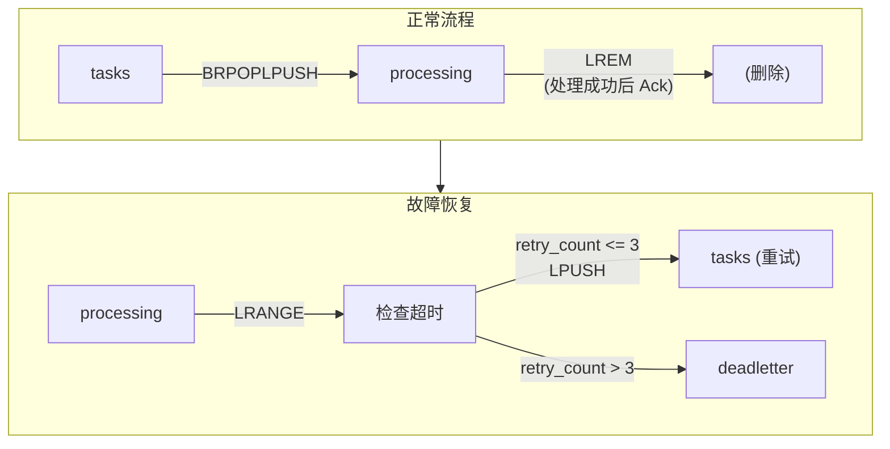

**Lua 脚本保证原子性**:

```lua
-- pushTaskScript: 原子去重 + 入队
local added = redis.call('SADD', KEYS[1], ARGV[1])  -- pending_set
if added == 0 then
    return 'exists'
end
redis.call('LPUSH', KEYS[2], ARGV[2])  -- task_queue
return 'ok'

-- ackTaskScript: 原子确认
redis.call('LREM', KEYS[1], 1, ARGV[1])   -- processing_queue
redis.call('SREM', KEYS[2], ARGV[2])       -- pending_set
redis.call('HDEL', KEYS[3], ARGV[3])       -- started_hash
return 1
```

### 5.4 HASH 详解 - 状态机

**用途**: 追踪每个商品的状态变化

**TTL 策略**:
- `on_sale` 商品: 24 小时 (活跃窗口)
- `sold` 商品: 48 小时 (覆盖冷门 IP ~33h 可见范围)

```go
// internal/analyzer/state_machine.go

func (sm *StateMachine) UpdateItemState(ctx context.Context, ipID uint64, item *pb.Item) (*Transition, error) {
    key := fmt.Sprintf("animetop:item:%d:%s", ipID, item.SourceId)

    // 获取现有状态
    existing, _ := sm.rdb.HGetAll(ctx, key).Result()

    // 计算状态转换
    transition := computeTransition(existing, item)

    // 更新状态
    sm.rdb.HSet(ctx, key, map[string]interface{}{
        "status":     item.Status,
        "price":      item.Price,
        "first_seen": firstSeen,
        "last_seen":  time.Now().Unix(),
    })

    // 设置 TTL
    ttl := 24 * time.Hour
    if item.Status == "sold" {
        ttl = 48 * time.Hour
    }
    sm.rdb.Expire(ctx, key, ttl)

    return transition, nil
}
```

### 5.5 SET 详解 - 去重与幂等

**任务去重** (`animetop:queue:tasks:pending`):

```go
// 防止同一 IP 重复入队
dedupKey := fmt.Sprintf("ip:%d", ipID)

// PushTask 时检查
if exists := rdb.SIsMember(ctx, pendingSet, dedupKey); exists {
    return ErrTaskExists
}
rdb.SAdd(ctx, pendingSet, dedupKey)
rdb.LPush(ctx, taskQueue, taskJSON)

// AckTask 时清除
rdb.SRem(ctx, pendingSet, dedupKey)
```

**幂等性检查** (`animetop:processed`):

```go
// Pipeline 处理前检查
if processed := rdb.SIsMember(ctx, processedSet, taskID); processed {
    // 跳过重复处理
    return nil
}

// 处理成功后标记
rdb.SAdd(ctx, processedSet, taskID)
rdb.Expire(ctx, processedSet, 24*time.Hour)
```

---

## 6. 系统互联与数据流

### 6.1 完整数据流图

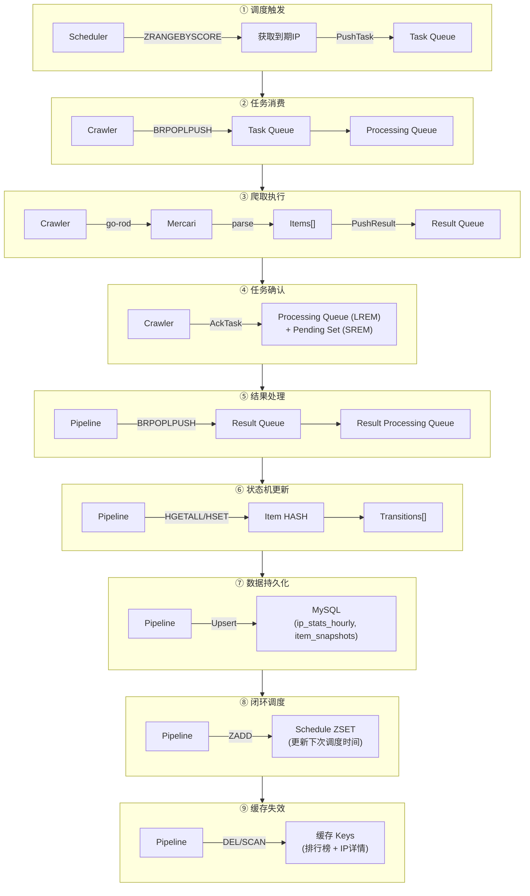

### 6.2 组件接口定义

```go
// IPScheduler 接口 (供 Pipeline 调用)
type IPScheduler interface {
    ScheduleIP(ctx context.Context, ipID uint64, nextTime time.Time) error
}

// ScheduleStore 接口 (供 Scheduler 使用)
type ScheduleStore interface {
    Schedule(ctx context.Context, ipID uint64, nextTime time.Time) error
    GetDue(ctx context.Context) ([]uint64, error)
    GetNextTime(ctx context.Context) (time.Time, bool, error)
    Remove(ctx context.Context, ipID uint64) error
    Count(ctx context.Context) (int64, error)
}

// RedisQueue 接口 (Crawler/Pipeline 共用)
type RedisQueue interface {
    PushTask(ctx context.Context, task *pb.CrawlRequest) error
    PopTask(ctx context.Context, timeout time.Duration) (*pb.CrawlRequest, error)
    AckTask(ctx context.Context, task *pb.CrawlRequest) error
    PushResult(ctx context.Context, result *pb.CrawlResponse) error
    PopResult(ctx context.Context, timeout time.Duration) (*pb.CrawlResponse, error)
    AckResult(ctx context.Context, result *pb.CrawlResponse) error
}
```

### 6.3 消息序列化 (Protocol Buffers)

服务间通信使用 **Protocol Buffers** 定义消息格式，通过 **protojson** 序列化为 JSON 存入 Redis。

#### 6.3.1 消息定义

```protobuf
// proto/crawler.proto

// 爬虫请求 (Scheduler → Crawler)
message CrawlRequest {
  uint64 ip_id = 1;              // IP 数据库 ID
  string keyword = 2;            // 搜索关键词
  string task_id = 4;            // 任务追踪 ID (UUID)
  int64 created_at = 5;          // 任务创建时间 (Unix 时间戳)
  int32 retry_count = 9;         // 已重试次数
  int32 pages_on_sale = 10;      // 在售页数 (默认 5)
  int32 pages_sold = 11;         // 已售页数 (默认 5)
}

// 商品信息
message Item {
  string source_id = 1;          // 商品源 ID (m123456789)
  string title = 2;              // 商品标题
  int32 price = 3;               // 价格 (日元)
  string image_url = 4;          // 商品图片 URL
  string item_url = 5;           // 商品详情页 URL
  ItemStatus status = 6;         // 商品状态 (on_sale/sold)
}

// 爬虫响应 (Crawler → Pipeline)
message CrawlResponse {
  uint64 ip_id = 1;              // IP 数据库 ID
  repeated Item items = 3;       // 抓取到的商品列表
  int32 total_found = 4;         // 总数
  string error_message = 5;      // 错误消息
  string task_id = 6;            // 任务追踪 ID
  int64 crawled_at = 7;          // 抓取完成时间
  int32 pages_crawled = 10;      // 实际翻页数
  int32 retry_count = 11;        // 已重试次数
}
```

#### 6.3.2 序列化流程

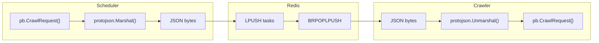

#### 6.3.3 Redis 中的 JSON 格式

```json
// Task Queue (animetop:queue:tasks)
{
  "ipId": "11",
  "keyword": "鬼滅の刃",
  "taskId": "550e8400-e29b-41d4-a716-446655440000",
  "createdAt": "1705890000",
  "pagesOnSale": 5,
  "pagesSold": 5
}

// Result Queue (animetop:queue:results)
{
  "ipId": "11",
  "items": [
    {
      "sourceId": "m1234567890",
      "title": "鬼滅の刃 フィギュア",
      "price": 5000,
      "imageUrl": "https://...",
      "itemUrl": "https://...",
      "status": "ITEM_STATUS_ON_SALE"
    }
  ],
  "totalFound": 50,
  "taskId": "550e8400-e29b-41d4-a716-446655440000",
  "crawledAt": "1705890150",
  "pagesCrawled": 10
}
```

#### 6.3.4 为什么使用 protojson 而非二进制 proto

| 对比项 | protojson (JSON) | 二进制 proto |
|--------|------------------|--------------|
| 可读性 | ✅ 可直接 `redis-cli` 查看 | ❌ 需要解码 |
| 调试 | ✅ 日志友好 | ❌ 难以阅读 |
| 字段兼容 | ✅ 缺失字段自动零值 | ✅ 相同 |
| 体积 | 较大 (~2x) | 较小 |
| 性能 | 足够 (队列场景) | 更快 |

**选择理由**: 队列消息量不大 (~10 msg/min)，可读性优先于极致性能。

#### 6.3.5 代码生成

```bash
# 从 proto 生成 Go 代码
make proto

# 或直接运行
protoc --go_out=. --go_opt=module=animetop proto/crawler.proto
```

生成文件: `proto/pb/crawler.pb.go`

### 6.4 初始化顺序

```go
// cmd/analyzer/main.go

func main() {
    // 1. 基础设施
    db := initMySQL(cfg.MySQL)
    rdb := initRedis(cfg.Redis)
    queue := redisqueue.NewClientWithRedis(rdb)

    // 2. 调度存储 (先于 Scheduler)
    scheduleStore := scheduler.NewRedisScheduleStore(rdb, logger)

    // 3. 调度器 (先于 Pipeline)
    ipScheduler := scheduler.NewIPScheduler(db, rdb, queue, scheduleStore, cfg, logger)

    // 4. Pipeline (依赖 Scheduler)
    pipeline := analyzer.NewPipeline(db, rdb, queue, analyzerCfg, pipelineCfg, ipScheduler)

    // 5. API Server (依赖 Pipeline + Scheduler)
    server := api.NewServer(db, rdb, pipeline, ipScheduler, logger, apiCfg)

    // 6. 启动顺序
    pipeline.Start(ctx)     // 先启动消费者
    ipScheduler.Start(ctx)  // 再启动生产者
    server.Start()          // 最后启动 API
}
```

---

## 7. 可靠性保障

### 7.1 故障场景与应对

| 故障场景 | 影响 | 应对机制 |
|----------|------|----------|
| Crawler 崩溃 | 任务卡在 processing | Janitor 救援 (10min 超时) |
| Pipeline 崩溃 | 结果卡在 processing | Janitor 救援 |
| Redis 重启 | ZSET/Queue 数据丢失 | RDB/AOF 持久化 |
| MySQL 慢查询 | Pipeline 超时 | 独立连接池 + 超时控制 |
| 网络抖动 | 任务超时 | 自动重试 (最多 3 次) |

### 7.2 Janitor 救援机制

```go
// internal/scheduler/ip_scheduler.go:455-482
func (s *IPScheduler) janitorLoop(ctx context.Context) {
    ticker := time.NewTicker(s.config.JanitorInterval) // 默认 5 分钟
    for {
        select {
        case <-ctx.Done():
            return
        case <-ticker.C:
            // 救援卡住的任务
            s.queue.RescueStuckTasks(ctx, s.config.JanitorTimeout)
            // 救援卡住的结果
            s.queue.RescueStuckResults(ctx, s.config.JanitorTimeout)
        }
    }
}
```

**救援流程**:

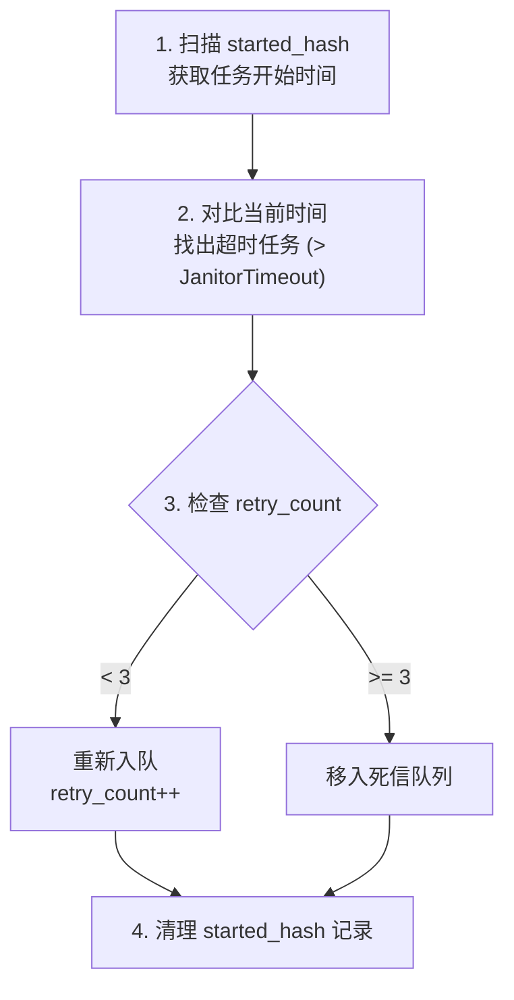

### 7.3 幂等性保障

**多层幂等检查**:

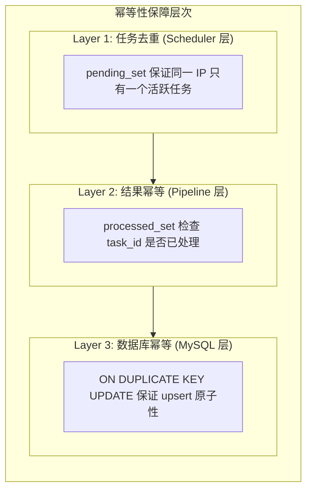

### 7.4 数据一致性

**最终一致性模型**:

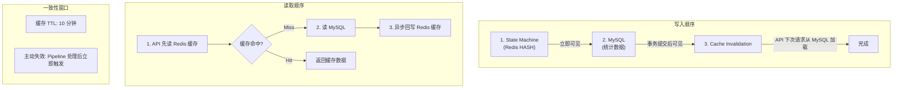

### 7.5 监控与告警

**关键指标**:

| 指标 | 说明 | 告警阈值 |
|------|------|----------|
| `animetop_scheduler_tasks_pending_in_queue` | 任务队列深度 | > 100 |
| `animetop_pipeline_processing_duration_seconds` | 处理延迟 | > 30s |
| `animetop_crawler_request_duration_seconds` | 爬取延迟 | > 60s |
| `animetop_queue_deadletter_len` | 死信队列长度 | > 0 |
| `animetop_scheduler_scheduled_ips` | 调度 IP 数 | < 预期 |

### 7.6 Redis 持久化配置

**推荐配置** (`redis.conf`):

```conf
# RDB 快照
save 900 1      # 15分钟内 1 次写入
save 300 10     # 5分钟内 10 次写入
save 60 10000   # 1分钟内 10000 次写入

# AOF 日志
appendonly yes
appendfsync everysec  # 每秒同步，平衡性能与持久性

# 混合持久化 (Redis 4.0+)
aof-use-rdb-preamble yes
```

---

## 附录

### A. 配置参数速查

| 参数 | 环境变量 | 默认值 | 说明 |
|------|----------|--------|------|
| BaseInterval | `SCHEDULER_BASE_INTERVAL` | 2h | 基础爬取间隔 |
| MinInterval | `SCHEDULER_MIN_INTERVAL` | 1h | 最小间隔 |
| MaxInterval | `SCHEDULER_MAX_INTERVAL` | 2h | 最大间隔 |
| PagesOnSale | `SCHEDULER_PAGES_ON_SALE` | 5 | 在售页数 |
| PagesSold | `SCHEDULER_PAGES_SOLD` | 5 | 已售页数 |
| BatchSize | `SCHEDULER_BATCH_SIZE` | 50 | 批量推送数 |
| JanitorInterval | `JANITOR_INTERVAL` | 5m | Janitor 间隔 |
| JanitorTimeout | `JANITOR_TIMEOUT` | 10m | 任务超时阈值 |
| MaxRetries | - | 3 | 最大重试次数 |
| ItemTTLAvailable | `ANALYZER_ITEM_TTL_AVAILABLE` | 24h | on_sale TTL |
| ItemTTLSold | `ANALYZER_ITEM_TTL_SOLD` | 48h | sold TTL |

### B. Redis Key 速查

| Key Pattern | 类型 | 说明 |
|-------------|------|------|
| `animetop:schedule:pending` | ZSET | 调度队列 |
| `animetop:queue:tasks` | LIST | 任务队列 |
| `animetop:queue:tasks:processing` | LIST | 处理中任务 |
| `animetop:queue:tasks:deadletter` | LIST | 死信任务 |
| `animetop:queue:tasks:pending` | SET | 任务去重 |
| `animetop:queue:tasks:started` | HASH | 任务开始时间 |
| `animetop:queue:results` | LIST | 结果队列 |
| `animetop:queue:results:processing` | LIST | 处理中结果 |
| `animetop:item:{ip_id}:{source_id}` | HASH | 商品状态 |
| `animetop:processed` | SET | 幂等检查 |
| `animetop:leaderboard:{type}:{hours}` | STRING | 排行榜缓存 |
| `animetop:ip:{ip_id}:*` | STRING | IP 详情缓存 |

### C. 关键代码入口

| 模块 | 文件 | 入口函数 |
|------|------|----------|
| Scheduler | `internal/scheduler/ip_scheduler.go` | `NewIPScheduler()`, `Start()` |
| ScheduleStore | `internal/scheduler/schedule_store.go` | `NewRedisScheduleStore()` |
| Crawler | `internal/crawler/service.go` | `NewService()`, `Start()` |
| CrawlLogic | `internal/crawler/crawl.go` | `StartWorker()`, `doCrawl()` |
| Pipeline | `internal/analyzer/pipeline.go` | `NewPipeline()`, `Start()` |
| StateMachine | `internal/analyzer/state_machine.go` | `ProcessItemsBatch()` |
| RedisQueue | `internal/pkg/redisqueue/client.go` | `NewClientWithRedis()` |
