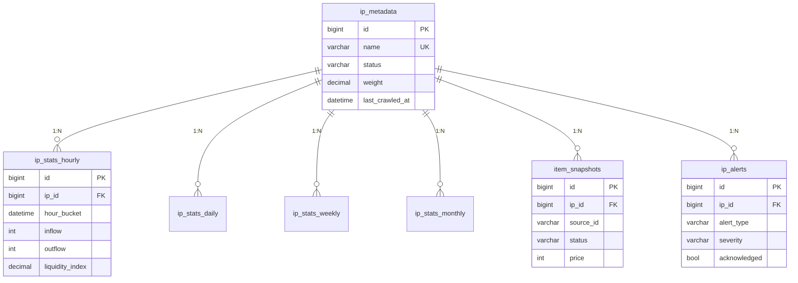
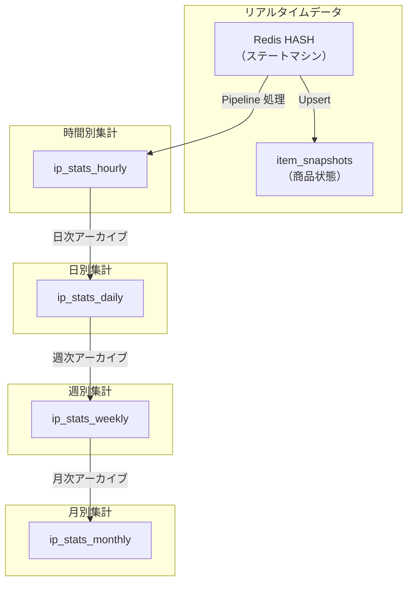

# Anime Hot データベーススキーマ

## 概要

Anime Hot は MySQL 8.0 をメインデータベースとして使用し、IP 流動性指標を時系列階層アーキテクチャで保存します。

**データベース設定**:
- **Charset**: utf8mb4（日本語/中国語対応）
- **Collation**: utf8mb4_unicode_ci
- **Engine**: InnoDB
- **タイムスタンプ精度**: ミリ秒 (DATETIME(3))

---

## テーブル関係図



---

## テーブル構造詳細

### 1. ip_metadata

**用途**: 監視対象 IP のメタデータを保存

| フィールド | 型 | 制約 | 説明 |
|------------|------|------|------|
| id | BIGINT UNSIGNED | PK, AUTO_INCREMENT | 主キー |
| name | VARCHAR(255) | NOT NULL, UNIQUE | 日本語名（検索キーワード） |
| name_en | VARCHAR(255) | DEFAULT '' | 英語別名 |
| name_cn | VARCHAR(255) | DEFAULT '' | 中国語別名 |
| category | VARCHAR(50) | DEFAULT '' | カテゴリ (anime/game/vocaloid/vtuber) |
| tags | JSON | - | タグ配列 |
| image_url | VARCHAR(512) | DEFAULT '' | 画像 URL |
| external_id | VARCHAR(100) | DEFAULT '', INDEXED | 外部 ID (mal:xxx, bgm:xxx) |
| notes | TEXT | - | メモ |
| weight | DECIMAL(5,2) | NOT NULL, DEFAULT 1.00 | スケジュール重み |
| status | VARCHAR(20) | NOT NULL, DEFAULT 'active', INDEXED | ステータス |
| last_crawled_at | DATETIME(3) | INDEXED | 最終クロール時刻 |
| created_at | DATETIME(3) | NOT NULL | 作成時刻 |
| updated_at | DATETIME(3) | NOT NULL | 更新時刻 |
| deleted_at | DATETIME(3) | INDEXED, NULLABLE | 論理削除時刻 |

**インデックス**:
```sql
PRIMARY KEY (id)
UNIQUE KEY uk_name (name)
KEY idx_ip_status (status)
KEY idx_weight (weight DESC)
KEY idx_last_crawled (last_crawled_at)
KEY idx_external_id (external_id)
KEY idx_deleted_at (deleted_at)
```

**ステータス列挙型** (`IPStatus`):
- `active` - 通常監視
- `paused` - 監視一時停止
- `deleted` - 削除済み

**重み説明**:
- `1.0` = 基準（2時間間隔）
- `2.0` = 2倍頻度（1時間間隔）
- `0.5` = 0.5倍頻度（4時間間隔、MaxInterval で制限）

---

### 2. ip_stats_hourly

**用途**: 時間別流動性統計

| フィールド | 型 | 制約 | 説明 |
|------------|------|------|------|
| id | BIGINT UNSIGNED | PK, AUTO_INCREMENT | 主キー |
| ip_id | BIGINT UNSIGNED | NOT NULL, FK | ip_metadata への外部キー |
| hour_bucket | DATETIME | NOT NULL, INDEXED DESC | 時間バケット |
| inflow | INT UNSIGNED | NOT NULL, DEFAULT 0 | 入荷量（新規出品） |
| outflow | INT UNSIGNED | NOT NULL, DEFAULT 0 | 出荷量（成約） |
| liquidity_index | DECIMAL(8,4) | NULLABLE, INDEXED DESC | 流動性指数 |
| active_count | INT UNSIGNED | NOT NULL, DEFAULT 0 | アクティブ商品数 |
| avg_price | DECIMAL(10,2) | NULLABLE | 平均価格 |
| median_price | DECIMAL(10,2) | NULLABLE | 中央値価格 |
| min_price | DECIMAL(10,2) | NULLABLE | 最低価格 |
| max_price | DECIMAL(10,2) | NULLABLE | 最高価格 |
| min_price_item | JSON | NULLABLE | 最低価格商品詳細 |
| max_price_item | JSON | NULLABLE | 最高価格商品詳細 |
| price_stddev | DECIMAL(10,2) | NULLABLE | 価格標準偏差 |
| sample_count | INT UNSIGNED | NOT NULL, DEFAULT 0 | サンプル数 |
| created_at | DATETIME(3) | NOT NULL | 作成時刻 |

**インデックス**:
```sql
PRIMARY KEY (id)
UNIQUE KEY uk_ip_hour (ip_id, hour_bucket)
KEY idx_hour_bucket (hour_bucket)
KEY idx_liquidity (liquidity_index DESC)
KEY idx_ip_time_range (ip_id, hour_bucket DESC)
```

**外部キー**:
```sql
CONSTRAINT fk_stats_ip FOREIGN KEY (ip_id)
  REFERENCES ip_metadata(id) ON DELETE CASCADE
```

**JSON カラム構造** (`PriceItemJSON`):
```json
{
  "source_id": "m1234567890",
  "title": "商品タイトル",
  "price": 3500,
  "image_url": "https://...",
  "item_url": "https://..."
}
```

**流動性指数計算**:
```
liquidity_index = outflow / inflow  (inflow=0 の場合は NULL)
```

---

### 3. ip_stats_daily

**用途**: 日別統計（時間別データから集計）

| フィールド | 型 | 制約 | 説明 |
|------------|------|------|------|
| id | BIGINT UNSIGNED | PK, AUTO_INCREMENT | 主キー |
| ip_id | BIGINT UNSIGNED | NOT NULL | ip_metadata への外部キー |
| date_bucket | DATE | NOT NULL, INDEXED | 日付 |
| total_inflow | INT UNSIGNED | NOT NULL, DEFAULT 0 | 日間総入荷量 |
| total_outflow | INT UNSIGNED | NOT NULL, DEFAULT 0 | 日間総出荷量 |
| avg_liquidity | DECIMAL(8,4) | NULLABLE | 平均流動性 |
| max_sold_price | DECIMAL(10,2) | NULLABLE | 最高成約価格 |
| min_sold_price | DECIMAL(10,2) | NULLABLE | 最低成約価格 |
| median_sold_price | DECIMAL(10,2) | NULLABLE | 中央値成約価格 |
| avg_sold_price | DECIMAL(10,2) | NULLABLE | 平均成約価格 |
| min_price_item | JSON | NULLABLE | 最低価格商品 |
| max_price_item | JSON | NULLABLE | 最高価格商品 |
| sample_count | INT UNSIGNED | NOT NULL, DEFAULT 0 | サンプル総数 |
| hourly_records | INT UNSIGNED | NOT NULL, DEFAULT 0 | 集計した時間別レコード数 |
| created_at | DATETIME(3) | NOT NULL | 作成時刻 |

**インデックス**:
```sql
PRIMARY KEY (id)
UNIQUE KEY uk_ip_day (ip_id, date_bucket)
KEY idx_date_bucket (date_bucket)
```

---

### 4. ip_stats_weekly

**用途**: 週別統計（日別データから集計）

| フィールド | 型 | 説明 |
|------------|------|------|
| id | BIGINT UNSIGNED | 主キー |
| ip_id | BIGINT UNSIGNED | ip_metadata への外部キー |
| week_start | DATE | 週の月曜日 |
| total_inflow | INT UNSIGNED | 週間総入荷量 |
| total_outflow | INT UNSIGNED | 週間総出荷量 |
| avg_liquidity | DECIMAL(8,4) | 平均流動性 |
| max/min/median/avg_sold_price | DECIMAL(10,2) | 価格統計 |
| min_price_item | JSON | 最低価格商品 |
| max_price_item | JSON | 最高価格商品 |
| sample_count | INT UNSIGNED | サンプル総数 |
| daily_records | INT UNSIGNED | 集計した日別レコード数 |

**インデックス**:
```sql
UNIQUE KEY uk_ip_week (ip_id, week_start)
KEY idx_week_start (week_start)
```

---

### 5. ip_stats_monthly

**用途**: 月別統計（週別データから集計）

構造は `ip_stats_weekly` と類似、`month_start`（毎月1日）を時間キーとして使用。

---

### 6. item_snapshots

**用途**: 商品状態スナップショット（状態追跡とデバッグ用）

| フィールド | 型 | 制約 | 説明 |
|------------|------|------|------|
| id | BIGINT UNSIGNED | PK, AUTO_INCREMENT | 主キー |
| ip_id | BIGINT UNSIGNED | NOT NULL, FK | ip_metadata への外部キー |
| source_id | VARCHAR(64) | NOT NULL, INDEXED | ソースプラットフォーム商品 ID |
| title | VARCHAR(512) | NOT NULL, DEFAULT '' | 商品タイトル |
| price | INT UNSIGNED | NOT NULL, DEFAULT 0 | 価格（円） |
| status | VARCHAR(20) | NOT NULL, DEFAULT 'on_sale', INDEXED | ステータス |
| image_url | VARCHAR(1024) | NULLABLE | 画像 URL |
| item_url | VARCHAR(1024) | NULLABLE | 商品ページ URL |
| first_seen_at | DATETIME(3) | NOT NULL, INDEXED | 初回発見時刻 |
| last_seen_at | DATETIME(3) | NOT NULL | 最終更新時刻 |
| sold_at | DATETIME(3) | NULLABLE, INDEXED | 成約時刻 |
| price_changed | BOOL | NOT NULL, DEFAULT FALSE | 価格変更フラグ |
| created_at | DATETIME(3) | NOT NULL | 作成時刻 |
| updated_at | DATETIME(3) | NOT NULL | 更新時刻 |

**インデックス**:
```sql
PRIMARY KEY (id)
UNIQUE KEY uk_ip_source (ip_id, source_id)
KEY idx_item_status (status)
KEY idx_ip_status_time (ip_id, status, last_seen_at DESC)
KEY idx_source_id (source_id)
KEY idx_first_seen (first_seen_at)
KEY idx_sold_at (sold_at)
```

**ステータス列挙型** (`ItemStatus`):
- `on_sale` - 出品中
- `sold` - 売却済み
- `deleted` - 削除/取り下げ

---

### 7. ip_alerts

**用途**: 流動性異常アラートレコード

| フィールド | 型 | 制約 | 説明 |
|------------|------|------|------|
| id | BIGINT UNSIGNED | PK, AUTO_INCREMENT | 主キー |
| ip_id | BIGINT UNSIGNED | NOT NULL, FK, INDEXED | ip_metadata への外部キー |
| alert_type | VARCHAR(20) | NOT NULL, INDEXED | アラート種別 |
| severity | VARCHAR(20) | NOT NULL, DEFAULT 'info', INDEXED | 重大度 |
| message | VARCHAR(1024) | NOT NULL | アラートメッセージ |
| metric_value | DECIMAL(10,4) | NULLABLE | 実際の指標値 |
| threshold_value | DECIMAL(10,4) | NULLABLE | トリガー閾値 |
| hour_bucket | DATETIME | NOT NULL | 対応する時間バケット |
| acknowledged | BOOL | NOT NULL, DEFAULT FALSE | 確認済みか |
| acknowledged_at | DATETIME(3) | NULLABLE | 確認時刻 |
| created_at | DATETIME(3) | NOT NULL, INDEXED DESC | 作成時刻 |

**インデックス**:
```sql
PRIMARY KEY (id)
KEY idx_ip_type (ip_id, alert_type)
KEY idx_alert_severity (severity)
KEY idx_created (created_at DESC)
```

**アラート種別** (`AlertType`):
- `high_outflow` - 高出荷量
- `low_liquidity` - 低流動性
- `high_liquidity` - 高流動性（卒業潮の可能性）
- `price_drop` - 価格暴落
- `surge` - 異常流入

**重大度** (`AlertSeverity`):
- `info` - 情報
- `warning` - 警告
- `critical` - 重大

---

## データ集計階層



**集計トリガー**:
- **時間別統計**: Pipeline がリアルタイム書き込み
- **日別統計**: 管理 API でトリガー (`POST /api/v1/admin/archive/daily`)
- **週別統計**: 管理 API でトリガー (`POST /api/v1/admin/archive/weekly`)
- **月別統計**: 管理 API でトリガー

---

## よく使うクエリ

### IP の直近 24 時間統計を取得

```sql
SELECT * FROM ip_stats_hourly
WHERE ip_id = 11
  AND hour_bucket >= DATE_SUB(NOW(), INTERVAL 24 HOUR)
ORDER BY hour_bucket DESC;
```

### 人気 IP ランキング取得 (1H)

```sql
SELECT
  m.id, m.name, m.name_en,
  s.inflow, s.outflow,
  (s.outflow + 1.0) / (s.inflow + 1.0) * LOG(s.outflow + 1) AS hot_score
FROM ip_stats_hourly s
JOIN ip_metadata m ON s.ip_id = m.id
WHERE s.hour_bucket = DATE_FORMAT(DATE_SUB(NOW(), INTERVAL 1 HOUR), '%Y-%m-%d %H:00:00')
  AND m.status = 'active'
ORDER BY hot_score DESC
LIMIT 10;
```

### IP の出品中商品を取得

```sql
SELECT * FROM item_snapshots
WHERE ip_id = 11 AND status = 'on_sale'
ORDER BY last_seen_at DESC
LIMIT 50;
```

### 未確認アラートを取得

```sql
SELECT a.*, m.name AS ip_name
FROM ip_alerts a
JOIN ip_metadata m ON a.ip_id = m.id
WHERE a.acknowledged = FALSE
ORDER BY a.created_at DESC;
```

---

## データベース初期化

**自動マイグレーション** (GORM):

```go
func AutoMigrate(db *gorm.DB) error {
    return db.AutoMigrate(
        &IPMetadata{},
        &IPStatsHourly{},
        &IPStatsDaily{},
        &IPStatsWeekly{},
        &IPStatsMonthly{},
        &ItemSnapshot{},
        &IPAlert{},
    )
}
```

**手動マイグレーション**:

```bash
mysql -u root -p animetop < migrations/001_init.sql
```

---

## データ保持ポリシー

| テーブル | 推奨保持期間 | クリーンアップ方法 |
|----------|--------------|-------------------|
| ip_stats_hourly | 30 日 | daily へアーカイブ後削除 |
| ip_stats_daily | 1 年 | weekly へアーカイブ後削除 |
| ip_stats_weekly | 2 年 | monthly へアーカイブ後削除 |
| ip_stats_monthly | 永久 | - |
| item_snapshots | 7 日 (on_sale) / 30 日 (sold) | 定期クリーンアップ |
| ip_alerts | 90 日 | 確認済みアラートを定期クリーンアップ |
