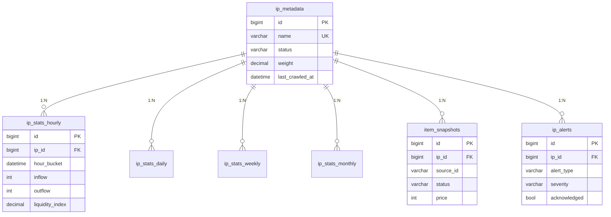
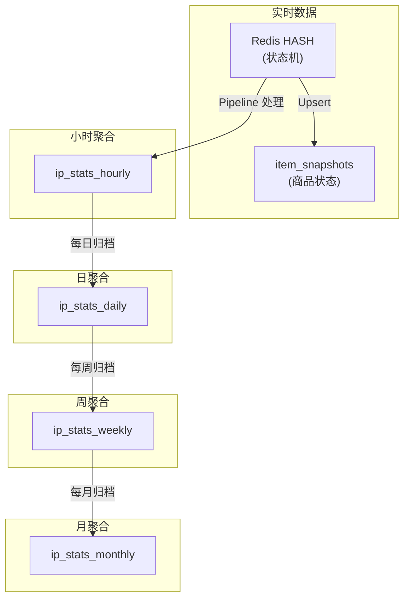

# Anime Hot Database Schema

## Overview

Anime Hot 使用 MySQL 8.0 作为主数据库，采用时间序列分层架构存储 IP 流动性指标。

**数据库配置**:
- **Charset**: utf8mb4 (支持日文/中文)
- **Collation**: utf8mb4_unicode_ci
- **Engine**: InnoDB
- **时间戳精度**: 毫秒 (DATETIME(3))

---

## 表关系图



---

## 表结构详解

### 1. ip_metadata

**用途**: 存储监控 IP 的元数据

| 字段 | 类型 | 约束 | 说明 |
|------|------|------|------|
| id | BIGINT UNSIGNED | PK, AUTO_INCREMENT | 主键 |
| name | VARCHAR(255) | NOT NULL, UNIQUE | 日文名称 (搜索关键词) |
| name_en | VARCHAR(255) | DEFAULT '' | 英文别名 |
| name_cn | VARCHAR(255) | DEFAULT '' | 中文别名 |
| category | VARCHAR(50) | DEFAULT '' | 分类 (anime/game/vocaloid/vtuber) |
| tags | JSON | - | 标签数组 |
| image_url | VARCHAR(512) | DEFAULT '' | 图片 URL |
| external_id | VARCHAR(100) | DEFAULT '', INDEXED | 外部 ID (mal:xxx, bgm:xxx) |
| notes | TEXT | - | 备注 |
| weight | DECIMAL(5,2) | NOT NULL, DEFAULT 1.00 | 调度权重 |
| status | VARCHAR(20) | NOT NULL, DEFAULT 'active', INDEXED | 状态 |
| last_crawled_at | DATETIME(3) | INDEXED | 最后爬取时间 |
| created_at | DATETIME(3) | NOT NULL | 创建时间 |
| updated_at | DATETIME(3) | NOT NULL | 更新时间 |
| deleted_at | DATETIME(3) | INDEXED, NULLABLE | 软删除时间 |

**索引**:
```sql
PRIMARY KEY (id)
UNIQUE KEY uk_name (name)
KEY idx_ip_status (status)
KEY idx_weight (weight DESC)
KEY idx_last_crawled (last_crawled_at)
KEY idx_external_id (external_id)
KEY idx_deleted_at (deleted_at)
```

**状态枚举** (`IPStatus`):
- `active` - 正常监控
- `paused` - 暂停监控
- `deleted` - 已删除

**权重说明**:
- `1.0` = 基准 (2小时间隔)
- `2.0` = 2倍频率 (1小时间隔)
- `0.5` = 0.5倍频率 (4小时间隔，但受 MaxInterval 限制)

---

### 2. ip_stats_hourly

**用途**: 小时级流动性统计

| 字段 | 类型 | 约束 | 说明 |
|------|------|------|------|
| id | BIGINT UNSIGNED | PK, AUTO_INCREMENT | 主键 |
| ip_id | BIGINT UNSIGNED | NOT NULL, FK | 关联 ip_metadata |
| hour_bucket | DATETIME | NOT NULL, INDEXED DESC | 小时时间桶 |
| inflow | INT UNSIGNED | NOT NULL, DEFAULT 0 | 进货量 (新上架) |
| outflow | INT UNSIGNED | NOT NULL, DEFAULT 0 | 出货量 (成交) |
| liquidity_index | DECIMAL(8,4) | NULLABLE, INDEXED DESC | 流动性指数 |
| active_count | INT UNSIGNED | NOT NULL, DEFAULT 0 | 活跃商品数 |
| avg_price | DECIMAL(10,2) | NULLABLE | 平均价格 |
| median_price | DECIMAL(10,2) | NULLABLE | 中位数价格 |
| min_price | DECIMAL(10,2) | NULLABLE | 最低价格 |
| max_price | DECIMAL(10,2) | NULLABLE | 最高价格 |
| min_price_item | JSON | NULLABLE | 最低价商品详情 |
| max_price_item | JSON | NULLABLE | 最高价商品详情 |
| price_stddev | DECIMAL(10,2) | NULLABLE | 价格标准差 |
| sample_count | INT UNSIGNED | NOT NULL, DEFAULT 0 | 样本数 |
| created_at | DATETIME(3) | NOT NULL | 创建时间 |

**索引**:
```sql
PRIMARY KEY (id)
UNIQUE KEY uk_ip_hour (ip_id, hour_bucket)
KEY idx_hour_bucket (hour_bucket)
KEY idx_liquidity (liquidity_index DESC)
KEY idx_ip_time_range (ip_id, hour_bucket DESC)
```

**外键**:
```sql
CONSTRAINT fk_stats_ip FOREIGN KEY (ip_id)
  REFERENCES ip_metadata(id) ON DELETE CASCADE
```

**JSON 列结构** (`PriceItemJSON`):
```json
{
  "source_id": "m1234567890",
  "title": "商品标题",
  "price": 3500,
  "image_url": "https://...",
  "item_url": "https://..."
}
```

**流动性指数计算**:
```
liquidity_index = outflow / inflow  (inflow=0 时为 NULL)
```

---

### 3. ip_stats_daily

**用途**: 日级统计 (由小时数据聚合)

| 字段 | 类型 | 约束 | 说明 |
|------|------|------|------|
| id | BIGINT UNSIGNED | PK, AUTO_INCREMENT | 主键 |
| ip_id | BIGINT UNSIGNED | NOT NULL | 关联 ip_metadata |
| date_bucket | DATE | NOT NULL, INDEXED | 日期 |
| total_inflow | INT UNSIGNED | NOT NULL, DEFAULT 0 | 日总进货量 |
| total_outflow | INT UNSIGNED | NOT NULL, DEFAULT 0 | 日总出货量 |
| avg_liquidity | DECIMAL(8,4) | NULLABLE | 平均流动性 |
| max_sold_price | DECIMAL(10,2) | NULLABLE | 最高成交价 |
| min_sold_price | DECIMAL(10,2) | NULLABLE | 最低成交价 |
| median_sold_price | DECIMAL(10,2) | NULLABLE | 中位成交价 |
| avg_sold_price | DECIMAL(10,2) | NULLABLE | 平均成交价 |
| min_price_item | JSON | NULLABLE | 最低价商品 |
| max_price_item | JSON | NULLABLE | 最高价商品 |
| sample_count | INT UNSIGNED | NOT NULL, DEFAULT 0 | 样本总数 |
| hourly_records | INT UNSIGNED | NOT NULL, DEFAULT 0 | 聚合的小时记录数 |
| created_at | DATETIME(3) | NOT NULL | 创建时间 |

**索引**:
```sql
PRIMARY KEY (id)
UNIQUE KEY uk_ip_day (ip_id, date_bucket)
KEY idx_date_bucket (date_bucket)
```

---

### 4. ip_stats_weekly

**用途**: 周级统计 (由日数据聚合)

| 字段 | 类型 | 说明 |
|------|------|------|
| id | BIGINT UNSIGNED | 主键 |
| ip_id | BIGINT UNSIGNED | 关联 ip_metadata |
| week_start | DATE | 周一日期 |
| total_inflow | INT UNSIGNED | 周总进货量 |
| total_outflow | INT UNSIGNED | 周总出货量 |
| avg_liquidity | DECIMAL(8,4) | 平均流动性 |
| max/min/median/avg_sold_price | DECIMAL(10,2) | 价格统计 |
| min_price_item | JSON | 最低价商品 |
| max_price_item | JSON | 最高价商品 |
| sample_count | INT UNSIGNED | 样本总数 |
| daily_records | INT UNSIGNED | 聚合的日记录数 |

**索引**:
```sql
UNIQUE KEY uk_ip_week (ip_id, week_start)
KEY idx_week_start (week_start)
```

---

### 5. ip_stats_monthly

**用途**: 月级统计 (由周数据聚合)

结构与 `ip_stats_weekly` 类似，使用 `month_start` (每月1日) 作为时间键。

---

### 6. item_snapshots

**用途**: 商品状态快照 (状态追踪与调试)

| 字段 | 类型 | 约束 | 说明 |
|------|------|------|------|
| id | BIGINT UNSIGNED | PK, AUTO_INCREMENT | 主键 |
| ip_id | BIGINT UNSIGNED | NOT NULL, FK | 关联 ip_metadata |
| source_id | VARCHAR(64) | NOT NULL, INDEXED | 来源平台商品 ID |
| title | VARCHAR(512) | NOT NULL, DEFAULT '' | 商品标题 |
| price | INT UNSIGNED | NOT NULL, DEFAULT 0 | 价格 (日元) |
| status | VARCHAR(20) | NOT NULL, DEFAULT 'on_sale', INDEXED | 状态 |
| image_url | VARCHAR(1024) | NULLABLE | 图片 URL |
| item_url | VARCHAR(1024) | NULLABLE | 商品页 URL |
| first_seen_at | DATETIME(3) | NOT NULL, INDEXED | 首次发现时间 |
| last_seen_at | DATETIME(3) | NOT NULL | 最后更新时间 |
| sold_at | DATETIME(3) | NULLABLE, INDEXED | 成交时间 |
| price_changed | BOOL | NOT NULL, DEFAULT FALSE | 价格变动标记 |
| created_at | DATETIME(3) | NOT NULL | 创建时间 |
| updated_at | DATETIME(3) | NOT NULL | 更新时间 |

**索引**:
```sql
PRIMARY KEY (id)
UNIQUE KEY uk_ip_source (ip_id, source_id)
KEY idx_item_status (status)
KEY idx_ip_status_time (ip_id, status, last_seen_at DESC)
KEY idx_source_id (source_id)
KEY idx_first_seen (first_seen_at)
KEY idx_sold_at (sold_at)
```

**状态枚举** (`ItemStatus`):
- `on_sale` - 在售
- `sold` - 已售出
- `deleted` - 已删除/下架

---

### 7. ip_alerts

**用途**: 流动性异常告警记录

| 字段 | 类型 | 约束 | 说明 |
|------|------|------|------|
| id | BIGINT UNSIGNED | PK, AUTO_INCREMENT | 主键 |
| ip_id | BIGINT UNSIGNED | NOT NULL, FK, INDEXED | 关联 ip_metadata |
| alert_type | VARCHAR(20) | NOT NULL, INDEXED | 告警类型 |
| severity | VARCHAR(20) | NOT NULL, DEFAULT 'info', INDEXED | 严重程度 |
| message | VARCHAR(1024) | NOT NULL | 告警消息 |
| metric_value | DECIMAL(10,4) | NULLABLE | 实际指标值 |
| threshold_value | DECIMAL(10,4) | NULLABLE | 触发阈值 |
| hour_bucket | DATETIME | NOT NULL | 对应小时时间桶 |
| acknowledged | BOOL | NOT NULL, DEFAULT FALSE | 是否已确认 |
| acknowledged_at | DATETIME(3) | NULLABLE | 确认时间 |
| created_at | DATETIME(3) | NOT NULL, INDEXED DESC | 创建时间 |

**索引**:
```sql
PRIMARY KEY (id)
KEY idx_ip_type (ip_id, alert_type)
KEY idx_alert_severity (severity)
KEY idx_created (created_at DESC)
```

**告警类型** (`AlertType`):
- `high_outflow` - 高出货量
- `low_liquidity` - 低流动性
- `high_liquidity` - 高流动性 (可能退坑潮)
- `price_drop` - 价格暴跌
- `surge` - 异常涌入

**严重程度** (`AlertSeverity`):
- `info` - 信息
- `warning` - 警告
- `critical` - 严重

---

## 数据聚合层次



**聚合触发**:
- **小时统计**: Pipeline 实时写入
- **日统计**: 管理 API 触发 (`POST /api/v1/admin/archive/daily`)
- **周统计**: 管理 API 触发 (`POST /api/v1/admin/archive/weekly`)
- **月统计**: 管理 API 触发

---

## 常用查询

### 查询 IP 最近 24 小时统计

```sql
SELECT * FROM ip_stats_hourly
WHERE ip_id = 11
  AND hour_bucket >= DATE_SUB(NOW(), INTERVAL 24 HOUR)
ORDER BY hour_bucket DESC;
```

### 查询热门 IP 排行榜 (1H)

```sql
SELECT
  m.id, m.name, m.name_en,
  s.inflow, s.outflow,
  (s.outflow + 1.0) / (s.inflow + 1.0) * LOG(s.outflow + 1) AS hot_score
FROM ip_stats_hourly s
JOIN ip_metadata m ON s.ip_id = m.id
WHERE s.hour_bucket = DATE_FORMAT(DATE_SUB(NOW(), INTERVAL 1 HOUR), '%Y-%m-%d %H:00:00')
  AND m.status = 'active'
ORDER BY hot_score DESC
LIMIT 10;
```

### 查询 IP 在售商品

```sql
SELECT * FROM item_snapshots
WHERE ip_id = 11 AND status = 'on_sale'
ORDER BY last_seen_at DESC
LIMIT 50;
```

### 查询未确认告警

```sql
SELECT a.*, m.name AS ip_name
FROM ip_alerts a
JOIN ip_metadata m ON a.ip_id = m.id
WHERE a.acknowledged = FALSE
ORDER BY a.created_at DESC;
```

---

## 数据库初始化

**自动迁移** (GORM):

```go
func AutoMigrate(db *gorm.DB) error {
    return db.AutoMigrate(
        &IPMetadata{},
        &IPStatsHourly{},
        &IPStatsDaily{},
        &IPStatsWeekly{},
        &IPStatsMonthly{},
        &ItemSnapshot{},
        &IPAlert{},
    )
}
```

**手动迁移**:

```bash
mysql -u root -p animetop < migrations/001_init.sql
```

---

## 数据保留策略

| 表 | 建议保留时间 | 清理方式 |
|----|--------------|----|
| ip_stats_hourly | 30 天 | 归档到 daily 后删除 |
| ip_stats_daily | 1 年 | 归档到 weekly 后删除 |
| ip_stats_weekly | 2 年 | 归档到 monthly 后删除 |
| ip_stats_monthly | 永久 | - |
| item_snapshots | 7 天 (on_sale) / 30 天 (sold) | 定期清理 |
| ip_alerts | 90 天 | 定期清理已确认告警 |
