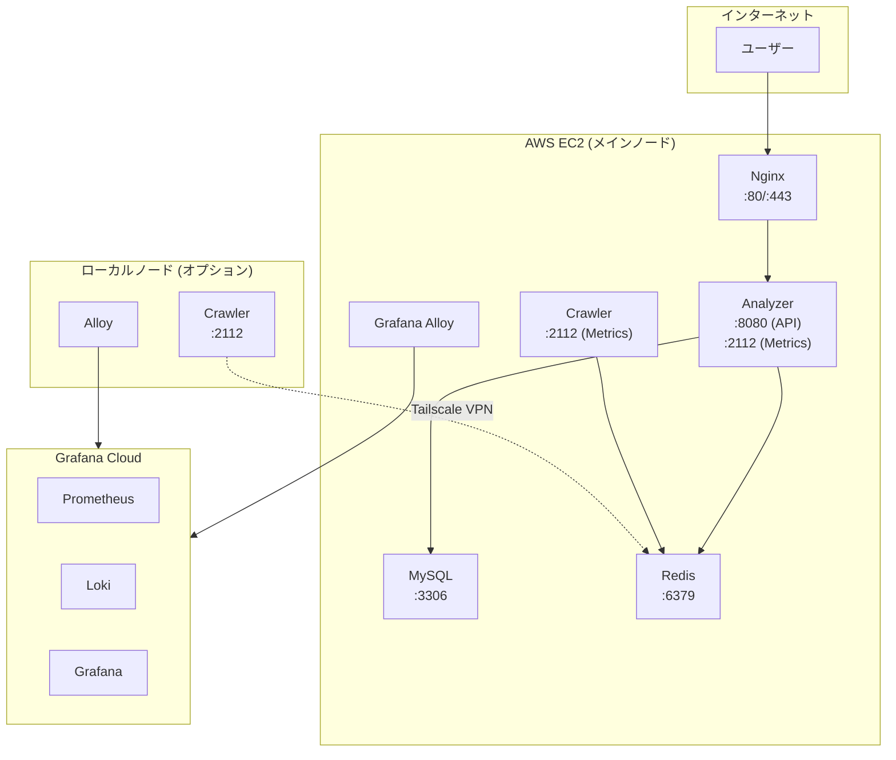
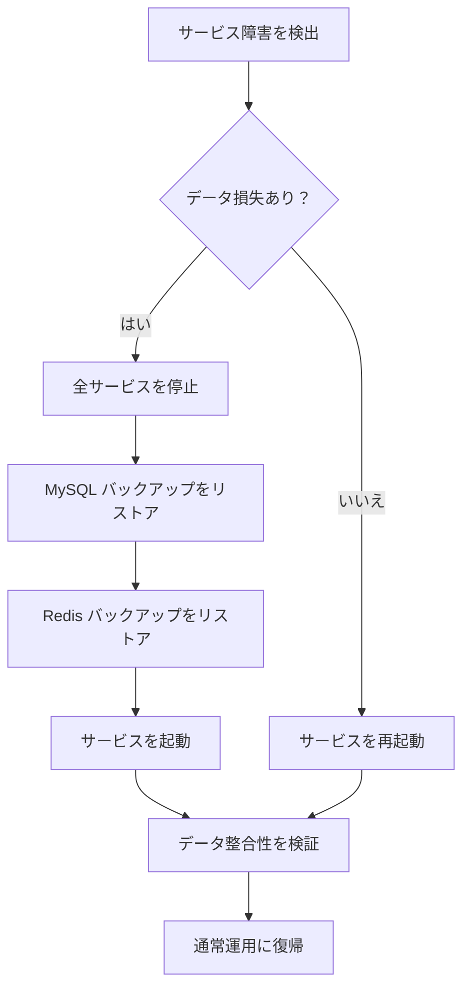

# Anime Hot 運用マニュアル

## 概要

本マニュアルは Anime Hot システムのデプロイ、監視、運用、トラブルシューティングを網羅します。

---

## 目次

1. [デプロイアーキテクチャ](#1-デプロイアーキテクチャ)
2. [サービス管理](#2-サービス管理)
3. [監視・メトリクス](#3-監視メトリクス)
4. [ログ管理](#4-ログ管理)
5. [ヘルスチェック](#5-ヘルスチェック)
6. [環境変数設定](#6-環境変数設定)
7. [トラブルシューティング](#7-トラブルシューティング)
8. [運用スクリプト](#8-運用スクリプト)
9. [バックアップ・リストア](#9-バックアップリストア)

---

## 1. デプロイアーキテクチャ

### 1.1 サービスアーキテクチャ



### 1.2 ポートマッピング

| サービス | ポート | 説明 |
|----------|--------|------|
| Nginx | 80, 443 | HTTP/HTTPS |
| Analyzer | 8080 | API サービス |
| Analyzer | 2112 | Prometheus Metrics |
| Crawler | 2112 | Prometheus Metrics |
| MySQL | 3306 | データベース（内部のみ） |
| Redis | 6379 | キャッシュ（内部/Tailscale のみ） |

---

## 2. サービス管理

### 2.1 Docker Compose コマンド

```bash
# 開発環境
make docker-build          # イメージをビルド
make docker-up             # 全サービスを起動
make docker-down           # サービスを停止
make docker-logs           # 全ログを表示
make docker-ps             # サービス状態を表示

# 依存サービスのみ起動（ローカル開発）
make dev-deps              # MySQL + Redis を起動
make dev-analyzer          # Analyzer をローカルで実行
make dev-crawler           # Crawler をローカルで実行

# 本番環境
docker compose -f docker-compose.prod.yml up -d
docker compose -f docker-compose.prod.yml --profile monitoring up -d

# ローカルクローラーノード
docker compose -f docker-compose.crawler.yml up -d
```

### 2.2 サービスの起動・停止

```bash
# 単一サービスを再起動
docker compose restart analyzer
docker compose restart crawler

# 強制再作成
docker compose up -d --force-recreate analyzer

# 単一サービスのログを表示
docker compose logs -f analyzer
docker compose logs -f crawler
```

### 2.3 グレースフルシャットダウン

**Analyzer シャットダウン順序** (30秒タイムアウト):
1. 新規リクエストの受付を停止
2. HTTP サーバーをシャットダウン
3. スケジューラを停止
4. Pipeline の処理完了を待機
5. データベース接続をクローズ

**Crawler シャットダウン順序** (2分タイムアウト):
1. 新規タスクの受付を停止
2. 現在のクロール完了を待機
3. ブラウザインスタンスをクローズ
4. Metrics サーバーをシャットダウン

```yaml
# docker-compose.yml
crawler:
  stop_grace_period: 2m  # ブラウザクリーンアップに長い時間が必要
```

---

## 3. 監視・メトリクス

### 3.1 Metrics エンドポイント

- **Analyzer**: `http://localhost:2112/metrics`
- **Crawler**: `http://localhost:2112/metrics`

### 3.2 主要メトリクス

#### タスクキュー

| メトリクス | 型 | 説明 |
|------------|------|------|
| `crawler_queue_depth{name="tasks"}` | Gauge | 待機中タスク数 |
| `crawler_queue_depth{name="results"}` | Gauge | 待機中結果数 |
| `animetop_scheduler_tasks_pending_in_queue` | Gauge | スケジューラキュー深度 |
| `animetop_task_dlq_total` | Counter | デッドレターキュー数 |

#### タスク処理

| メトリクス | 型 | 説明 |
|------------|------|------|
| `animetop_tasks_processed_total{status="success"}` | Counter | 成功タスク数 |
| `animetop_tasks_processed_total{status="failed"}` | Counter | 失敗タスク数 |
| `animetop_task_processing_duration_seconds` | Histogram | 処理時間分布 |

#### クローラー

| メトリクス | 型 | 説明 |
|------------|------|------|
| `animetop_crawler_requests_total` | Counter | クロールリクエスト数 |
| `animetop_crawler_request_duration_seconds` | Histogram | クロール時間 |
| `animetop_crawler_errors_total{type="timeout"}` | Counter | タイムアウトエラー |
| `animetop_crawler_errors_total{type="blocked"}` | Counter | ブロックされた |
| `animetop_crawler_browser_active` | Gauge | アクティブブラウザページ |
| `animetop_crawler_proxy_mode` | Gauge | プロキシモード (0=直接, 1=プロキシ) |

#### HTTP API

| メトリクス | 型 | 説明 |
|------------|------|------|
| `animetop_http_requests_total` | Counter | リクエスト総数 |
| `animetop_http_request_duration_seconds` | Histogram | リクエスト時間 |

#### データベース

| メトリクス | 型 | 説明 |
|------------|------|------|
| `animetop_db_connections_active` | Gauge | アクティブ接続数 |
| `animetop_db_connections_idle` | Gauge | アイドル接続数 |
| `animetop_db_query_duration_seconds` | Histogram | クエリ時間 |

### 3.3 アラートルール例

```yaml
# Prometheus alerting rules
groups:
  - name: animetop
    rules:
      # タスクキュー滞留
      - alert: TaskQueueBacklog
        expr: crawler_queue_depth{name="tasks"} > 100
        for: 5m
        labels:
          severity: warning
        annotations:
          summary: "タスクキュー滞留 ({{ $value }})"

      # デッドレターキューにデータあり
      - alert: DeadLetterQueueNotEmpty
        expr: animetop_task_dlq_total > 0
        for: 1m
        labels:
          severity: critical
        annotations:
          summary: "デッドレターキューに {{ $value }} 件のタスク"

      # クローラーがブロックされた
      - alert: CrawlerBlocked
        expr: increase(animetop_crawler_errors_total{type="blocked"}[5m]) > 5
        labels:
          severity: critical
        annotations:
          summary: "クローラーがブロックされた、5分間で {{ $value }} 回"

      # 処理遅延が高い
      - alert: HighProcessingLatency
        expr: histogram_quantile(0.95, animetop_task_processing_duration_seconds_bucket) > 60
        for: 5m
        labels:
          severity: warning
        annotations:
          summary: "P95 処理遅延が 60s を超過"
```

### 3.4 Grafana ダッシュボード

**推奨パネル**:
1. **タスクキュー深度** - `crawler_queue_depth`
2. **タスク処理レート** - `rate(animetop_tasks_processed_total[5m])`
3. **クロール成功率** - `rate(animetop_crawler_requests_total{status="success"}[5m])`
4. **P95 遅延** - `histogram_quantile(0.95, ...)`
5. **DB 接続** - `animetop_db_connections_*`
6. **ブラウザインスタンス** - `animetop_crawler_browser_*`

---

## 4. ログ管理

### 4.1 ログ形式

JSON 構造化ログ、stdout に出力：

```json
{
  "time": "2026-01-21T14:30:00.123+09:00",
  "level": "INFO",
  "msg": "task processed",
  "service": "pipeline",
  "ip_id": 11,
  "inflow": 25,
  "outflow": 8
}
```

### 4.2 Docker ログ設定

```yaml
# docker-compose.yml
logging:
  driver: "json-file"
  options:
    max-size: "10m"
    max-file: "3"
```

### 4.3 ログ表示

```bash
# リアルタイム表示
docker compose logs -f analyzer
docker compose logs -f crawler

# 最新 100 行を表示
docker compose logs --tail=100 analyzer

# エラーをフィルタ
docker compose logs analyzer 2>&1 | grep -i error

# 特定時間帯を表示
docker compose logs --since="2026-01-21T14:00:00" analyzer
```

### 4.4 主要ログイベント

| ログ内容 | レベル | 説明 |
|----------|--------|------|
| `starting IP liquidity analyzer service` | INFO | サービス起動 |
| `MySQL connected` | INFO | DB 接続成功 |
| `shutdown signal received` | INFO | シャットダウンシグナル受信 |
| `failed to load config` | ERROR | 設定読み込み失敗 |
| `task processing failed` | ERROR | タスク処理失敗 |
| `crawler blocked detected` | WARN | ブロック検出 |
| `proxy switched` | INFO | プロキシ切り替え |

---

## 5. ヘルスチェック

### 5.1 ヘルスチェックエンドポイント

```bash
# 基本ヘルスチェック
curl http://localhost:8080/health

# システム状態
curl http://localhost:8080/api/v1/system/status

# スケジューラ状態
curl http://localhost:8080/api/v1/system/scheduler
```

### 5.2 Docker ヘルスチェック

```yaml
healthcheck:
  test: ["CMD", "wget", "-qO-", "http://127.0.0.1:8080/health"]
  interval: 10s
  timeout: 3s
  retries: 5
  start_period: 30s
```

### 5.3 ヘルスチェックスクリプト

```bash
#!/bin/bash
# scripts/health_check.sh

# API チェック
if ! curl -sf http://localhost:8080/health > /dev/null; then
  echo "ERROR: API ヘルスチェック失敗"
  exit 1
fi

# MySQL チェック
if ! docker compose exec -T mysql mysqladmin ping -h localhost -u root -p"$MYSQL_ROOT_PASSWORD" > /dev/null 2>&1; then
  echo "ERROR: MySQL ヘルスチェック失敗"
  exit 1
fi

# Redis チェック
if ! docker compose exec -T redis redis-cli ping > /dev/null 2>&1; then
  echo "ERROR: Redis ヘルスチェック失敗"
  exit 1
fi

# キュー深度チェック
QUEUE_DEPTH=$(curl -sf http://localhost:8080/api/v1/system/status | jq -r '.data.stats.active_items // 0')
if [ "$QUEUE_DEPTH" -gt 1000 ]; then
  echo "WARNING: タスクキュー深度が高い: $QUEUE_DEPTH"
fi

echo "OK: 全ヘルスチェック合格"
```

---

## 6. 環境変数設定

### 6.1 コア設定

| 変数 | デフォルト | 説明 |
|------|----------|------|
| `APP_ENV` | local | 環境 (local/prod) |
| `DEBUG` | false | デバッグモード |
| `AUTO_MIGRATE` | true | 自動 DB マイグレーション |

### 6.2 データベース

| 変数 | デフォルト | 説明 |
|------|----------|------|
| `MYSQL_USER` | animetop | ユーザー名 |
| `MYSQL_PASSWORD` | - | パスワード |
| `MYSQL_DATABASE` | animetop | データベース名 |
| `MYSQL_PORT` | 3306 | ポート |

### 6.3 Redis

| 変数 | デフォルト | 説明 |
|------|----------|------|
| `REDIS_PORT` | 6379 | ポート |
| `REDIS_POOL_SIZE` | 10 | コネクションプールサイズ |

### 6.4 スケジューラ

| 変数 | デフォルト | 説明 |
|------|----------|------|
| `SCHEDULER_BASE_INTERVAL` | 2h | 基本間隔 |
| `SCHEDULER_MIN_INTERVAL` | 1h | 最小間隔 |
| `SCHEDULER_MAX_INTERVAL` | 2h | 最大間隔 |
| `SCHEDULER_PAGES_ON_SALE` | 5 | 出品中ページ数 |
| `SCHEDULER_PAGES_SOLD` | 5 | 売却済みページ数 |

### 6.5 クローラー

| 変数 | デフォルト | 説明 |
|------|----------|------|
| `BROWSER_MAX_CONCURRENCY` | 2 | 最大同時ページ数 |
| `BROWSER_MAX_FETCH_COUNT` | 120 | 1ページあたり最大商品数 |
| `BROWSER_PAGE_TIMEOUT` | 60s | ページ読み込みタイムアウト |
| `BROWSER_TASK_TIMEOUT` | 12m | タスク総タイムアウト |
| `MAX_TASKS` | 50 | 再起動前の最大タスク数 |
| `APP_RATE_LIMIT` | 3 | リクエスト/秒 |

### 6.6 プロキシ

| 変数 | デフォルト | 説明 |
|------|----------|------|
| `HTTP_PROXY` | - | プロキシアドレス |
| `PROXY_AUTO_SWITCH` | false | 自動プロキシ切り替え |
| `PROXY_FAILURE_THRESHOLD` | 10 | 切り替え閾値 |
| `PROXY_COOLDOWN` | 10m | 切り替えクールダウン |

### 6.7 アラート閾値

| 変数 | デフォルト | 説明 |
|------|----------|------|
| `ANALYZER_HIGH_OUTFLOW_THRESHOLD` | 50 | 高出荷量閾値 |
| `ANALYZER_LOW_LIQUIDITY_THRESHOLD` | 0.3 | 低流動性閾値 |
| `ANALYZER_HIGH_LIQUIDITY_THRESHOLD` | 2.0 | 高流動性閾値 |

---

## 7. トラブルシューティング

### 7.1 よくある問題

#### タスクキュー滞留

**症状**: `crawler_queue_depth{name="tasks"}` が継続的に増加

**調査手順**:
```bash
# 1. Crawler 状態を確認
docker compose ps crawler
docker compose logs --tail=50 crawler

# 2. ブラウザ状態を確認
curl -s http://localhost:2112/metrics | grep crawler_browser

# 3. ブロックされているか確認
curl -s http://localhost:2112/metrics | grep 'errors_total.*blocked'

# 4. 手動でクロールをテスト
curl -X POST http://localhost:8080/api/v1/ips/11/trigger
```

**解決策**:
- Crawler を再起動: `docker compose restart crawler`
- プロキシを有効化: `HTTP_PROXY` を設定して再起動
- 同時実行数を下げる: `BROWSER_MAX_CONCURRENCY` を減らす

#### Pipeline 処理失敗

**症状**: `animetop_tasks_processed_total{status="failed"}` が増加

**調査手順**:
```bash
# 1. Pipeline ログを確認
docker compose logs analyzer 2>&1 | grep -i "failed\|error"

# 2. DB 接続を確認
docker compose exec mysql mysqladmin ping -h localhost

# 3. Redis 接続を確認
docker compose exec redis redis-cli ping

# 4. デッドレターキューを確認
docker compose exec redis redis-cli LLEN animetop:queue:tasks:deadletter
```

#### クローラーがブロックされた

**症状**: 大量の `timeout` または `blocked` エラー

**調査手順**:
```bash
# 1. エラータイプ分布を確認
curl -s http://localhost:2112/metrics | grep crawler_errors_total

# 2. プロキシ状態を確認
curl -s http://localhost:2112/metrics | grep proxy_mode

# 3. プロキシを手動テスト
curl -x http://proxy:port https://jp.mercari.com -I
```

**解決策**:
- プロキシを切り替え
- リクエスト間隔を増やす: `APP_RATE_LIMIT` を減らす
- クールダウン後に再試行

### 7.2 データベース問題

```bash
# 接続数を確認
docker compose exec mysql mysql -u root -p -e "SHOW STATUS LIKE 'Threads_connected';"

# スロークエリを確認
docker compose exec mysql mysql -u root -p -e "SHOW PROCESSLIST;"

# テーブルサイズを確認
docker compose exec mysql mysql -u root -p -e "
  SELECT table_name,
         ROUND(data_length/1024/1024, 2) AS 'Data (MB)',
         ROUND(index_length/1024/1024, 2) AS 'Index (MB)'
  FROM information_schema.tables
  WHERE table_schema = 'animetop'
  ORDER BY data_length DESC;
"
```

### 7.3 Redis 問題

```bash
# メモリ使用量を確認
docker compose exec redis redis-cli INFO memory

# キュー状態を確認
docker compose exec redis redis-cli LLEN animetop:queue:tasks
docker compose exec redis redis-cli LLEN animetop:queue:results
docker compose exec redis redis-cli LLEN animetop:queue:tasks:processing
docker compose exec redis redis-cli LLEN animetop:queue:tasks:deadletter

# スケジュール ZSET を確認
docker compose exec redis redis-cli ZCARD animetop:schedule:pending
docker compose exec redis redis-cli ZRANGE animetop:schedule:pending 0 5 WITHSCORES
```

---

## 8. 運用スクリプト

### 8.1 グレースケール検証

```bash
# 起動して検証
make grayscale-start
sleep 60
make grayscale-verify
```

### 8.2 Redis キュー確認

```bash
# scripts/check_redis.sh
#!/bin/bash
echo "=== キュー状態 ==="
docker compose exec redis redis-cli LLEN animetop:queue:tasks
docker compose exec redis redis-cli LLEN animetop:queue:results
docker compose exec redis redis-cli LLEN animetop:queue:tasks:processing
docker compose exec redis redis-cli LLEN animetop:queue:tasks:deadletter

echo "=== スケジュール ZSET ==="
docker compose exec redis redis-cli ZCARD animetop:schedule:pending

echo "=== 待機セット ==="
docker compose exec redis redis-cli SCARD animetop:queue:tasks:pending
```

### 8.3 MySQL データ確認

```bash
# scripts/check_mysql.sh
#!/bin/bash
docker compose exec mysql mysql -u root -p"$MYSQL_ROOT_PASSWORD" animetop -e "
  SELECT 'ip_metadata' AS tbl, COUNT(*) AS cnt FROM ip_metadata
  UNION ALL
  SELECT 'ip_stats_hourly', COUNT(*) FROM ip_stats_hourly
  UNION ALL
  SELECT 'item_snapshots', COUNT(*) FROM item_snapshots
  UNION ALL
  SELECT 'ip_alerts (未確認)', COUNT(*) FROM ip_alerts WHERE acknowledged = FALSE;
"
```

### 8.4 デッドレターキューのクリア

```bash
# デッドレター内容を表示
docker compose exec redis redis-cli LRANGE animetop:queue:tasks:deadletter 0 -1

# デッドレターキューをクリア（注意して実行）
docker compose exec redis redis-cli DEL animetop:queue:tasks:deadletter
```

---

## 9. バックアップ・リストア

### 9.1 データベースバックアップ

```bash
# バックアップ
docker compose exec mysql mysqldump -u root -p"$MYSQL_ROOT_PASSWORD" animetop > backup_$(date +%Y%m%d).sql

# リストア
docker compose exec -T mysql mysql -u root -p"$MYSQL_ROOT_PASSWORD" animetop < backup_20260121.sql
```

### 9.2 Redis バックアップ

```bash
# RDB スナップショットをトリガー
docker compose exec redis redis-cli BGSAVE

# RDB ファイルをコピー
docker compose exec redis cat /data/dump.rdb > redis_backup_$(date +%Y%m%d).rdb
```

### 9.3 自動バックアップスクリプト

```bash
#!/bin/bash
# scripts/backup.sh

BACKUP_DIR="/backup/animetop"
DATE=$(date +%Y%m%d_%H%M%S)

mkdir -p $BACKUP_DIR

# MySQL バックアップ
docker compose exec -T mysql mysqldump -u root -p"$MYSQL_ROOT_PASSWORD" animetop | gzip > "$BACKUP_DIR/mysql_$DATE.sql.gz"

# Redis RDB バックアップ
docker compose exec redis redis-cli BGSAVE
sleep 5
docker cp $(docker compose ps -q redis):/data/dump.rdb "$BACKUP_DIR/redis_$DATE.rdb"

# 7 日前のバックアップを削除
find $BACKUP_DIR -name "*.sql.gz" -mtime +7 -delete
find $BACKUP_DIR -name "*.rdb" -mtime +7 -delete

echo "バックアップ完了: $DATE"
```

### 9.4 災害復旧フロー


