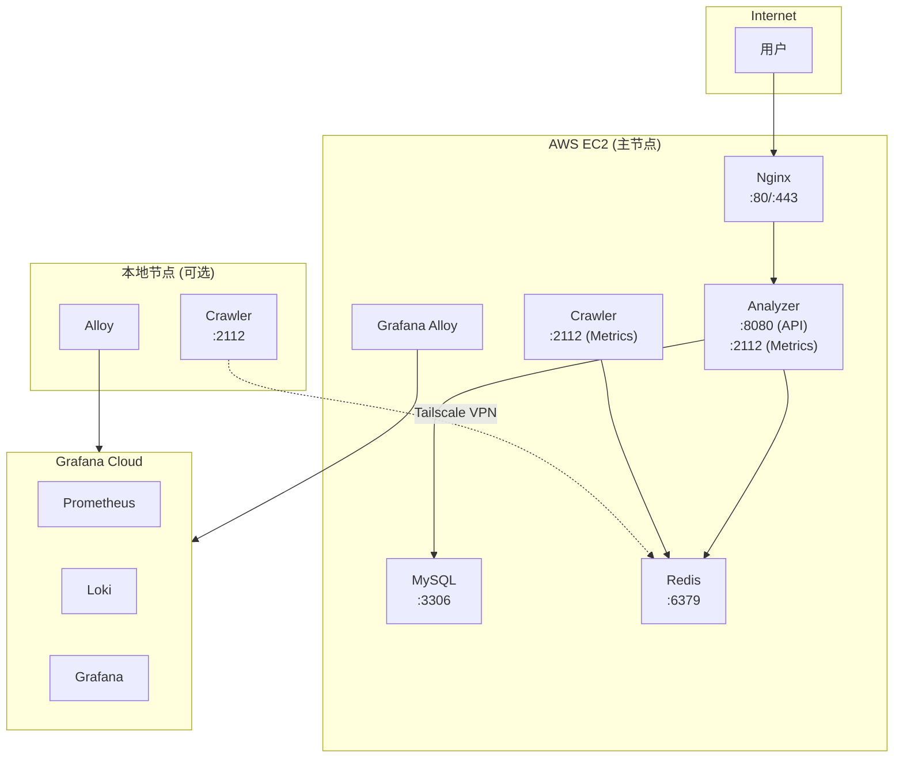
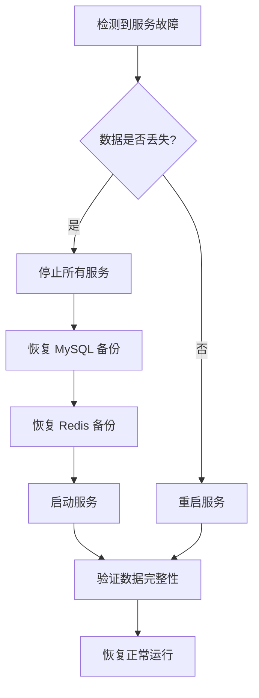

# Anime Hot Operations Manual

## Overview

本手册涵盖 Anime Hot 系统的部署、监控、运维和故障排查。

---

## 目录

1. [部署架构](#1-部署架构)
2. [服务管理](#2-服务管理)
3. [监控与指标](#3-监控与指标)
4. [日志管理](#4-日志管理)
5. [健康检查](#5-健康检查)
6. [环境变量配置](#6-环境变量配置)
7. [故障排查](#7-故障排查)
8. [运维脚本](#8-运维脚本)
9. [备份与恢复](#9-备份与恢复)

---

## 1. 部署架构

### 1.1 服务架构



### 1.2 端口映射

| 服务 | 端口 | 说明 |
|------|------|------|
| Nginx | 80, 443 | HTTP/HTTPS |
| Analyzer | 8080 | API 服务 |
| Analyzer | 2112 | Prometheus Metrics |
| Crawler | 2112 | Prometheus Metrics |
| MySQL | 3306 | 数据库 (仅内部) |
| Redis | 6379 | 缓存 (仅内部/Tailscale) |

---

## 2. 服务管理

### 2.1 Docker Compose 命令

```bash
# 开发环境
make docker-build          # 构建镜像
make docker-up             # 启动全部服务
make docker-down           # 停止服务
make docker-logs           # 查看所有日志
make docker-ps             # 查看服务状态

# 仅启动依赖服务 (本地开发)
make dev-deps              # 启动 MySQL + Redis
make dev-analyzer          # 本地运行 Analyzer
make dev-crawler           # 本地运行 Crawler

# 生产环境
docker compose -f docker-compose.prod.yml up -d
docker compose -f docker-compose.prod.yml --profile monitoring up -d

# 本地爬虫节点
docker compose -f docker-compose.crawler.yml up -d
```

### 2.2 服务启停

```bash
# 重启单个服务
docker compose restart analyzer
docker compose restart crawler

# 强制重建
docker compose up -d --force-recreate analyzer

# 查看单个服务日志
docker compose logs -f analyzer
docker compose logs -f crawler
```

### 2.3 优雅关闭

**Analyzer 关闭顺序** (30s 超时):
1. 停止接收新请求
2. 关闭 HTTP 服务器
3. 停止调度器
4. 等待 Pipeline 处理完成
5. 关闭数据库连接

**Crawler 关闭顺序** (2min 超时):
1. 停止接收新任务
2. 等待当前爬取完成
3. 关闭浏览器实例
4. 关闭 Metrics 服务

```yaml
# docker-compose.yml
crawler:
  stop_grace_period: 2m  # 浏览器清理需要更长时间
```

---

## 3. 监控与指标

### 3.1 Metrics 端点

- **Analyzer**: `http://localhost:2112/metrics`
- **Crawler**: `http://localhost:2112/metrics`

### 3.2 关键指标

#### 任务队列

| 指标 | 类型 | 说明 |
|------|------|------|
| `crawler_queue_depth{name="tasks"}` | Gauge | 待处理任务数 |
| `crawler_queue_depth{name="results"}` | Gauge | 待处理结果数 |
| `animetop_scheduler_tasks_pending_in_queue` | Gauge | 调度器队列深度 |
| `animetop_task_dlq_total` | Counter | 死信队列数量 |

#### 任务处理

| 指标 | 类型 | 说明 |
|------|------|------|
| `animetop_tasks_processed_total{status="success"}` | Counter | 成功任务数 |
| `animetop_tasks_processed_total{status="failed"}` | Counter | 失败任务数 |
| `animetop_task_processing_duration_seconds` | Histogram | 处理耗时分布 |

#### 爬虫

| 指标 | 类型 | 说明 |
|------|------|------|
| `animetop_crawler_requests_total` | Counter | 爬取请求数 |
| `animetop_crawler_request_duration_seconds` | Histogram | 爬取耗时 |
| `animetop_crawler_errors_total{type="timeout"}` | Counter | 超时错误 |
| `animetop_crawler_errors_total{type="blocked"}` | Counter | 被封禁 |
| `animetop_crawler_browser_active` | Gauge | 活跃浏览器页面 |
| `animetop_crawler_proxy_mode` | Gauge | 代理模式 (0=直连, 1=代理) |

#### HTTP API

| 指标 | 类型 | 说明 |
|------|------|------|
| `animetop_http_requests_total` | Counter | 请求总数 |
| `animetop_http_request_duration_seconds` | Histogram | 请求耗时 |

#### 数据库

| 指标 | 类型 | 说明 |
|------|------|------|
| `animetop_db_connections_active` | Gauge | 活跃连接数 |
| `animetop_db_connections_idle` | Gauge | 空闲连接数 |
| `animetop_db_query_duration_seconds` | Histogram | 查询耗时 |

### 3.3 告警规则建议

```yaml
# Prometheus alerting rules
groups:
  - name: animetop
    rules:
      # 任务队列积压
      - alert: TaskQueueBacklog
        expr: crawler_queue_depth{name="tasks"} > 100
        for: 5m
        labels:
          severity: warning
        annotations:
          summary: "任务队列积压 ({{ $value }})"

      # 死信队列有数据
      - alert: DeadLetterQueueNotEmpty
        expr: animetop_task_dlq_total > 0
        for: 1m
        labels:
          severity: critical
        annotations:
          summary: "死信队列有 {{ $value }} 条任务"

      # 爬虫被封禁
      - alert: CrawlerBlocked
        expr: increase(animetop_crawler_errors_total{type="blocked"}[5m]) > 5
        labels:
          severity: critical
        annotations:
          summary: "爬虫被封禁，5分钟内 {{ $value }} 次"

      # 处理延迟高
      - alert: HighProcessingLatency
        expr: histogram_quantile(0.95, animetop_task_processing_duration_seconds_bucket) > 60
        for: 5m
        labels:
          severity: warning
        annotations:
          summary: "P95 处理延迟超过 60s"
```

### 3.4 Grafana 仪表盘

**推荐面板**:
1. **任务队列深度** - `crawler_queue_depth`
2. **任务处理速率** - `rate(animetop_tasks_processed_total[5m])`
3. **爬取成功率** - `rate(animetop_crawler_requests_total{status="success"}[5m])`
4. **P95 延迟** - `histogram_quantile(0.95, ...)`
5. **数据库连接** - `animetop_db_connections_*`
6. **浏览器实例** - `animetop_crawler_browser_*`

---

## 4. 日志管理

### 4.1 日志格式

JSON 结构化日志，输出到 stdout：

```json
{
  "time": "2026-01-21T14:30:00.123+09:00",
  "level": "INFO",
  "msg": "task processed",
  "service": "pipeline",
  "ip_id": 11,
  "inflow": 25,
  "outflow": 8
}
```

### 4.2 Docker 日志配置

```yaml
# docker-compose.yml
logging:
  driver: "json-file"
  options:
    max-size: "10m"
    max-file: "3"
```

### 4.3 查看日志

```bash
# 实时查看
docker compose logs -f analyzer
docker compose logs -f crawler

# 查看最近 100 行
docker compose logs --tail=100 analyzer

# 过滤错误
docker compose logs analyzer 2>&1 | grep -i error

# 查看特定时间段
docker compose logs --since="2026-01-21T14:00:00" analyzer
```

### 4.4 关键日志事件

| 日志内容 | 级别 | 说明 |
|----------|------|------|
| `starting IP liquidity analyzer service` | INFO | 服务启动 |
| `MySQL connected` | INFO | 数据库连接成功 |
| `shutdown signal received` | INFO | 收到关闭信号 |
| `failed to load config` | ERROR | 配置加载失败 |
| `task processing failed` | ERROR | 任务处理失败 |
| `crawler blocked detected` | WARN | 检测到封禁 |
| `proxy switched` | INFO | 代理已切换 |

---

## 5. 健康检查

### 5.1 健康检查端点

```bash
# 基础健康检查
curl http://localhost:8080/health

# 系统状态
curl http://localhost:8080/api/v1/system/status

# 调度器状态
curl http://localhost:8080/api/v1/system/scheduler
```

### 5.2 Docker 健康检查

```yaml
healthcheck:
  test: ["CMD", "wget", "-qO-", "http://127.0.0.1:8080/health"]
  interval: 10s
  timeout: 3s
  retries: 5
  start_period: 30s
```

### 5.3 健康检查脚本

```bash
#!/bin/bash
# scripts/health_check.sh

# 检查 API
if ! curl -sf http://localhost:8080/health > /dev/null; then
  echo "ERROR: API health check failed"
  exit 1
fi

# 检查 MySQL
if ! docker compose exec -T mysql mysqladmin ping -h localhost -u root -p"$MYSQL_ROOT_PASSWORD" > /dev/null 2>&1; then
  echo "ERROR: MySQL health check failed"
  exit 1
fi

# 检查 Redis
if ! docker compose exec -T redis redis-cli ping > /dev/null 2>&1; then
  echo "ERROR: Redis health check failed"
  exit 1
fi

# 检查队列深度
QUEUE_DEPTH=$(curl -sf http://localhost:8080/api/v1/system/status | jq -r '.data.stats.active_items // 0')
if [ "$QUEUE_DEPTH" -gt 1000 ]; then
  echo "WARNING: Task queue depth is high: $QUEUE_DEPTH"
fi

echo "OK: All health checks passed"
```

---

## 6. 环境变量配置

### 6.1 核心配置

| 变量 | 默认值 | 说明 |
|------|--------|------|
| `APP_ENV` | local | 环境 (local/prod) |
| `DEBUG` | false | 调试模式 |
| `AUTO_MIGRATE` | true | 自动数据库迁移 |

### 6.2 数据库

| 变量 | 默认值 | 说明 |
|------|--------|------|
| `MYSQL_USER` | animetop | 用户名 |
| `MYSQL_PASSWORD` | - | 密码 |
| `MYSQL_DATABASE` | animetop | 数据库名 |
| `MYSQL_PORT` | 3306 | 端口 |

### 6.3 Redis

| 变量 | 默认值 | 说明 |
|------|--------|------|
| `REDIS_PORT` | 6379 | 端口 |
| `REDIS_POOL_SIZE` | 10 | 连接池大小 |

### 6.4 调度器

| 变量 | 默认值 | 说明 |
|------|--------|------|
| `SCHEDULER_BASE_INTERVAL` | 2h | 基础间隔 |
| `SCHEDULER_MIN_INTERVAL` | 1h | 最小间隔 |
| `SCHEDULER_MAX_INTERVAL` | 2h | 最大间隔 |
| `SCHEDULER_PAGES_ON_SALE` | 5 | 在售页数 |
| `SCHEDULER_PAGES_SOLD` | 5 | 已售页数 |

### 6.5 爬虫

| 变量 | 默认值 | 说明 |
|------|--------|------|
| `BROWSER_MAX_CONCURRENCY` | 2 | 最大并发页面 |
| `BROWSER_MAX_FETCH_COUNT` | 120 | 单页最大商品数 |
| `BROWSER_PAGE_TIMEOUT` | 60s | 页面加载超时 |
| `BROWSER_TASK_TIMEOUT` | 12m | 任务总超时 |
| `MAX_TASKS` | 50 | 重启前最大任务数 |
| `APP_RATE_LIMIT` | 3 | 请求/秒 |

### 6.6 代理

| 变量 | 默认值 | 说明 |
|------|--------|------|
| `HTTP_PROXY` | - | 代理地址 |
| `PROXY_AUTO_SWITCH` | false | 自动切换代理 |
| `PROXY_FAILURE_THRESHOLD` | 10 | 切换阈值 |
| `PROXY_COOLDOWN` | 10m | 切换冷却时间 |

### 6.7 告警阈值

| 变量 | 默认值 | 说明 |
|------|--------|------|
| `ANALYZER_HIGH_OUTFLOW_THRESHOLD` | 50 | 高出货量阈值 |
| `ANALYZER_LOW_LIQUIDITY_THRESHOLD` | 0.3 | 低流动性阈值 |
| `ANALYZER_HIGH_LIQUIDITY_THRESHOLD` | 2.0 | 高流动性阈值 |

---

## 7. 故障排查

### 7.1 常见问题

#### 任务队列积压

**症状**: `crawler_queue_depth{name="tasks"}` 持续增长

**排查步骤**:
```bash
# 1. 检查 Crawler 状态
docker compose ps crawler
docker compose logs --tail=50 crawler

# 2. 检查浏览器状态
curl -s http://localhost:2112/metrics | grep crawler_browser

# 3. 检查是否被封禁
curl -s http://localhost:2112/metrics | grep 'errors_total.*blocked'

# 4. 手动测试爬取
curl -X POST http://localhost:8080/api/v1/ips/11/trigger
```

**解决方案**:
- 重启 Crawler: `docker compose restart crawler`
- 启用代理: 设置 `HTTP_PROXY` 并重启
- 降低并发: 减小 `BROWSER_MAX_CONCURRENCY`

#### Pipeline 处理失败

**症状**: `animetop_tasks_processed_total{status="failed"}` 增加

**排查步骤**:
```bash
# 1. 检查 Pipeline 日志
docker compose logs analyzer 2>&1 | grep -i "failed\|error"

# 2. 检查数据库连接
docker compose exec mysql mysqladmin ping -h localhost

# 3. 检查 Redis 连接
docker compose exec redis redis-cli ping

# 4. 检查死信队列
docker compose exec redis redis-cli LLEN animetop:queue:tasks:deadletter
```

#### 爬虫被封禁

**症状**: 大量 `timeout` 或 `blocked` 错误

**排查步骤**:
```bash
# 1. 检查错误类型分布
curl -s http://localhost:2112/metrics | grep crawler_errors_total

# 2. 检查代理状态
curl -s http://localhost:2112/metrics | grep proxy_mode

# 3. 手动测试代理
curl -x http://proxy:port https://jp.mercari.com -I
```

**解决方案**:
- 切换代理
- 增加请求间隔: 减小 `APP_RATE_LIMIT`
- 等待冷却后重试

### 7.2 数据库问题

```bash
# 检查连接数
docker compose exec mysql mysql -u root -p -e "SHOW STATUS LIKE 'Threads_connected';"

# 检查慢查询
docker compose exec mysql mysql -u root -p -e "SHOW PROCESSLIST;"

# 检查表大小
docker compose exec mysql mysql -u root -p -e "
  SELECT table_name,
         ROUND(data_length/1024/1024, 2) AS 'Data (MB)',
         ROUND(index_length/1024/1024, 2) AS 'Index (MB)'
  FROM information_schema.tables
  WHERE table_schema = 'animetop'
  ORDER BY data_length DESC;
"
```

### 7.3 Redis 问题

```bash
# 检查内存使用
docker compose exec redis redis-cli INFO memory

# 检查队列状态
docker compose exec redis redis-cli LLEN animetop:queue:tasks
docker compose exec redis redis-cli LLEN animetop:queue:results
docker compose exec redis redis-cli LLEN animetop:queue:tasks:processing
docker compose exec redis redis-cli LLEN animetop:queue:tasks:deadletter

# 检查调度 ZSET
docker compose exec redis redis-cli ZCARD animetop:schedule:pending
docker compose exec redis redis-cli ZRANGE animetop:schedule:pending 0 5 WITHSCORES
```

---

## 8. 运维脚本

### 8.1 灰度验证

```bash
# 启动并验证
make grayscale-start
sleep 60
make grayscale-verify
```

### 8.2 检查 Redis 队列

```bash
# scripts/check_redis.sh
#!/bin/bash
echo "=== Queue Status ==="
docker compose exec redis redis-cli LLEN animetop:queue:tasks
docker compose exec redis redis-cli LLEN animetop:queue:results
docker compose exec redis redis-cli LLEN animetop:queue:tasks:processing
docker compose exec redis redis-cli LLEN animetop:queue:tasks:deadletter

echo "=== Schedule ZSET ==="
docker compose exec redis redis-cli ZCARD animetop:schedule:pending

echo "=== Pending Set ==="
docker compose exec redis redis-cli SCARD animetop:queue:tasks:pending
```

### 8.3 检查 MySQL 数据

```bash
# scripts/check_mysql.sh
#!/bin/bash
docker compose exec mysql mysql -u root -p"$MYSQL_ROOT_PASSWORD" animetop -e "
  SELECT 'ip_metadata' AS tbl, COUNT(*) AS cnt FROM ip_metadata
  UNION ALL
  SELECT 'ip_stats_hourly', COUNT(*) FROM ip_stats_hourly
  UNION ALL
  SELECT 'item_snapshots', COUNT(*) FROM item_snapshots
  UNION ALL
  SELECT 'ip_alerts (unacked)', COUNT(*) FROM ip_alerts WHERE acknowledged = FALSE;
"
```

### 8.4 清理死信队列

```bash
# 查看死信内容
docker compose exec redis redis-cli LRANGE animetop:queue:tasks:deadletter 0 -1

# 清空死信队列 (谨慎操作)
docker compose exec redis redis-cli DEL animetop:queue:tasks:deadletter
```

---

## 9. 备份与恢复

### 9.1 数据库备份

```bash
# 备份
docker compose exec mysql mysqldump -u root -p"$MYSQL_ROOT_PASSWORD" animetop > backup_$(date +%Y%m%d).sql

# 恢复
docker compose exec -T mysql mysql -u root -p"$MYSQL_ROOT_PASSWORD" animetop < backup_20260121.sql
```

### 9.2 Redis 备份

```bash
# 触发 RDB 快照
docker compose exec redis redis-cli BGSAVE

# 复制 RDB 文件
docker compose exec redis cat /data/dump.rdb > redis_backup_$(date +%Y%m%d).rdb
```

### 9.3 自动备份脚本

```bash
#!/bin/bash
# scripts/backup.sh

BACKUP_DIR="/backup/animetop"
DATE=$(date +%Y%m%d_%H%M%S)

mkdir -p $BACKUP_DIR

# MySQL 备份
docker compose exec -T mysql mysqldump -u root -p"$MYSQL_ROOT_PASSWORD" animetop | gzip > "$BACKUP_DIR/mysql_$DATE.sql.gz"

# Redis RDB 备份
docker compose exec redis redis-cli BGSAVE
sleep 5
docker cp $(docker compose ps -q redis):/data/dump.rdb "$BACKUP_DIR/redis_$DATE.rdb"

# 清理 7 天前的备份
find $BACKUP_DIR -name "*.sql.gz" -mtime +7 -delete
find $BACKUP_DIR -name "*.rdb" -mtime +7 -delete

echo "Backup completed: $DATE"
```

### 9.4 灾难恢复流程


